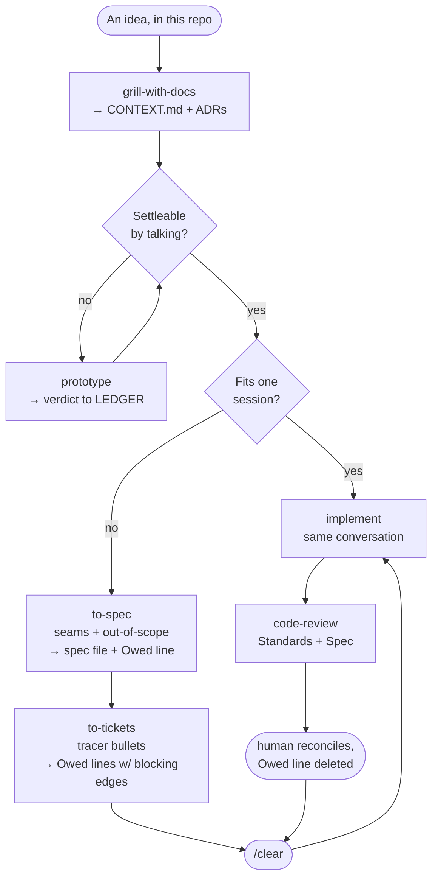
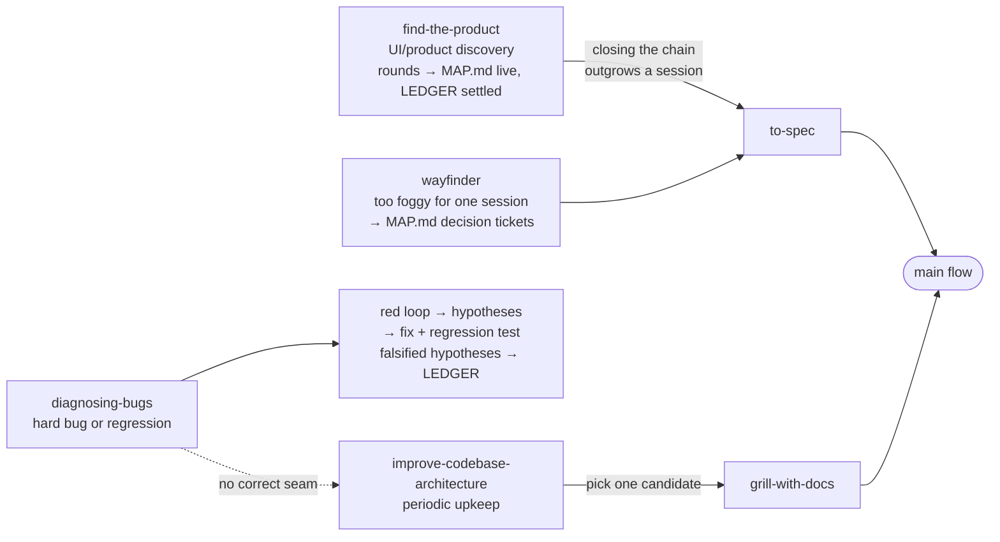
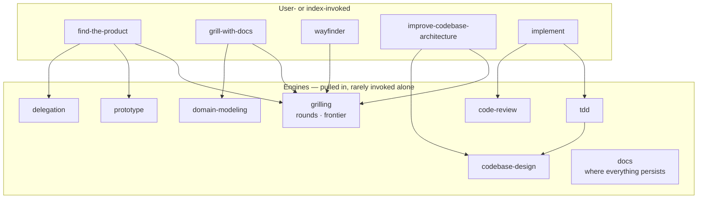
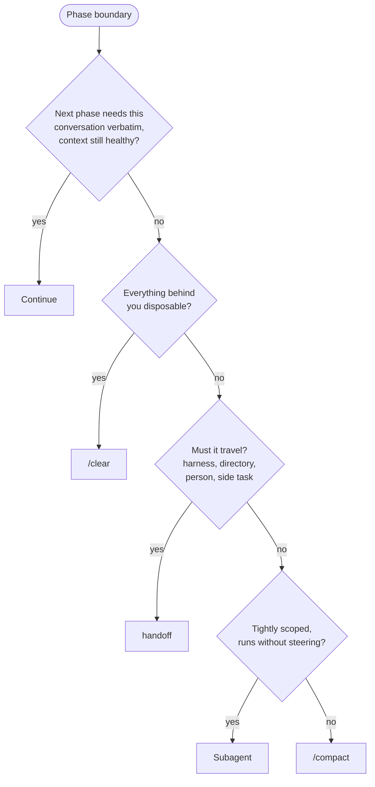

# Flows

The skill set as conditional flows — our fork (no external tracker; ledgers/MAP.md per the `docs` skill; `find-the-product` and `delegation` are first-class). Each skill leaves the next a better input: shared decisions, a spec, an Owed line, a failing test, or a reviewable diff.

## The main flow

## On-ramps

## Engines underneath

## Phase boundaries

At a phase end — never mid-phase — walk in order; first yes wins. See [PHASE-BOUNDARIES.md](PHASE-BOUNDARIES.md).

Continuing preserves a primary source; every alternative is lossy, so `/compact` is the fallback, not the first move.

## The shortest useful rule

**Decide with the human, persist only what code can't say, split work into independently provable slices, build one slice in a fresh context, and verify it at an agreed public seam.**
