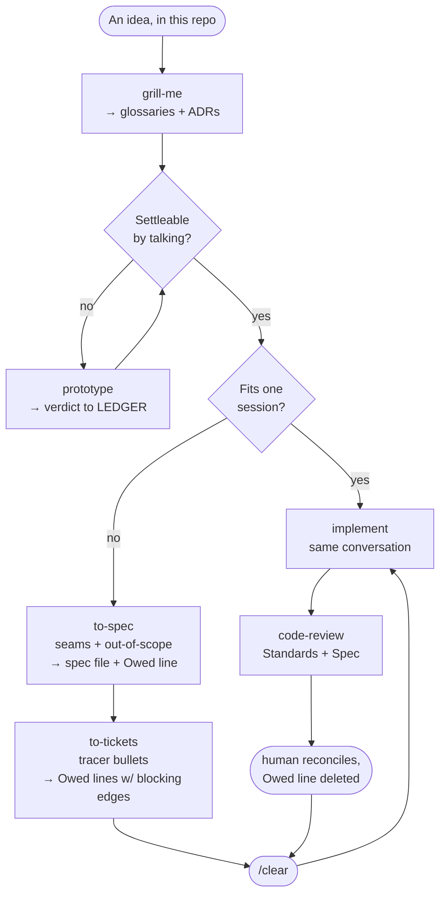
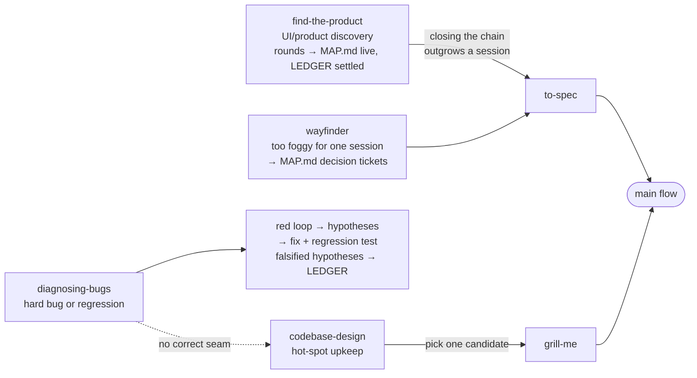
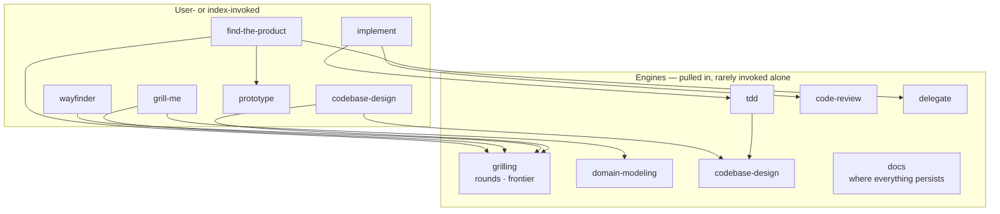
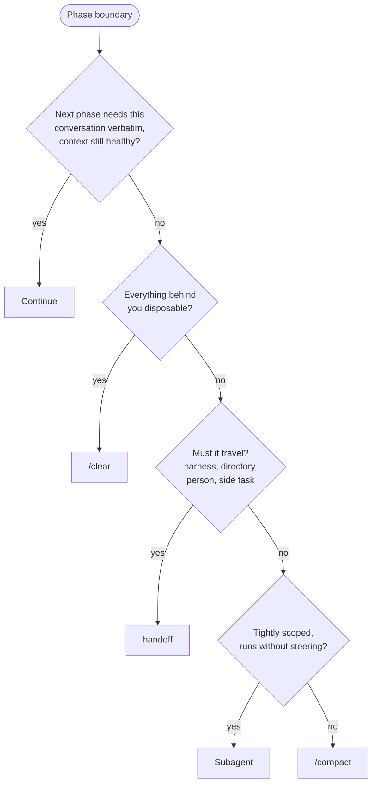

# Index

The single entry point over this repo's skill set. The user states intent; you pick the route and **drive it**: invoke each hop yourself where the skill allows model invocation; where the next hop is user-invocable only (`disable-model-invocation: true`), hand back the exact slash command to run and stop there. Otherwise stop only at genuine decision gates (grilling answers, round verdicts, spec approval, commits). Never recommend a vague direction — name the next command.

When a route spans sessions, decide continuation per [PHASE-BOUNDARIES.md](PHASE-BOUNDARIES.md). Docs conventions (ledgers, ADRs, MAP.md, grounding, handoffs) live in the `docs` skill — every route persists through it.

## Why this exists — the failure modes it prevents

- **Wrong work:** grill before building.
- **Wrong product:** prototype against real data before canonizing; the UI's demands shape the backend.
- **Lost decisions:** ledgers, ADRs, and scoped glossaries catch what code can't say.
- **Broken code:** work through a tight red/green feedback loop.
- **Architectural decay:** test at public seams; periodically hunt deeper modules.
- **Context decay:** choose explicitly at phase boundaries instead of compacting by habit.
- **Token waste:** delegate per the `delegate` skill; the driver holds judgment, subagents hold bulk.

## Routes

Match intent to the route; enter mid-route when earlier steps are already done. Reality check from two months of history: most sessions actually enter through find-the-product rounds, a goal-style mission brief with binding gates, or a pasted handoff — the grill→spec→tickets chain is the exception. Route by what the situation is, not by ceremony.

- **Find or refine a product surface (UI or the backend it demands)** → `find-the-product`. The most-traveled on-ramp. Its rounds drive `prototype` + `grilling` under `delegate`; verdicts persist per the `docs` skill (MAP.md live, LEDGER settled). When closing the chain outgrows one session, merge onto the main flow at `to-spec`.
- **An idea, settleable by conversation** → `grill-me`, then: fits one session → `implement` here; multi-session → `to-spec` → `to-tickets` (Owed lines) → `implement` per ticket with `/clear` between.
- **Huge and foggy — can't see the way** → `wayfinder` (MAP.md of decision tickets). A cleared map merges at `to-spec`; it is not a build plan.
- **Something's broken** → `diagnosing-bugs`. No hypotheses before a red loop. Its "no seam exists" finding routes to `codebase-design`.
- **Upkeep, spare cycle** → `codebase-design` (hot-spot scoping); a picked candidate re-enters at `grill-me`.
- **Reading legwork** → `research` (background agent, cited file per `docs` conventions).
- **Blocked on someone/something, or design question needs runnable proof** → `prototype` directly.

Engines the routes drive (rarely invoked alone): `grilling`, `tdd`, `code-review`, `domain-modeling`, `codebase-design`, `delegate`, `docs` — and `execute`, which rules on how anything is run or proven (every route that reaches code passes through it). `handoff` is a first-class phase, not a utility — continuation via handoff (and auto-compaction) is the steady state of long work, so treat writing one as part of the route, not an afterthought. Standalone utilities: `teach`, `writing-for-agents`.

## Driving the loop

After a skill completes its phase, proceed to the next hop yourself — or, if the hop is user-invocable only, hand the user its exact slash command. Stop for the human only when:

1. A decision is theirs (grilling rounds, prototype verdicts, spec/ticket approval, scope changes). Exception — **sanctioned autonomous sessions**: when the user explicitly hands over a session (e.g. an AFK find-the-product round), the agent may grill against recorded verdicts and rule in their absence; record such rulings as re-openable and say which were made autonomously.
2. A destructive or outward-facing action is next (commits are fine on approved work; force-pushes, deletions of unreviewed work are not).
3. The route itself is ambiguous after reading the Flows section below — say what you'd pick and why, then proceed unless redirected.

When a skill's SKILL.md disagrees with this index, the skill wins — this file routes, it doesn't govern.

## Disposition

- Use ASD-STE100 Simplified Technical English and grow glossaries. Talk like this especially when the users feel like "wait what".

---

# Flows

The skill set as conditional flows — our fork (no external tracker; ledgers/MAP.md per the `docs` skill; `find-the-product` and `delegate` are first-class). Each skill leaves the next a better input: shared decisions, a spec, an Owed line, a failing test, or a reviewable diff.

## The main flow

## On-ramps

## Engines underneath

## Phase boundaries

At a phase end — never mid-phase — walk in order; first yes wins. See [PHASE-BOUNDARIES.md](PHASE-BOUNDARIES.md).

Continuing preserves a primary source; every alternative is lossy, so `/compact` is the fallback, not the first move.

## The shortest useful rule

**Decide with the human, persist only what code can't say, split work into independently provable slices, build one slice in a fresh context, and verify it at an agreed public seam.**
