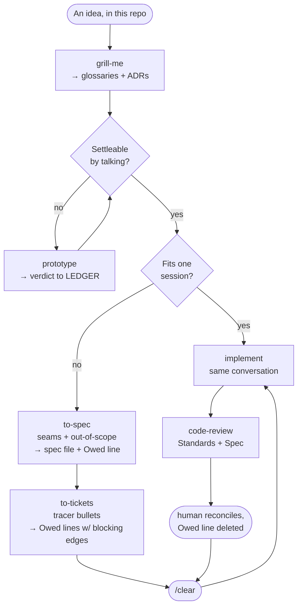
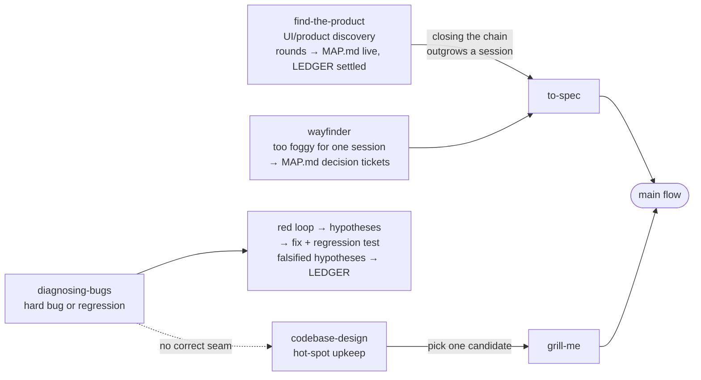
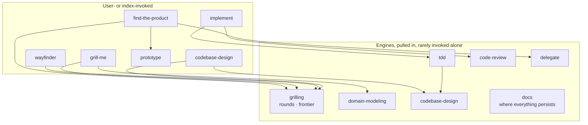
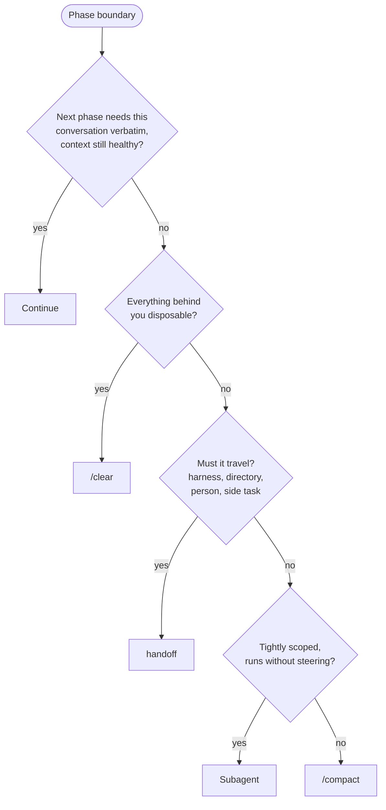

# Index

The single entry point over this repo's skill set. The user states intent; you pick the route and **drive it**: invoke each hop yourself where the skill allows model invocation; where the next hop is user-invocable only (`disable-model-invocation: true`), hand back the exact slash command to run and stop there. Otherwise stop only at genuine decision gates (grilling answers, round verdicts, spec approval, commits). Never recommend a vague direction, name the next command.

When a route spans sessions, decide continuation per [PHASE-BOUNDARIES.md](PHASE-BOUNDARIES.md). Docs conventions (ledgers, ADRs, MAP.md, grounding, handoffs) live in the `docs` skill, every route persists through it.

## Why this exists, the failure modes it prevents

- **Wrong work:** grill before building.
- **Wrong product:** prototype against real data before canonizing; the UI's demands shape the backend.
- **Lost decisions:** ledgers, ADRs, and scoped glossaries catch what code can't say.
- **Broken code:** work through a tight red/green feedback loop.
- **Architectural decay:** test at public seams; periodically hunt deeper modules.
- **Context decay:** choose explicitly at phase boundaries instead of compacting by habit.
- **Token waste:** delegate per the `delegate` skill; the driver holds judgment, subagents hold bulk.

## Routes

Match intent to the route; enter mid-route when earlier steps are already done. Reality check from two months of history: most sessions actually enter through find-the-product rounds, a goal-style mission brief with binding gates, or a pasted handoff, the grill→spec→tickets chain is the exception. Route by what the situation is, not by ceremony.

- **Find or refine a product surface (UI or the backend it demands)** → `find-the-product`. The most-traveled on-ramp. Its rounds drive `prototype` + `grilling` under `delegate`; verdicts persist per the `docs` skill (MAP.md live, LEDGER settled). When closing the chain outgrows one session, merge onto the main flow at `to-spec`.
- **An idea, settleable by conversation** → `grill-me`, then: fits one session → `implement` here; multi-session → `to-spec` → `to-tickets` (Owed lines) → `implement` per ticket with `/clear` between.
- **Huge and foggy, can't see the way** → `wayfinder` (MAP.md of decision tickets). A cleared map merges at `to-spec`; it is not a build plan.
- **Something's broken** → `diagnosing-bugs`. No hypotheses before a red loop. Its "no seam exists" finding routes to `codebase-design`.
- **Upkeep, spare cycle** → `codebase-design` (hot-spot scoping); a picked candidate re-enters at `grill-me`.
- **Reading legwork** → `research` (background agent, cited file per `docs` conventions).
- **Blocked on someone/something, or design question needs runnable proof** → `prototype` directly.

Engines the routes drive (rarely invoked alone): `grilling`, `tdd`, `code-review`, `domain-modeling`, `codebase-design`, `delegate`, `docs`, and `execute`, which rules on how anything is run or proven (every route that reaches code passes through it). `handoff` is a first-class phase, not a utility, continuation via handoff (and auto-compaction) is the steady state of long work, so treat writing one as part of the route, not an afterthought. Standalone utilities: `teach`, `writing-for-agents`.

## Driving the loop

After a skill completes its phase, proceed to the next hop yourself, or, if the hop is user-invocable only, hand the user its exact slash command. Stop for the human only when:

1. A decision is theirs (grilling rounds, prototype verdicts, spec/ticket approval, scope changes). Exception, **sanctioned autonomous sessions**: when the user explicitly hands over a session (e.g. an AFK find-the-product round), the agent may grill against recorded verdicts and rule in their absence; record such rulings as re-openable and say which were made autonomously.
2. A destructive or outward-facing action is next (commits are fine on approved work; force-pushes, deletions of unreviewed work are not).
3. The route itself is ambiguous after reading the Flows section below, say what you'd pick and why, then proceed unless redirected.

When a skill's SKILL.md disagrees with this index, the skill wins, this file routes, it doesn't govern.

## Disposition

- Unslop all of your speech. 
- For knowledge capture use ASD-STE100 Simplified Technical English and grow glossaries.
- When the user thinks "what what" then talk in ASD-STE100.

---

# Skill Flows

The skill set as conditional flows, our fork (no external tracker; ledgers/MAP.md per the `docs` skill; `find-the-product` and `delegate` are first-class). Each skill leaves the next a better input: shared decisions, a spec, an Owed line, a failing test, or a reviewable diff.

## The main flow

## On-ramps

## Engines underneath

## Phase boundaries

At a phase end, never mid-phase, walk in order; first yes wins. See [PHASE-BOUNDARIES.md](PHASE-BOUNDARIES.md).

Continuing preserves a primary source; every alternative is lossy, so `/compact` is the fallback, not the first move.

## The shortest useful rule

**Decide with the human, persist only what code can't say, split work into independently provable slices, build one slice in a fresh context, and verify it at an agreed public seam.**

--- 

# Unslop Skill

Edit text to remove AI patterns and add human voice.

## Process

1. Scan for the patterns below.
2. Rewrite. Preserve meaning, match intended tone.
3. Add soul (see next section).
4. Self-audit: "What makes this obviously AI generated?" Fix remaining tells.
5. Densify/compress/distill. *It's never short enough*, facts and opinions should have a place, fluff should not.

## Adding soul

Removing patterns is half the job. Sterile, voiceless writing is just as obvious.

- **Use "I" when it fits.** First person isn't unprofessional.
- **Have opinions.** React to facts instead of neutrally listing pros and cons.
- **Acknowledge complexity.** "Impressive but also kind of unsettling" beats "impressive."
- **Vary rhythm.** Short sentences. Then longer ones that take their time. Mix it up.
- **Be specific.** Not "this is concerning" but "there's something unsettling about agents churning away at 3am."
- **Tastefully, abstract metaphor nouns.** When a concept is genuinely foggy it gives the user a single word to refer to the thing by. But, overused they read as technical when they aren't. 
  - Example anti-patterns and their fix: substrate → base, wedge in → add, vector → way or method, gold-plating → more than the job needs, ratchet → mechanism's real name or a "limit that only tightens", evacuate → move out, endgame → the last phase, etc. 

## Patterns to detect and fix

### Plain speech

1. **Say what it does, not how it feels.** "the database stays close at hand", "SQL you can read", "types that follow your schema" name a feeling. The fix names the mechanism or a number: "`.toSQL()` returns the exact string sent to the database", "a column rename fails the build". Ask what the sentence tells the reader to do or know, then write that. If you can't restate it as a concrete instruction, fact, or number, cut it. One more check: if the sentence could appear unchanged in another project's docs, it says nothing about this one. Cut it.
2. **Shorten or split dense sentences.** If the reader has to backtrack to parse a sentence, break it in two or drop clauses. One idea per sentence.
3. **Active voice.** Prefer it. Catch "is/are/was/were + past participle" and name the actor: "queries are validated" becomes "the compiler validates queries", "the file is parsed by the loader" becomes "the loader parses the file". Passive is fine only when the actor is unknown or genuinely doesn't matter.
4. **Cut adverbs, or use a stronger verb.** "runs quickly" becomes "is fast" or the number. "significantly improves" becomes the measured delta. An adverb propping up a weak verb means the verb is wrong.
5. **Prefer the plain word.** "utilize" becomes "use", "leverage" becomes "use", "facilitate" becomes "help", "numerous" becomes "many", "in the event that" becomes "if". The fancier synonym is rarely clearer.

### Content
6. **Synonym cycling.** Protagonist, main character, central figure, hero all in one paragraph. Pick one, repeat it.
7. **False ranges.** "from X to Y" where X and Y aren't on a meaningful scale. List topics directly.
8. **Rule of three.** Forcing ideas into groups of three. Use the natural number OR "Example, example, etc.". Exhaustive lists cause reading fatigue.
9. **"Not just X, but Y."** State the point directly instead. Don't talk like you're writing copy.

### Language

10. **Buzzwords, cliches, corporate-speak, jargonese.** Don't obscure meaning when discussing concrete fact.
11. **Filler phrases.** "In order to" becomes "To". "Due to the fact that" becomes "Because". "It is important to note that" gets deleted.
12. **Fancy ways to say "is".** "serves as", "stands as", "boasts", "features". Just say "is" or "has".
13. **Excessive hedging.** "could potentially possibly be argued that it might" becomes "may". Hedge in big blocks
14. **Superficial -ing phrases.** "highlighting...", "ensuring...", "reflecting...", "showcasing...", "fostering...". Delete or expand with real sources.
15. **Puffery.** "pivotal moment", "testament to", "evolving landscape", "setting the stage for", "indelible mark", "deeply rooted". Cut puffery, state what happened.
16. **Promotional language.** "nestled", "vibrant", "breathtaking", "groundbreaking", "renowned", "stunning", "must-visit". Use neutral descriptions.
17. **AI vocabulary.** Additionally, crucial, delve, enduring, enhance, fostering, garner, interplay, intricate, landscape (abstract), pivotal, showcase, tapestry (abstract), testament, underscore, vibrant. Replace with plain words.

### Style

18. **Em dash overuse.** Avoid em dashes entirely. Use periods or commas only (no parentheses, no en dashes, no hyphen-as-dash substitutes). Em dashes are an AI tell, and reaching for parentheses instead just trades one tell for another. If a thought needs separation, end the sentence or use a comma.
19. **Colon overuse.** Colons are fine before a list or example. Not as mid-sentence connectors. "If you're coming from traditional automation: instead of registering event handlers, you describe conditions" adds nothing with the colon. Rewrite to let the point stand on its own without comparison framing. "Describing when the scheduler should fire works best as plain English." Same meaning, no crutch punctuation.
