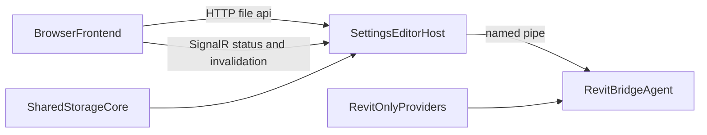

# Host-Owned Settings Files

## Recommendation

Move the **settings-aware** filesystem responsibilities out of the frontend and
into the **out-of-proc host**, not into the in-proc Revit add-in/bridge. That
should reduce duplicate logic and multiple sources of truth, but only if the
migration is paired with a small shared backend core extracted from `Pe.Global`.

The browser should stay thin and own only UX concerns. A browser-only fallback
mode can remain optional for POC work, but it should not be the long-term owner
of pathing/composition rules.

## Why This Is The Better SOT Split

The frontend currently owns more than raw file IO:

- `[signalir-clientside-demo/v3/src/lib/fs/fs-store.ts](signalir-clientside-demo/v3/src/lib/fs/fs-store.ts)`
  is a browser-side service for pick/restore root, list entries, read/write
  files, snapshots, and polling.
- `[signalir-clientside-demo/v3/src/lib/fs/traverse.ts](signalir-clientside-demo/v3/src/lib/fs/traverse.ts)`
  already hardcodes settings-specific rules like `@local`/`@global` directive
  resolution and addin/global path conventions.
- `[signalir-clientside-demo/v3/src/lib/settings-doc-state/doc-state.ts](signalir-clientside-demo/v3/src/lib/settings-doc-state/doc-state.ts)`
  composes, polls dependencies, and validates document state in the frontend.

But the canonical storage rules already live in `Pe.Tools`:

- `[source/Pe.Global/Services/Storage/Core/SettingsPathing.cs](source/Pe.Global/Services/Storage/Core/SettingsPathing.cs)`
  is already the safe pathing and directive-resolution authority.
- `[source/Pe.Global/Services/Storage/Core/Json/ComposableJson.cs](source/Pe.Global/Services/Storage/Core/Json/ComposableJson.cs)`
  already owns composition, schema injection, validation, and fragment/preset
  scaffolding.
- `[source/Pe.SettingsEditor.Host/Hubs/SettingsEditorHub.cs](source/Pe.SettingsEditor.Host/Hubs/SettingsEditorHub.cs)`
  shows the host is already the frontend-facing backend boundary; it just does
  not own file APIs yet.

That means today the frontend is maintaining a second implementation of rules
that are supposed to be backend-owned.

## Important Caveat

Do **not** solve this by routing filesystem calls through the Revit named-pipe
bridge. That would make plain file editing depend on Revit and would directly
conflict with your goal of editing without Revit running.

Also do **not** point the host directly at all of `Pe.Global` as-is.
`[source/Pe.Global/Pe.Global.csproj](source/Pe.Global/Pe.Global.csproj)` is a
Revit SDK project, and parts of `Services/Storage` are Revit-aware. The clean
path is to extract the host-safe pathing/composition/discovery pieces into a
non-Revit shared project first.

## Target Ownership

Desired split:

- **Host-owned:** settings discovery, logical pathing, directive resolution,
  composition preview, file read/write, dependency watching, save-back rules.
- **Bridge/Revit-owned:** document-aware field option datasets, parameter
  catalog, document invalidation, active-document-sensitive capabilities.
- **Frontend-owned:** UI state, local cache, forms, optimistic UX, optional
  browser-only POC adapter if you still want it.

## Migration Shape

1. Extract a host-safe storage/composition library. Use
   `[source/Pe.Global/Services/Storage/Core/SettingsPathing.cs](source/Pe.Global/Services/Storage/Core/SettingsPathing.cs)`
   and the host-safe portions of
   `[source/Pe.Global/Services/Storage/Core/Json/ComposableJson.cs](source/Pe.Global/Services/Storage/Core/Json/ComposableJson.cs)`
   as the seed, but move only code that does not depend on Revit packages or
   active-document services.
2. Add host-owned file APIs. Put CRUD/discovery/composition endpoints in
   `[source/Pe.SettingsEditor.Host/Program.cs](source/Pe.SettingsEditor.Host/Program.cs)`
   and/or dedicated services under `source/Pe.SettingsEditor.Host/`. Prefer HTTP
   for file/list/read/write/compose operations, and keep SignalR mainly for
   connection state and push invalidation.
3. Slim the frontend into an API client. Replace the settings-specific logic in
   `[signalir-clientside-demo/v3/src/lib/fs/traverse.ts](signalir-clientside-demo/v3/src/lib/fs/traverse.ts)`
   and
   `[signalir-clientside-demo/v3/src/lib/settings-doc-state/doc-state.ts](signalir-clientside-demo/v3/src/lib/settings-doc-state/doc-state.ts)`
   with host calls. Keep only browser UX plumbing that is still valuable.
4. Decide whether browser-only mode remains a first-class feature. If yes, keep
   a small alternate adapter behind a clearly separate interface. If no, delete
   the browser File System Access implementation entirely once host APIs cover
   the workflow.

## Practical Recommendation

I would do this migration, but with a narrower scope than “move all file
access.”

Move server-side now:

- settings file discovery
- logical path resolution
- directive/include/preset resolution
- composition preview and dependency graph inputs
- read/write/save-back for authoring files
- watch/invalidation based on host-side file monitoring

Keep client-side only if still needed:

- folder picker / permission restore for a browser-only POC mode
- purely presentational cache/state helpers

## Success Criteria

This is worth doing only if it results in:

- one source of truth for directive/path/composition semantics
- less frontend-only maintenance for composition errors and resolution behavior
- the frontend still being usable without Revit, by talking only to the host
- no new dependency from file editing onto the Revit bridge
