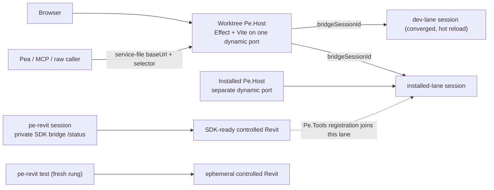

# Pe.Tools Build and Runtime Decisions

This document is the repo-level decision record for build, package, runtime, and Revit proof lanes. It intentionally explains why the lanes are separate more than it tries to be a complete runbook.

Keep detailed workflow behavior in the owning package docs, repo skills, or the tooling itself. `BUILD.md` should preserve the durable mental model future agents need before they choose a command.

## Core decision

A terminal build, a packaged artifact, a running Revit session, and an installed product are different authorities. Do not let one claim stand in for another.

The practical rule is:

> A successful `dotnet build` proves source compilation. It does not prove that any running Revit session loaded the bytes it produced.

This separation exists because Revit, hot reload, package-local outputs, isolated build outputs, installed roots, and test-owned Revit processes all have different ownership and failure modes. Collapsing them into one “build succeeded” claim creates stale-runtime bugs that are expensive to diagnose.

## Why the lanes exist

| Lane                              | Decision                                                                                   | Why it exists                                                                                             | What it proves                                                           |
| --------------------------------- | ------------------------------------------------------------------------------------------ | --------------------------------------------------------------------------------------------------------- | ------------------------------------------------------------------------ |
| **compile**                       | Ordinary terminal `dotnet build` is the safe default.                                      | Most source work should not touch Revit, installed files, or a session's hot-reload baseline.             | The selected package compiles into isolated `.artifacts/...` outputs.    |
| **artifact**                      | `./build` owns bundle, appbundle, MSI, payload, and release artifact shape.                | Packaging needs consistent repo-local topology and generated manifests, not ad hoc project builds.        | Durable artifacts were staged under `.artifacts/packages/...`.           |
| **deterministic**                 | `pe-revit test --project <P>` on a year-neutral project. | Most suites need no Revit, and the rung comes from the project — so it is the same on a build agent with no Revit installed. | Behavior with no Revit, no year lease, no process to own. |
| **fresh**                         | `pe-revit test --project <P>` on a Revit-backed project. | The user's session is expensive, slow to recover, likely stale, and usually not the thing under test. | Behavior in one ephemeral controlled Revit on the installed payload. |
| **attached**                      | `pe-revit test --project <P> --attach [--id N]`. | Only a running session can prove session, document, and loaded-assembly state; MSBuild success cannot be read as that. | Behavior inside one named controlled session, converged first. |
| **session**                       | `pe-revit session start` for a durable controlled Revit. | Worktree, experimental, and end-user proof each want a Revit that outlives one command. | Behavior in a controlled session — name its lane, `dev` or `installed`, because they run different bytes. |
| **installed**                     | Installed behavior must be validated from installed roots. | MSI/product roots and dev/runtime roots intentionally differ. | Installed bootstrap/runtime behavior, not source or session behavior. |

Deterministic, fresh, and attached are RUNGS `pe-revit test` picks from the project and discloses — not verbs you type. `pe-revit test --plan --project <P>` prints the rung and why. A Revit-backed claim also names the session's custody, `controlled` or `observed`, per ADR 0008.

## Product context decision

The pea product tools keep narrow repo-specific context because this environment is unusually easy to misread:

- Revit and the IDE are long-lived user processes.
- Hot reload can report success without proving the loaded Revit assembly graph is behaviorally fresh.
- Host reachability, Revit bridge connectivity, active documents, and log deltas are separate facts.
- A Revit-backed test can own an ephemeral process or attach to an existing session; those are not interchangeable.
- Source-linked `pea`, installed `pea`, dev `Pe.Host`, and installed `Pe.Host` are different runtime roots.

The SDK encodes custody, session lifecycle, rung selection, materialization, and explicit proof/does-not-prove language. The pea MCP tools add the product context around that: read-only orientation (`pe_status`), bounded Pea/host/Revit logs (`pe_logs`), product probes, and `pea --prompt` for black-box Pea feedback.

That does not make `BUILD.md` a tool manual. The durable decision is: **when the claim depends on current Revit state, drive it with `pe-revit session` and `pe-revit test` instead of reproducing that orchestration by hand or resurrecting removed `pe-dev` commands; use the pea tools only when Pea status/logs or product probes should accompany the proof.** For how those verbs behave — flags, refusal codes, the resolver's five states — run `pe-revit guide session` and `pe-revit guide test`. This doc never restates them: a repo copy of an SDK flag is a cache that rots.

## Environment limitations this repo designs around

- **Windows dotnet state can be poisoned.** Missing core Windows environment variables can break NuGet/MSBuild restore with errors such as `Value cannot be null. (Parameter 'path1')`. The build tool detects this and points to `tools/dotnet-sandbox-safe.ps1`; recovery notes live in that script's comment header.
- **Revit process startup is expensive.** A cold start is 90-300s. Avoid touching a session unless its UI/document state is the subject of proof.
- **The dev session is user-owned state.** A restart can cost minutes and reopens only the active document. Attached proof should be deliberate and evidence-based.
- **Hot reload is useful but not proof by itself.** Treat an applied delta as a step toward a behavior/log/script/test proof, not as the final freshness claim. `buildStamp` is provenance only; loaded-path identity and a restart are the freshness facts.
- **Terminal isolated outputs do not feed a session's loaded assemblies.** The safe compile lane writes `.artifacts/...`; a dev-lane session runs a byte copy of the package-local interactive build, and the installed lane runs neither.
- **Installed and dev roots are separate.** Do not validate installed behavior against dev host/runtime roots.

## Build modes and output ownership

| Mode                              | Selected by                                       | Output owner                       | Decision                                                               |
| --------------------------------- | ------------------------------------------------- | ---------------------------------- | ---------------------------------------------------------------------- |
| **Isolated**                      | Plain terminal `dotnet build`, `./build`, CI      | `.artifacts/...`                   | Default for safe source/package proof.                                 |
| **Interactive/package-local**     | An IDE build or explicit non-isolated override    | Package-local `bin/obj`            | The byte source a dev-lane session copies from and the emitter baselines against. |
| **Terminal interactive override** | `/p:PeIsolatedBuild=false`                        | Package-local `bin/obj` from shell | Escape hatch; rewrites the fixed path a live dev-lane session was copied from. Use deliberately. |

Verified mechanics:

- Isolated builds redirect outputs into `.artifacts/build/...`.
- Non-isolated builds keep package-local `obj/$(Configuration)` intermediates.
- Full `pack` publishes Pe.App once into `.artifacts/publish/installer/revit/<year>`.
- Repo guards disable `DeployAddin` and `LaunchRevit` during isolated terminal builds.
- `.Tests` configurations force off `DeployAddin` and `LaunchRevit`.
- Non-release interactive builds pin `AssemblyInformationalVersion` to stable `dev` to reduce hot-reload baseline churn from generated metadata.

## Session launch decision

**No IDE is part of a session's lifecycle.** `pe-revit session` starts, converges, restarts, and stops every Revit this repo drives; there is no Rider plugin, no run/debug configuration in the launch contract, and no bridge to install. The durable model is:

```text
MSBuild solution configuration (Debug.R24 / Debug.R25 / Debug.R26)
=> Pe.Revit.Sdk RevitVersion inference from the Directory.Build.props year list
=> TargetFramework, Revit API refs, and the package-local interactive build output
=> pe-revit session start --project ... byte-copies that output into an immutable generation
```

The active solution configuration is the year authority. What an IDE build still contributes is exactly one thing: it writes the **package-local fixed-path output** (`bin/obj`, not `.artifacts/`) that a dev-lane session copies from and that the hot-reload emitter baselines against. Any build that writes that path — Rider, VS Code, or `dotnet build /p:PeIsolatedBuild=false` — serves equally, and none of them launches Revit.

```powershell
dotnet tool run pe-revit -- session converge --project .\source\Pe.App\Pe.App.csproj   # start-or-attach, the edit loop
dotnet tool run pe-revit -- session restart --id pe.app-25                             # the freshness mechanism
dotnet tool run pe-revit -- session status --json                                      # what is running, machine-wide
```

`pe-revit guide session` owns the mechanics — the five resolution states, custody, legs, the refusal table, what converge will and will not do. Read it there rather than here. Two things are worth knowing before you type anything: converge attaches and never restarts, and `dotnet build` succeeds while a session runs because Revit loaded the generation copy, not your build tree.

The debugger remains an ordinary attach-to-process against the session's Revit, and it is mutually exclusive with the emitter after the first hot-reload generation.

## Compile decision

Use ordinary `dotnet build` when you need compile confidence.

```powershell
dotnet build .\source\Pe.Revit\Pe.Revit.csproj -c Debug.R25
dotnet build .\source\Pe.App\Pe.App.csproj -c Debug.R25
dotnet build .\source\Pe.Dev.Cli\Pe.Dev.Cli.csproj -c Debug.R25
```

This proves compile correctness only. It does not refresh any session's loaded assemblies, the package-local interactive outputs, installed product roots, or source-linked TypeScript payloads.

## Revit proof decisions

### The verb chooses the rung; you choose whether to override it

`pe-revit test --project <P>` is the whole test surface. It reads the project, picks deterministic or fresh, and says which and why. `--attach` is the one override, and it is the only rung a caller decides.

```powershell
dotnet tool run pe-revit -- test --plan --project .\source\Pe.Revit.Tests\Pe.Revit.Tests.csproj --json
dotnet tool run pe-revit -- test --project .\source\Pe.Revit.Tests\Pe.Revit.Tests.csproj --filter "Name~Reports_runtime_assembly_load_paths" --timeout-seconds 900 --json
```

Run `--plan` first when the rung is not obvious: it prints the chosen rung, the reason, the resolved year and configuration, and the exact command, and launches nothing. Real Revit-backed runs should carry a bounded timeout, because a Revit launch or a test-adapter hang is otherwise easy to mistake for agent failure. `pe-revit guide test` owns the refusal table and the fresh-rung machinery.

The durable decision behind the ladder: **the rung comes from the project, never from the machine.** The same csproj takes the same rung on a build agent with no Revit installed as on a developer desktop. Do not build repo-side logic that picks a rung from what happens to be running.

### attached is for a session that already exists

Use `--attach [--id N]` only when a running session's active document, UI state, loaded assemblies, or black-box product behavior is the thing being validated. It converges that session first, so the code under test is the code you just saved.

Do not treat attached proof as “run a build, then trust it.” The attached loop must answer separate questions:

1. Is Host reachable?
2. Is the private Revit bridge connected?
3. Is the required document/session state present?
4. Did the relevant refresh path — a converged delta, or a restart — actually happen?
5. Did a behavior probe, script, host operation, attached test, log delta, or Pea black-box interaction prove the intended behavior?

Prefer the fresh rung whenever hot-reload risk, stale-assembly evidence, member-shape changes, or WPF/BAML/resource changes make an attached answer ambiguous. Several attached runs in a row can leave test and library assemblies loaded until the session restarts.

Attached probes can include host operations, script execution against the running document, attached Revit tests, or black-box Pea review. Script execution is a first-class proof path because it can reference Pe assemblies and exercise Host/Revit behavior in the session. Pea black-box review is also a first-class product harness because it tests the operator-facing product rather than the repo agent’s assumptions.

Do not document or depend on removed public `pe-dev` command groups (`doctor`, `status`, `sync`, `env`, `revit`, or `verify`) for session work. `pe-revit session` owns lifecycle and freshness; the pea MCP tools add Pea status/log context and product-facing probes.

### A durable session, for work one command cannot hold

`pe-revit session start` when the Revit must outlive a single verb: a worktree proving a change beside the user's own session, or an end-user-shaped run on the installed payload.

```powershell
dotnet tool run pe-revit -- session start --year 25 --id pe.app-25-probe --json          # installed payload
dotnet tool run pe-revit -- session start --project .\source\Pe.App\Pe.App.csproj --year 25 --json   # this checkout's bytes
```

Bare `start` (no `--project`) is the **installed** lane — every product on its `current.txt` pointer, no checkout, no build, no copy. That is what an end user runs, and it is the only lane that proves installed behavior. Adding `--project` makes it the **dev** lane. Name which one any claim used; they run different bytes and prove different things.

Every session pe-revit starts is `controlled`, so `session status`, `doc *`, `op list`, and stop/restart all work against it. A Revit the user launched is `observed`: readable, never mutable. Do not add a Pe.Tools-side guard for that — the SDK resolver refuses it before the verb runs.

## Packaging and release decisions

### `./build` is packaging authority, not compile authority

Use `./build` for package and release orchestration. Do not grow it into a replacement for normal `dotnet build`.

```powershell
dotnet run --project .\build\Build.csproj -c Release -- pack
dotnet run --project .\build\Build.csproj -c Release -- pack --configuration Release.R25
```

Pack targets:

```powershell
dotnet run --project .\build\Build.csproj -c Release -- pack desktop --configuration Release.R25
dotnet run --project .\build\Build.csproj -c Release -- pack pea
dotnet run --project .\build\Build.csproj -c Release -- pack installer
dotnet run --project .\build\Build.csproj -c Release -- pack automation
dotnet run --project .\build\Build.csproj -c Release -- pack all
```

`pack` with no explicit target is equivalent to `pack all`. `pack pea` builds only the installed Pea payload package so it can be proved without compiling Revit add-ins or creating an MSI. `pack installer` also creates the Pea payload because the MSI embeds it.

Package outputs:

- Desktop bundle: `.artifacts/packages/bundles/Pe.App.bundle.zip`
- Pea payload: `.artifacts/packages/pea/Pe.Tools.pea.<version>.zip` plus `.json` manifest
- Design Automation appbundle: `.artifacts/packages/automation/Pe.Dev.RevitAutomation.Worker.<year>.appbundle.zip`
- Portable install package: `.artifacts/packages/installers/Pe.Tools.<version>.install.zip`
- Installer: `.artifacts/packages/installers/*.msi`

`CreateBundleModule` owns the Pe.App year staging used by both transports.
`CreateInstallerModule` owns the host/Pea SEA payload builds plus the product release-signing
boundary. SDK `pe-revit install package`
copies the manifest-declared sources into the portable zip and writes its release receipt;
`pe-revit msi` consumes the same checked manifest and emits the MSI. Pe.Tools then signs that final
MSI and refreshes only the receipt's MSI SHA-256 so the receipt describes the bytes that will be
published. Pe.Tools does not rewrite a transport manifest or build zip topology.

The SDK bundle target publishes the Revit year matrix once into the installer manifest's source
root; the desktop bundle and installer transports consume those same bytes. The SDK builds the
independent year configurations in parallel. Installer packaging likewise builds Host and Pea
concurrently, then composes the install zip and MSI concurrently from their immutable payload
sources. The temporary SEA input bundles are removed after executable signing because they are
build inputs, not installed runtime files.

On Windows, installer packaging rebuilds each Vite+ bundle with Node's direct SEA builder using a
temporary Node copy whose existing Authenticode signature has been removed. It then signs and
verifies the final host and Pea executables. Injecting into the signed Node executable produces a
malformed signature table and makes SignTool fail with `0x800700C1`.

Installer packaging is deliberately complete-family: it rejects `--configuration`, requires every
`Directory.Build.props` Revit year publish root, and requires the manifest `years` transport contract
to match that matrix exactly. The SDK clears the shared Revit staging root once before parallel year
builds so stale payloads cannot survive while concurrent outputs remain isolated by year. Other pack
targets may still use `--configuration` for a narrow artifact.

`CreateAutomationBundleModule` likewise supplies only Pe.Tools policy: the worker project, eligible
year matrix, output root, and product version. SDK `PeCreateAppBundle` builds each engine lane and
owns the `.bundle`/`Contents` layout, `DBApplication` `.addin`, `PackageContents.xml`, zip, and hashed
receipt. Keep APS authentication/submission in the interim `pe-dev automation` adapter; do not
move Pe.Tools workflow semantics into the SDK or restore product-owned appbundle composition.

### Publish is a GitHub release workflow

The build pipeline has a `publish` command, but its module publishes release assets through GitHub and is skipped without a GitHub token. Treat it as CI/release-lane behavior, not a normal local validation command. Publish requires a production certificate through `PeCodeSignThumbprint` or `PeCodeSignPfx`; PFX use also requires `PE_CODESIGN_PFX_PASSWORD`. RFC 3161 timestamping is mandatory (`PeSignTimestamp=false` is rejected); `PeSignTimestampUrl` may override the default timestamp service.

Without an explicitly configured signing identity, local `pack` initializes the SDK development
certificate and signs its PE/MSI outputs without a timestamp. Those artifacts are acceptance-only:
they validate the complete signing and packaging mechanics on a developer machine that trusts the
certificate, but must not be distributed. `pack publish` rebuilds with the explicitly configured,
timestamped production identity and verifies the release artifacts before upload.

The SDK-owned `pe-revit release --build` path invokes this repo's existing `pack` command through
the manifest's `release.build` entry. SDK distribution mode bypasses the local development
certificate and verifies that reconstructed PE payloads are unsigned when no production identity
is configured. With `PeCodeSignThumbprint` or `PeCodeSignPfx`, the same path signs and verifies the
payloads with mandatory timestamping. The SDK also refuses any staged binary carrying its
development certificate, so the invalid local-certificate state cannot ship.

```powershell
dotnet run --project .\build\Build.csproj -c Release -- pack publish
```

## Runtime and install layout decisions

`Pe.Shared.Product` owns durable product identity and local runtime/user layout. Generated build projections are not the authority.

### Shared service primitive and explicit lifecycle

The SDK service primitive (`InstalledProduct.EnsureRunning` and the shipped TypeScript client) owns one named out-of-process service incarnation per product root: atomic service-file identity, actual bound port, version/lane matching, bounded startup, managed shutdown/takeover, and PID-reuse safety. Pe.Tools uses it for `Pe.Host` instead of maintaining a second product-specific supervisor.

That boundary is deliberately narrower than Revit orchestration:

- One product root plus service name means one active host. Dev and installed callers can explicitly take over that incarnation; simultaneous same-name hosts require different roots or names.
- `Pe.App` is a client of the healthy shared host, not a lane supervisor. Loading or reconnecting a Revit add-in is not permission to replace the host.
- Host discovery does not choose a Revit process. Raw `/call`, web, Pea, scripting, capture, and operation surfaces must preserve an explicit bridge-session selector; ambiguity is a hard failure.
- Script execution performs the requested targeted call only. It must not build, converge, or restart the dev session. Agents inspect freshness and invoke SDK lifecycle actions explicitly.
- A clean checkout may launch its checkout-pinned source host without a staged `Pe.Host.exe`, but that launch path is not a build or Revit-convergence path.

The acceptance bar is the field drive in `Pe.Revit.Sdk/RUNTIME_ACCEPTANCE.md` — one operator, released artifacts, a real Revit, cold start through stop. There is no second rig. Per-run records are disposable (the surviving pin decision is in `docs/features/host/LEDGER.md`).

### Runtime topology: readiness is not routing



A running web app plus an SDK-ready session are not connected unless Pe.Tools registers a
host/session route between them. The SDK proves the session's process, generation, descriptor, and
private readiness endpoint; it narrates `Pe.Host` as a companion leg but never starts it. Product
callers therefore carry two independent coordinates:

- `baseUrl` locates the Pe.Host incarnation for one installed lane or source worktree using the SDK service primitive's actual bound port.
- `bridgeSessionId` selects one Revit process inside that host and travels in `x-pe-bridge-session-id`.

Never infer one coordinate from the other. Typegen, Pea, browser operations, raw calls, settings,
capture, and scripting must preserve both; a requested/returned selector mismatch is a hard failure.

Key local roots:

```text
%LocalAppData%\Positive Energy\Pe.Tools\bin\host\      # installed shared Pe.Host runtime
%LocalAppData%\Positive Energy\Pe.Tools\bin\pea\       # PATH-visible pea launcher/payloads
%LocalAppData%\Positive Energy\Pe.Tools\dev\bin\host\  # dev-lane host runtime, not MSI-owned
```

Do not validate installed behavior against the dev host root. MSI upgrades intentionally replace the installed host runtime tree under `bin\host`; installer cleanup must never target `dev\bin\host`.

Installed Pea is an SDK `VersionedApp` payload (`product.payloads.json` → `{type: VersionedApp, name: pea, entry: pea.exe}`), fronted by a lane-aware PathShim (`target: versionedApp:pea`). The SDK install kernel owns the layout:

```text
%LOCALAPPDATA%\Positive Energy\Pe.Tools\
  shims\pea.cmd                       # SDK-written lane-aware shim (installed by default; dev when pea.dev.txt present)
  bin\pea\
    current.txt                       # active version pointer
    versions\<version>\
      pea.exe                         # the Node SEA (entry)
      bundle\                         # the SEA bundle sources
      node_modules\                   # sidecars staged beside the exe (see apps/pea/scripts/stage-native-sidecars.mjs)
      package.json                    # mastracode package-root decoy
```

The payload is a Node SEA executable produced by Vite+/tsdown from `source/pe-tools/apps/pea/src/main.ts`. Because a SEA cannot static-ESM-import external bare specifiers, `apps/pea/vite.config.ts` carries the `pe:sea-require-shim` plugin (identical to the host's): the win32 natives (duckdb/tokenizers/libsql) plus the JS sidecars that break when inlined (`drizzle-orm`, `get-stream`) are rewritten to runtime `createRequire` and staged into `node_modules\` beside the exe; `onnxruntime-node` is a throwing stub (no embedding feature runs — see SDK-LEDGER T9). `stage-native-sidecars.mjs` is the authority for the exact staged set. Build machines need Vite+ with Node 25.7.0+ and the `source/pe-tools` dependency store; end-user machines run no `pnpm install`/`deploy`/resolution. The shim resolves the installed target through `current.txt`; `pea --installed` forces it; a `pea.dev.txt` (written by `pe-revit dev link`) routes to the checkout instead.

Private `source/pe-tools` packages are source-exported for development. Their Vite+ package configs use explicit `pack.entry` values so `vp pack` can still produce artifacts without mutating package exports back to `dist`; keep installed payload bundling as the artifact boundary instead of adding parallel `main` / `main-installed` source entrypoints.

Artifact proof for `pack pea` touches no Revit. It proves archive shape and portable light CLI behavior, such as `--help` and host-operation contract search from a temp root. It does not prove attached-rung behavior, fresh-rung behavior, installed MSI registration, or full TUI rendering freshness.

### PATH-visible CLI decision

`pea` is the product/operator CLI. In the source-linked dev lane it is a PATH-visible launcher command under the installed-shaped `bin\pea` root, but it executes TypeScript sources from `source/pe-tools/apps` instead of an installer payload. (There is no separate `peco` dev CLI anymore; SDK `pe-revit` owns dev-session mechanics.)

The clean source-linked CLI model is:

- Bare `pea` launches the Pea Revit/operator agent TUI from `source/pe-tools/apps/pea/src/main.ts`.
- The source-linked `pea` package script uses `vp exec jiti src/main.ts`. This keeps the runtime under Vite+'s managed Node while letting `jiti` handle the repo's TypeScript/NodeNext source graph. Raw `vp exec node src/main.ts` is not enough for this source graph because Node's built-in TypeScript support is still strip/transform limited and does not resolve the repo's `.js` source specifiers back to `.ts`.
- `pnpm --dir source/pe-tools dev` runs the source host and its programmatic Vite server in one Node process.
- `pea <subcommand> ...` stays available for product/operator commands such as `host` and `script`.
- `pea --prompt "..." [--thread <id>] [--json]` runs one headless Pea turn and prints `{ threadId, response }` — the black-box product probe lane.
- `pea --installed ...` is the explicit installed-lane selector. Use it in installed-lane validation and scripts where ambiguity would be expensive.
- `pea --dev ...` is the explicit source-linked selector: it routes through the shim's `pea.dev.txt` marker (written by `pe-revit dev link`) and runs the Pea app from `source/pe-tools/apps/pea`.
- `PEA_RUNTIME=dev` is a local shell convenience only. Do not use ambient environment selection as proof of lane.
- `Pe.App`'s lane comes from `PePayloadContext`: loaded by the installed loader shim ⇒ `Deployment` is the lane-pinned `InstalledProduct` (host via `EnsureRunning`, siblings via `Resolve`); self-hosted classic deploy ⇒ dev lane. There is no `Pe.App.runtime.json` descriptor anymore, and no ambient lane inference.

This source-linked shape is intentionally about developer iteration, not installer payload ownership. A shim's `{name}.dev.txt` marker is a per-shim capability registration written by `pe-revit dev link`. It does not prove packaged installed behavior and should not be used as installed-lane evidence.

`pea` is the product/operator surface; SDK `pe-revit` owns source linking and Revit proof; ordinary
package scripts own TypeScript development. The repo-local `pe-dev` CLI remains automation-only as
an interim adapter over Pe.Tools-specific APS workflows. It is not a web or host supervisor.

### Source-linked web dev

Source-linked web dev is one command and one Node application process:

- `pnpm --dir source/pe-tools dev` runs the watched source `@pe/host` entrypoint.
- It creates one Node `http.Server`; Effect owns product APIs/WebSockets and the final dev fallback delegates to Vite/TanStack middleware and HMR.
- The server reuses its last available port or binds an ephemeral one. The SDK service file is the URL authority; there is no Vite proxy or second listener. A service file counts only while its pid is alive — crashed leftovers are never routed to (dev discovery fails fast instead of falling back to a default port) and are swept on the next host start.
- Each checkout owns `host-source-<hash-of-canonical-source-root>.json`. Different worktrees coexist; the installed lane remains `host.json` and coexists with every source host.
- `--take-over-host` replaces only an older incarnation with the same service name. The candidate binds a free port first, claims ownership, shuts down the incumbent, then initializes product state.
- React edits use Vite HMR without restarting the process. Host edits restart the whole process and normally reclaim the worktree's preferred port.

The browser remains same-origin because the literal server owns both surfaces. Revit, Pea, MCPs, and spawned sessions receive or discover that worktree's service-file URL; callers never assume `5180`.

Installed/product web behavior is separate: the installed host serves the built SPA itself. The source dev entrypoint is not installed-lane proof.

Useful dev-lane refresh commands:

```powershell
pe-revit path ensure     # once per machine: registers <appBase>\shims on the user PATH (safely)
pe-revit dev link        # from this checkout: routes pea and pe-dev shims to source
pe-revit dev status      # shows each shim's resolved lane
pnpm --dir source/pe-tools dev
pea
pea --installed --help
```

PATH and dev-shim management is SDK-owned (`pe-revit path`, `pe-revit dev`). The deleted
`pe-dev bootstrap-path` and `pe-dev pea link-dev` commands hand-edited the user
PATH (REG_SZ overwrite, whole-PATH rewrites) and maintained a second launcher generator in `bin\pea`.
One PATH entry — the product shims dir — is the condoned way onto PATH; everything else is a shim
file in that dir. A shim runs dev when ITS `{name}.dev.txt` exists (written by `dev link`), installed
otherwise; `--installed` / `PE_LANE=installed` forces the installed target.

Worktree identity is by location, like git: clients derive their checkout root by walking up from
cwd (`.git` + `Pe.Tools.slnx`), so an agent working in a worktree automatically addresses that
worktree's dev host — no env vars. `PE_LANE` / `PE_TOOLS_HOST_SOURCE_DIR` are spawn plumbing (a
supervisor telling its child who it is), never user configuration. To target explicitly, `--host`
(and `PE_TOOLS_HOST_BASE_URL`) accept a URL or a lane token: `installed`, `dev` (this location's
worktree), or a path inside any checkout. `pe-revit service list` is the phone book;
`pe-revit session status` lists every Revit the machine is running, controlled and observed alike.

If you used the old flow on this machine, clean up once: delete `%LOCALAPPDATA%\Positive Energy\Pe.Tools\bin\pea\*.cmd`
and remove the `bin\pea` / Pe.Dev.Cli output-dir entries from your user PATH (the SDK never writes those).

Do not use a dev command to rewrite the installed-shaped `pea` payload selection: source-linked dev
work is `pe-revit dev link` + `pea`; packaged installed payload validation is the
installer/package lane or `pea --installed ...`.

## Contract decisions (runtime op catalog)

The runtime contract self-registers: C# `BridgeOp` fields/`[BridgeOperation]` methods register at startup, and the TS host serves the live catalog — request/response JSON Schemas included — from `GET /ops` (rationale: `docs/features/host/LEDGER.md`). Typegen runs two lanes (`7af1eba`):

```powershell
# offline lane (deterministic; catalog projected from C# source via pe-dev ops-catalog)
pnpm --filter @pe/host-contracts codegen
pnpm --filter @pe/host-contracts codegen:check
# live lane: session-targeted parity check against a running host
pnpm --filter @pe/host-contracts codegen:verify-live -- --session <bridgeSessionId>
```

The generator is `packages/host-contracts/scripts/host-typegen.ts`; root `pnpm typegen:check` delegates to the offline `codegen:check` and runs inside `pnpm ready`. Regenerate after changing a C# request/response DTO or adding an op, and commit the result like a lockfile. Schema required-ness is honest per direction: response properties are required exactly when non-nullable in C#; request properties are required only when non-nullable *and* their constructor parameter has no default (`BridgeOpSchemaGenerator`).

What lives in `@pe/host-contracts`:

- `src/generated/host-ops.generated.ts` — the typegen lockfile: per-op request/response interfaces, the `HostOps` map, `hostOpKeys`.
- `src/operation-types.ts` — hand-authored TS-only op schemas (settings runtime, APS auth, logs), key guards, `OpKey`/`OpRequestOf`/`OpResponseOf`.
- `src/contracts/` — hand-authored bridge protocol, product constants, and operation vocabulary.

Session selection is caller scope, not operation payload: `HostSessionScope.bridgeSessionId` travels as the `x-pe-bridge-session-id` header on `POST /call` and `GET /ops`. The catalog response echoes `bridgeSessionId`; the live verify lane refuses a mismatched echo. The offline lane involves no session at all — and today it silently swallows a `--session` arg (host ledger, drive B-10).

### Field options, examples, and the registration gate

Operation metadata travels with the thing it describes, and the connected session validates it at registration — callers never hand-maintain a parallel copy.

- **Field options and descriptions live on the request DTO.** `[FieldOptions("<domain>")]` on a property (`source/Pe.Shared.RevitData/FieldOptionsAttribute.cs`) makes `BridgeOpSchemaGenerator` emit an `x-options` node on that property's request schema, and the property's XML `<summary>` becomes its schema `description`. The `/ops` form renders an option-backed string field as an input + `<datalist>` and shows the description; agents read the same off the catalog. This requires `GenerateDocumentationFile` on the *defining* project and the `.xml` present beside the assembly at runtime (it deploys with the bundle, so a missing description usually means the dependency's outputs went stale — see the SDK stamp/deploy note above — not that XML was skipped).
- **Options resolve live, by source key.** The `revit.catalog.field-options` op (`{ sourceKey }` → `FieldOptionsData`) resolves against the shared `SettingsValueDomainRegistry` — the *same* value domains the settings field-options path uses, so category/family/parameter lists come from the open document. Because it resolves by key alone (no property binding), a source key must be globally unambiguous.
- **Registration is the validation gate.** `BridgeOpRegistry` scans in two phases — discover + validate the whole set, then commit — so a failed op cannot half-register and mask the real error when the bridge supervisor re-scans on every reconnect. Validation strict-deserializes every request example and safe default against the request type (`MissingMemberHandling.Error`), so example drift fails registration and the unit tests instead of reaching a caller. Examples and call guidance are capped at two entries each.

## Design Automation decision

Design Automation flows touch no Revit session. Keep first-pass audit manifests intentionally small: one or two models before broadening.

```powershell
pe-dev automation auth login
pe-dev automation browse hubs
pe-dev automation manifest create --path docs/context/my-run/schedules.json
pe-dev automation submit schedules --manifest docs/context/my-run/schedules.json
pe-dev automation inspect receipt --receipt latest --download-artifacts true
```

The automation shell is `Pe.Dev.RevitAutomation.Worker`, not desktop `Pe.App`. Desktop and DA remain
sibling shells over shared DA-safe runtime packages. `pe-dev automation` is an interim thin terminal
adapter; a future Pea/host workflow can replace it when product use proves the right operation shape.

## Build matrix and configuration facts

- Default Revit year: `2025`.
- Default no-config solution configuration: `Debug.R25`.
- Solution configurations span `Debug`/`Release` for R23-R26, plus matching `.Tests` variants.
- Revit 2023/2024 packages target `net48`.
- Revit 2025/2026 and out-of-proc tooling target `net8.0-windows`.
- `Pe.Shared.*` packages are `netstandard2.0` shared-neutral libraries.
- Build packaging projects are explicit build-infrastructure tools.
- `Pe.Revit.Tests` is the only package whose projects can take the fresh or attached rung; everything else is deterministic.

## Build/package authorities

- `Pe.Tools.slnx` is IDE organization and parity input, not the build-matrix source of truth.
- `Directory.Build.props` owns the repo Revit-year list, default year, short solution configurations, isolated defaults, and product knobs.
- `Pe.Revit.Sdk` owns project taxonomy, target-framework projection, Revit package policy, deploy, and guardrails.
- `Pe.Revit.Versioning` owns non-MSBuild Revit suffixes and Design Automation support facts.
- `build/BuildArtifactLayout.cs` owns `.artifacts/...` package topology.
- `build/ProductLayoutAuthority.cs` composes repo/build/install layout and SDK installer payload paths.
- `pe-revit install package` and `pe-revit msi` own transport composition from the checked
  `product.payloads.json`; `CreateInstallerModule` only produces its declared source directories.

## Compact command index

| Goal                              | Use                                                                                                                              |
| --------------------------------- | -------------------------------------------------------------------------------------------------------------------------------- |
| Safe compile                      | `dotnet build .\source\<Package>\<Package>.csproj -c Debug.R25`                                                                  |
| Recover poisoned dotnet sandbox   | `.\tools\dotnet-sandbox-safe.ps1 <dotnet args>`                                                                                  |
| Revit-backed test proof           | `dotnet tool run pe-revit -- test --project <P> --filter "Name~..." --timeout-seconds 900 --json`                                |
| Which rung, and why               | `dotnet tool run pe-revit -- test --plan --project <P> --json`                                                                   |
| Attached proof                    | `dotnet tool run pe-revit -- test --project <P> --attach [--id <name>]`; add pea product tools (`pe_status`, `pe_logs`, `pea --prompt`) when Pea status/logs or product probes should accompany the proof. |
| Start-or-attach the edit loop     | `dotnet tool run pe-revit -- session converge --project .\source\Pe.App\Pe.App.csproj`                                          |
| What Revit is running             | `dotnet tool run pe-revit -- session status --json`                                                                              |
| Durable installed-lane session    | `dotnet tool run pe-revit -- session start --year 25 --json`                                                                     |
| Product host/log/script check     | `pea host ...`, `pea script ...`                                                                                                 |
| Package artifacts/MSI             | `dotnet run --project .\build\Build.csproj -c Release -- pack`                                                                   |
| Package one year                  | `dotnet run --project .\build\Build.csproj -c Release -- pack --configuration Release.R25`                                       |
| Package desktop bundle only       | `dotnet run --project .\build\Build.csproj -c Release -- pack desktop --configuration Release.R25`                               |
| Package Pea payload only          | `dotnet run --project .\build\Build.csproj -c Release -- pack pea`                                                               |
| Package installer only            | `dotnet run --project .\build\Build.csproj -c Release -- pack installer`                                                        |
| Package automation appbundle only | `dotnet run --project .\build\Build.csproj -c Release -- pack automation`                                                        |
| Publish GitHub release artifacts  | `dotnet run --project .\build\Build.csproj -c Release -- pack publish`                                                           |
| Link source CLI shims             | `pe-revit path ensure` (once), `pe-revit dev link`, then `pea` / `pe-dev automation`                                              |
| Run source web dev explicitly     | `pnpm --dir source/pe-tools dev`                                                                                                  |
| Validate installed `pea` lane     | `pea --installed ...`                                                                                                            |
| Regenerate host op types          | `pnpm --filter @pe/host-contracts codegen` (offline); `codegen:verify-live -- --session <id>` for live parity                    |
