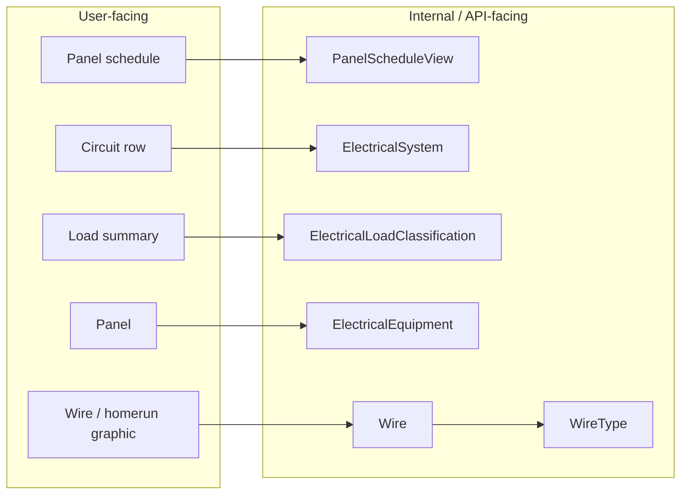
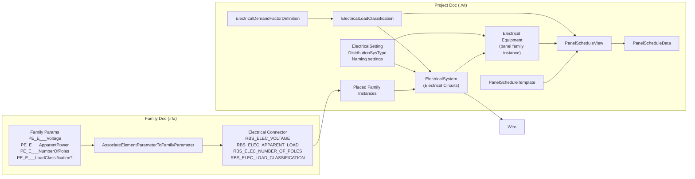
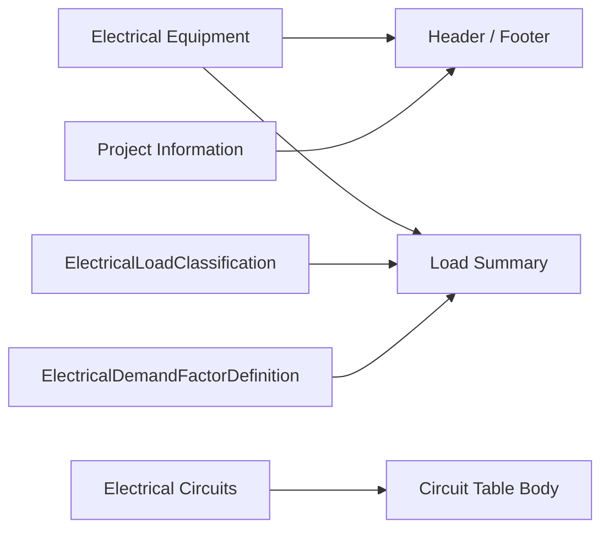
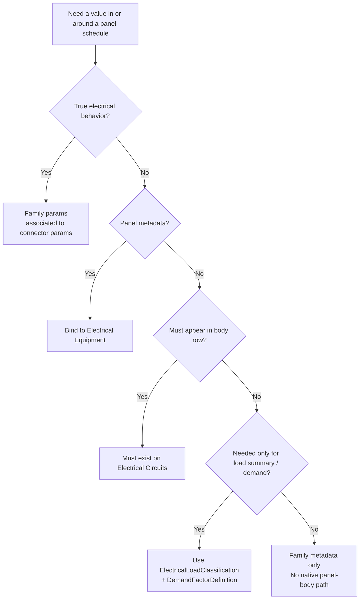
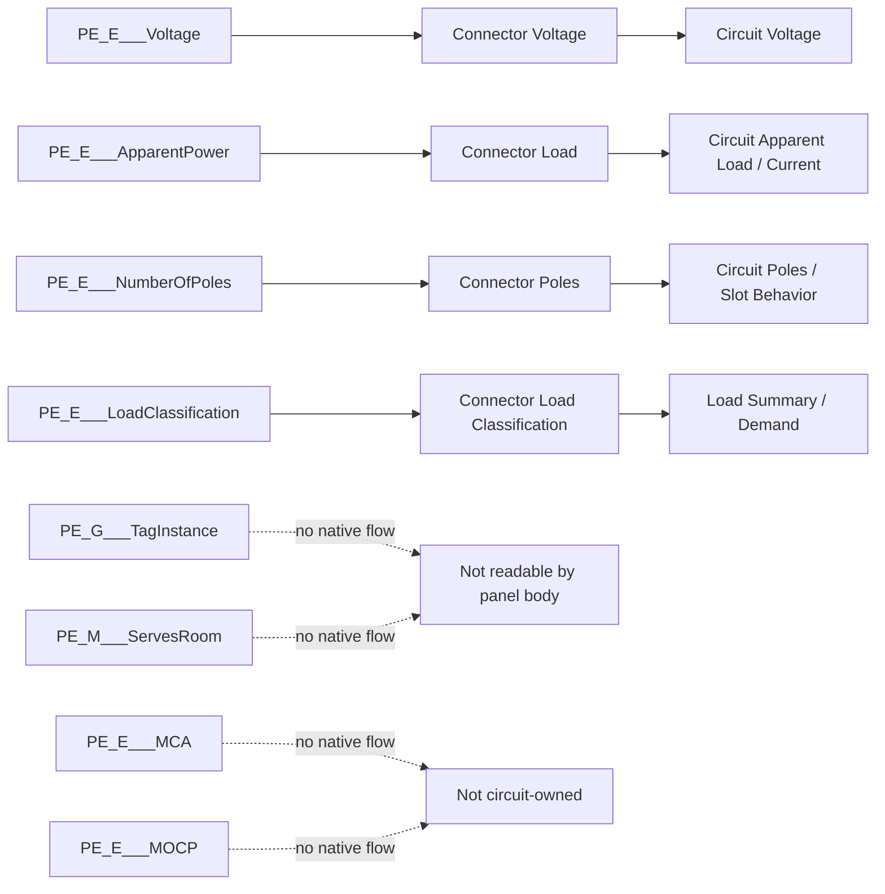
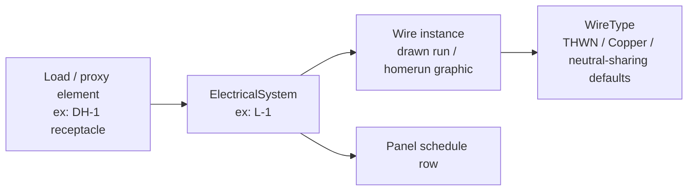
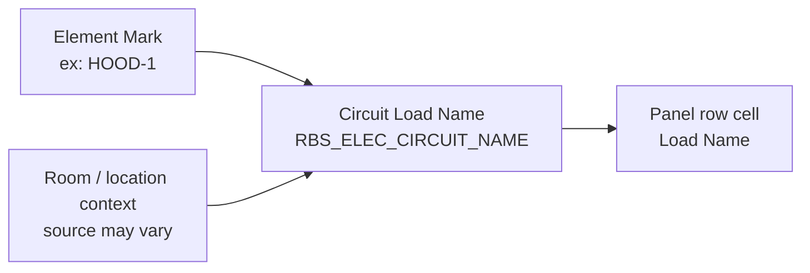
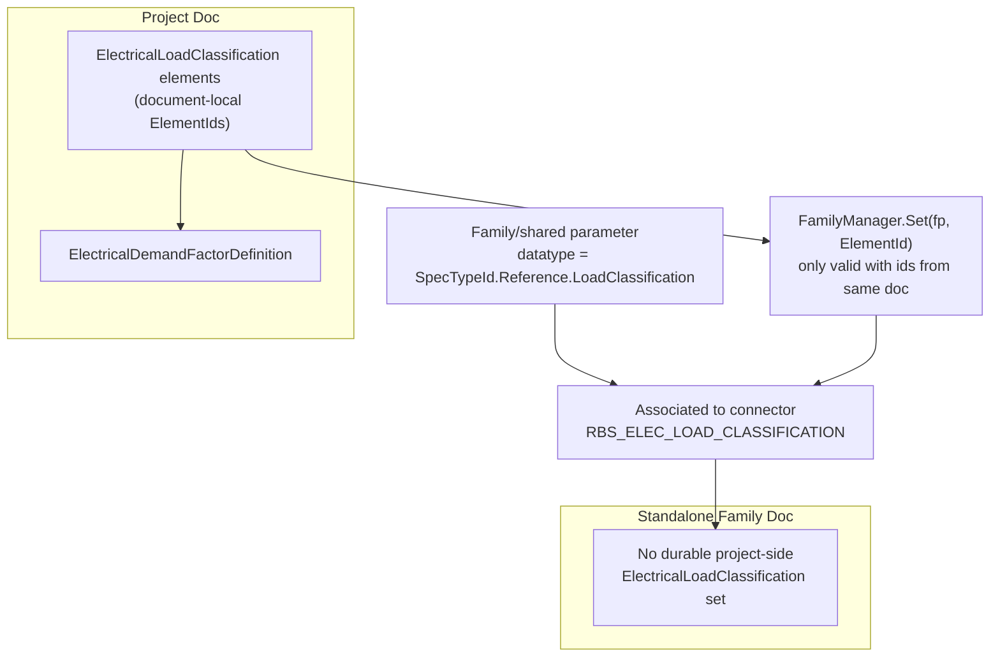
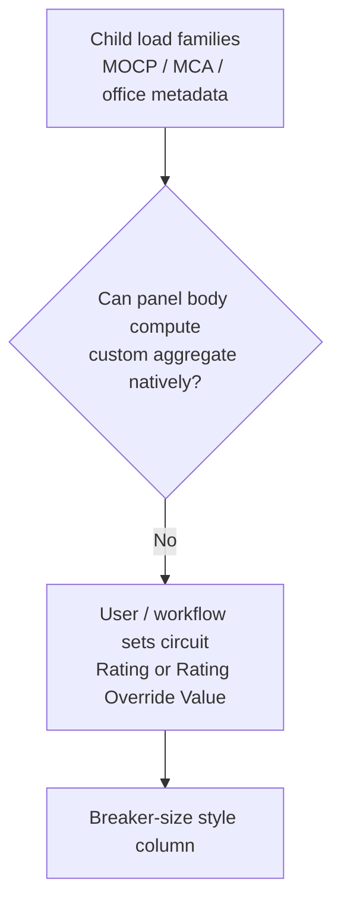
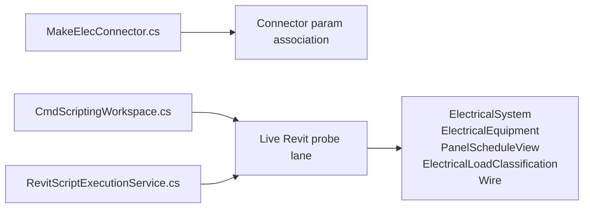

# Revit Panel Schedule Topology

## 0. User-Facing vs Internal

Rule:

- use user-facing terms for UX/workflow discussion
- use internal terms for ownership, APIs, and debugging

## 1. Whole System

Rule:

- `ElectricalSystem` owns circuit identity
- `Wire` is attached to that circuit as routing/graphics
- `WireType` owns conductor/material defaults, not panel-row identity

## 2. What Each Schedule Section Can Read

## 3. Parameter Home Decision

## 4. Native Flow vs Dead Ends

## 5. Wire Parentage

Observed example:

- proxy receptacle `DH-1` -> circuit `L-1`
- selected wire `6714280` -> `MEPSystem = ElectricalSystem 6714279`
- wire type `THWN (Copper w/ Neutral)` controls conductor/material defaults
- panel schedule reads the circuit, not the wire

## 6. `Load Name` Reality

Observed live examples:

- `HOOD-1 - Kitchen 100`
- `EVSE-1 - Carport`
- `Panel 'L'`

## 7. Load Classification Identity Problem

Rule:

- association is portable
- referenced value identity is document-local

## 8. Breaker / MOCP Limitation

## 9. Repo Touchpoints

