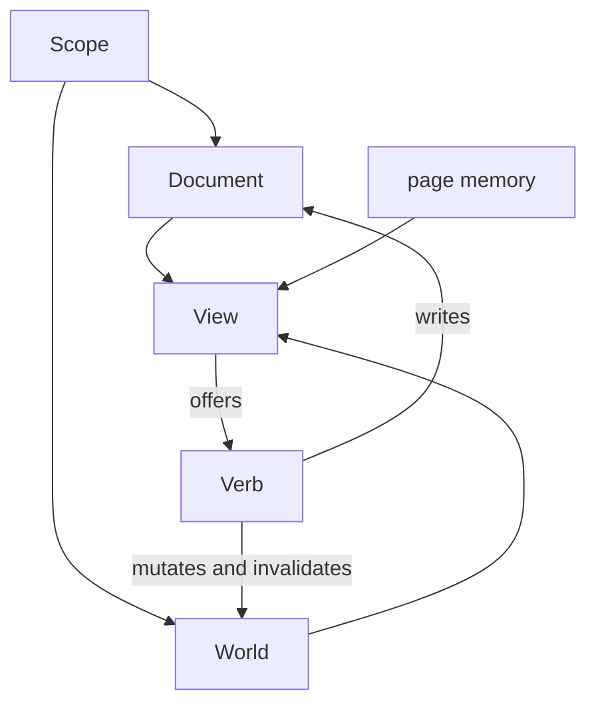
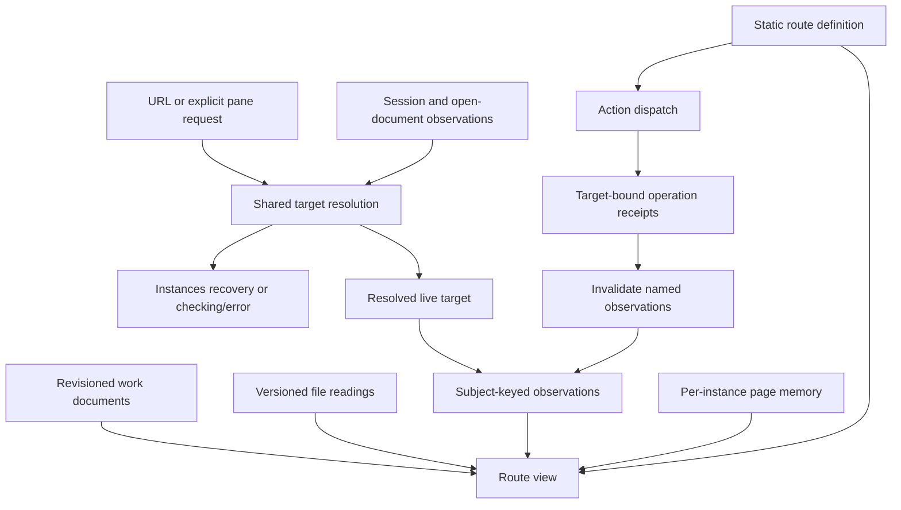

# Route primitive — spec (demiurge round 1, 2026-09-07)

Status: shape proposed, not built. Verdicts in `LEDGER.md` Decided (2026-09-07 lines).
Delete this file when the shape lands in code or the effort is abandoned.

Scope: one primitive for every Revit tool route in `source/pe-tools/apps/web`. A route binds to a
Revit document, reads model facts, stages edits, and commits them through a host operation.

---

## 1. Nouns

Six nouns. Three data, one capability, two projections.

| Noun | Kind | Definition |
|---|---|---|
| `Scope` | data | The (Revit session, document) pair the route exists at. Not a binding. |
| `Document` | data | The persisted, revisioned, co-edited JSON. Schema, write mask, commands. |
| `World` | projection | Everything read from Revit or disk. A cache with a subject and an observation time. |
| `Verb` | capability | A named, refusable, at-most-once unit of work. |
| `View` | projection | Panes, tables, plans. A pure function of (`Document`, `World`, page memory). |
| page memory | data | Cursor, filters, open panels, draft. Per tab. Never persisted. |

Nouns removed: `Link`, `Slot`, `Bound`, `Multi`, `Stage`, `Feed`, `Lane`, `Store`.
`targeting/model.ts:12-53` is a view model that is used as a state model. `Stage` is a grouping of
verbs by precondition and is derivable from `Verb.demands`. `Lane` is a property of the `World`
provider. A store is the runtime instance of the six nouns, not a seventh noun.



---

## 2. The shape

### 2.1 `Verb` is the primitive

Every requested capability is a projection of one `Verb` record. Nothing is declared twice.

```ts
// The one record. Six consumers read it.
interface Verb<K extends string, VK extends string = string> {
  key: VK                                   // agent tool name = `${route}.${key}`; doc anchor = #key
  label: string                             // button, menu row, tutorial row, tool title
  demands: readonly K[]                     // drives refusal and the "needs" sentence
  kind: "act" | "commit" | "nav" | "panel"  // "seam" is REMOVED; a seam is an absent capability
  run: (bound: Bound<K>, world: World<K>) => Promise<string | void>
  refuse: (bound: Bound<K>, world: World<K>) => string | null
  needs: string                             // the human sentence behind `demands`
  chord?: Hotkey                            // @tanstack/hotkeys literal type
  says?: string                             // one sentence for a stranger; also the agent tool description
  agent?: "any" | "human"                   // mirrors RouteStateCommandSpec.actor
}
```

| Projection | Source | Cost |
|---|---|---|
| button and refusal | `label`, `demands`, `refuse` | exists today |
| keyboard binding | `chord` → `useHotkeys` with `options.meta` | one registration loop |
| tutorial row | `useHotkeyRegistrations()` reads live registrations | zero per route |
| agent tool | `key`, `says`, `agent` | replaces a second declaration |
| demo id | `` `${stage.key}-${verb.key}` `` as a const-generic union | type only |
| documentation line | `says`, plus a `docs` JSX slot on the manifest | zero per route |

### 2.2 The manifest is static

The manifest moves to module scope. Today `takeoff/route-workspace.tsx:157-256` builds verbs inside
the React render function, closed over `live`, `zones`, and `r10Result`, with one verb constructed
conditionally. No module-level value names the verb keys, so no union exists.

This one change unlocks the `?demo=` union, the static keymap, the static tutorial, and the
generated agent tool list. It is the first move and everything else depends on it.

```ts
interface Product<K extends string> {
  key: string
  name: string
  slots: Readonly<Record<K, Link<K>>>
  stages: readonly Stage<K>[]      // verbs → keymap, tutorial, demo ids
  panes: readonly Pane<K>[]        // → pane map; a JSON view is a pane
  docs?: React.ReactNode           // orientation prose; the only prose channel
  files?: readonly BoundFileSpec[] // §2.5
}
```

### 2.3 Lanes are layers; `?demo=` replaces `?source=fixture`

`Atom.runtime` takes a `Layer` and threads the layer's `R` into every atom built on it
(`effect/src/unstable/reactivity/Atom.ts:796-812`, `714-732`). A demo layer that omits a capability
is a compile error at the atom, not a runtime `undefined`.

A demo is `Layer × Snapshot`: the layer fixes behaviour, the snapshot fixes the moment. Neither half
does the other's job, because behaviour composes and state does not.

```ts
type ActionId<P> = /* `${stage.key}-${verb.key}` union, const generics */
type DemoOf<P> = Readonly<Record<ActionId<P>, Demo<P>>>   // total map; a missing action does not compile

interface Demo<P> {
  title: string
  layer: Layer.Layer<RouteCaps>      // host reads, host writes, clock, ids, failure injection
  seed: RouteDocOf<Spec>             // route document seed; the doc stays live and writable
  page: Partial<PageMemory<P>>       // ~15 loose atoms collapse to one seedable record
  scope: Scope                       // the demo names the scope; the URL does not repeat it
}
```

Consequences: `kind: "seam"` and the paired `needs` string are deleted, because a seam is an absent
service and the refusal derives. `?source=fixture` is deleted. The demo lane can write, so demos
are the deterministic proof lane.

### 2.4 One socket, two loss policies

Transport unifies. Semantics do not.

```ts
interface PeFrame<T extends PeTopic = PeTopic> {
  seq: number       // monotonic per (connection, topic). Gaps prove loss. Must be ADDED at apps/host/src/app.ts:153
  at: number        // server clock
  topic: T
  body: PeBody<T>
}

type PeTopic =
  | { kind: "doc"; route: string; scope: string }  // COALESCING: latest wins, a frame is a full snapshot
  | { kind: "bridge"; sessionId: string }          // DISCRETE: every frame matters, a gap is a real loss
  | { kind: "thread"; threadId: string }
  | { kind: "scope"; threadId: string }

interface PeLink {
  connected: boolean
  gaps: ReadonlyMap<string, number>   // "your host reads may be stale"; does not exist today
  at: number | null
}
```

`doc` frames are snapshots and cannot be lost. `bridge` frames are events and can be lost, silently,
today. The envelope makes that visible; it does not remove it.

Law: no component opens a connection. The mediator is never on a write path. `docWriter` reads the
registry synchronously and POSTs directly (`state/route-store.ts:436-456`); that stays.

### 2.5 A bound local file is a spec, not a per-route improvisation

```ts
interface BoundFileSpec<F extends z.ZodType> {
  id: typeof settingsDocumentIdSchema   // {moduleKey, rootKey, relativePath} — survives a machine change
  content: F                            // the file's own zod schema. Missing today.
  overlay: "trichotomy" | "none"        // what the route stages against pointers into it
}

interface BoundFileSlice<F> {
  id: SettingsDocumentId | null
  read: { rawContent: string; token: string | null; observedAt: string; modified: string | null } | null
  parsed: z.infer<F> | null
  parseError: string | null             // the raw pane's reason to exist
  map: JsonMap                          // pointer ↔ character range, `json-map.ts:36`
  drift: "fresh" | "stale" | "conflict" | "gone"
}
```

The route document holds pointers and staging, never the file's content. The user's artifact never
receives route-internal state. Conflict detection is the token carried from read to write; there is
no watcher, no sync engine, no lock.

Raw view and editable view are two products. The raw view always ships. The editable view stages a
whole-file replacement and refuses on syntax error, refuses on route schema failure, warns on host
validation failure, then stages pointer patches through the same trichotomy a form edit uses.

### 2.6 Surfaces

- Status chip: the lamp (host, session phase, the bound world's name, checked-at) plus the release
  field, plus one door beside the frame. Two marks, one frame each.
- The door opens the meta surface: keys, panes, `docs` prose, and an inspector tab in dev builds.
- Theme and settings leave the product route name line. A JSON view is a `Pane`, not a chip item.
- The inspector is a dev tool. `inspector.set()` never ships. The inspector must also WRITE demo
  snapshot files, which is what makes §2.3 adoptable past demo ten.

### 2.7 Identity and lifetime

Identity is `(route, Scope)`. One key, not two; today `liveTakeoffsStoreKey` (`takeoff/route.tsx:104`)
and `RouteAtomKey` (`state/route-store.ts:295-310`) are two keys for one identity and can disagree.
The document stream is Scope-scoped, the store is mount-scoped, and the store is a lease on the
stream rather than its owner. Disposal must handle an in-flight verb: today `inFlight`
(`state/route-store.ts:87`) is a closure boolean and a disposed store's verb still calls
`registry.set` on released atoms.

---

## 3. Justification

| Decision | Evidence |
|---|---|
| `Verb` carries the chord and the prose | The hand-written tutorial already lies six days after it was written: `components/proto-tutorial/measure.ts:90-95` documents `Alt+1..n`, and no `Alt+` binding exists in `apps/web/src`. |
| The manifest leaves render | Verbs built in `takeoff/route-workspace.tsx:157-256` cannot produce a key union, so `?demo=`, the keymap, and the tool list cannot be typed. |
| Transport unifies | Two independent comments record the same injury: `state/route-store.ts:359-361` and `chat/scope.ts:17-20`. Chrome allows six connections per origin. The worst-case page uses five, and one of those is a duplicate `/events` at `takeoff/host.ts:155` beside the singleton at `host/events.ts:9`. |
| Semantics do not unify | `agent-controller-web.ts:314-335` coalesces route-document frames by design. `apps/host/src/app.ts:150` fans out every bridge event with no id and no replay. One loss policy loses one of the two. |
| Capabilities become services | `Atom.runtime`'s layer threads `R` into every atom (`Atom.ts:796-812`, `714-732`), so a missing capability is a compile error. `Clock` is a `Context.Reference` with a default (`effect/src/Clock.ts:111`) and therefore cannot be policed; a policed capability must be `Context.Service` with no default. |
| Page memory becomes one record | ~15 independent atoms (`takeoff/store.ts:406-427`) cannot be seeded as a unit, so `?demo=audit-partition` cannot land on the audit stage with a zone selected. |
| The inspector cannot answer "why" yet | Cause is a single mutable slot (`state/atom-inspect.ts:85`) overwritten by the next write and cleared by a 100ms poll (`:175`). Two writes in one tick misattribute. Change detection is `Object.is` on that poll (`:118`). |
| Labels must be forced | 113 `Atom.make`/`Atom.family` sites stand against 130 `owned(` sites and do not correspond (`families/store.ts:53,92,110,120,130`). Unlabelled nodes print as `"unlabelled"` (`state/atom-inspect.ts:57`). |
| `basis` is not provenance | `basis: readonly string[]` (`state/route-store.ts:198`) is a cache key doing duty as a subject. `hostRead(basis, read)` takes a thunk (`:202`) so it cannot know which host operation ran. |
| The bound-file primitive already exists unnamed | `route:settings` is a generic bound-file contract: `settings.ts:59-64` is the name, `:78-89` the reading, `:94-100` the route overlay. |
| Its conflict check is inert | `settings-commands.ts:103-121` re-opens the file and takes `expectedVersionToken` at save time, so an outside edit to the same key is clobbered and `conflictDetected` cannot fire. |
| `Bind` is redundant | `bindSchema {id,label}` (`route-state.ts:82-84`) has one writer (`family/store.ts:383`) whose only reader falls back to `documentId.relativePath` (`:109-112`). `families.ts:74` spells the same fact a third way as `profilePath`. |
| TanStack Query is mostly replaceable | Census: 3 features needed (15-minute `gcTime` on two reads, `setQueryData` as a writable cell at `chat/scope.ts:64,82,87`, `cancelQueries` at `workbench/provider/thread-stream.ts:55`), 8 replaceable, 3 unused. `useMutation` has one call site (`targeting/cluster.tsx:45`). |
| `@tanstack/highlight` cannot be an editor | It is a tokenizer. `dist/core.d.ts` exports highlight, tokenize, and decorations; there is no cursor and no document model. Any editable JSON is the overlay technique, permanently (`family-review/proto-editor/composed.tsx:22-26`). |

---

## 4. Rejected

| Rejected | Why |
|---|---|
| **A fat manifest that derives everything** (`core` shape D) | The first route whose refusal needs a branch forks the manifest into a manifest plus an escape hatch. `Verb.refuse` is a claim about the model: `takeoff/route-workspace.tsx:189-193` refuses partition when a bound zone has `elementId === null`. A derived refusal can only say "a slot is empty", so the UI says yes and the host says no. |
| **Code generation from one schema file** (`core` shape E) | It is the store handle with the abstraction spelled out at every call site. It also cannot support two route instances on one page. |
| **Deriving the document schema or the commit body** | A schema generated from a Revit type is shaped like Revit's API, which the house rule says to treat as untrusted. Deriving a mutation from a JSON diff assumes positional correspondence between paths and model elements. |
| **One root PubSub with every atom as a projection** (`unify` shape 5) | It puts a queue between a click and the revision that click is guarded by. `expectedRevision` must be read synchronously (`state/route-store.ts:452-456`). This downgrades the safety property from revision-guarded to eventually consistent against Revit. |
| **Keeping TanStack Query as an adapter that refills atoms** (`unify` shape 2) | It pays for a whole dependency plus an adapter to keep three features. |
| **A written rule over two graphs** (`unify` shape 1) | The rule has no compiler, and four stores already drifted to atoms without being told. |
| **A mock-object bag switched by a flag** (`demo` shape A) | It cannot make a write demoable. It is today's shape, and it is why five takeoff verbs are hand-declared `kind: "seam"` (`route-workspace.tsx:190,206,227`) with the same sentence written twice. |
| **Recorded transcripts** (`demo` shape C) | A stale recording still replays and still looks right. |
| **Whole-store snapshots alone** (`demo` shape D) | A snapshot demos a screen, not an action. |
| **No live lane, every lane a layer** (`demo` shape F) | Kept on the table, not adopted. The production path would run through the demo mechanism, and the brand check that stops a demo layer shipping contradicts the claim that no lane is privileged. |
| **The inspector as a product surface** (`observe` shape D) | User verdict 2026-09-07: it is a dev tool so kaitpw can take an active role in state design beside agents. `inspector.set()` writes past every mask and `expectedRevision` check. |
| **Time travel and replay** | Effects against a live Revit are not replayable. Shaping the primitive around replay buys a purity constraint whose payoff is a scrubber that lies. |
| **A hand-written help sheet per route** (`keys` shape S0) | Already falsified: see §3 row 1. |
| **A keymap declared separately from the verbs** (`keys` shape S1) | Covers only navigation keys. A route's verbs still have no documented affordance. |
| **Prose in MDX beside the route** (`keys` Q3 home C) | The second file is where the drift lives, and it is a new dependency for a document three people read. |
| **Prose in the route document** (`keys` Q3 home D) | Prose becomes data with a revision and an agent write mask; a typo becomes a revision. The 2026-09-01 ruling already closed this. |
| **A menu chip holding six rows** (`chip` shape S2) | `FactChip` has no press (`components/lang/chip.tsx:74`). A fact that opens a drawer is a kitchen drawer. |
| **A command palette as the chip** (`chip` shape S3) | The sentence and the stage strip are already the verb surface. |
| **A persistent meta rail** (`chip` shape S5) | A tutorial in a side rail cannot point at the panes it describes. |
| **Theme and settings on a product route name line** | Neither reports machine state, and the instrument cluster's own law says all fields report machine state (`targeting/cluster.tsx:2-6`). |
| **The JSON view as a chip item** | It would make the chip know the route's data model. A JSON view is a `Pane`. |
| **The file as the route document** (`json` shape S3) | The trichotomy is the product. Route-internal proposals and staging would pollute the user's shippable artifact. |
| **The file as a projection of Revit** (`json` shape S4) | Already ruled against: nothing may imply the file and Revit are in sync (`family-review/proto-editor/composed.tsx:15-20`). |
| **One adapter interface over disk, Revit, and remote** (`json` shape S5) | A uniform `freshness` field is the abstraction confessing that the three have different freshness semantics. |
| **A file watcher, a sync engine, or locks** | The repo's concurrency model is `expectedRevision` and a version token. If a token is not enough, the answer is to read again. |
| **A second `AtomRegistry`** | ADR 0009 stands. Identity is `(route, Scope)` within one graph. |
| **Component-local state for anything a verb reads** | Ledger law 2026-08-24. Under this shape it becomes a correctness requirement, because unseeded state cannot be demoed. |

---

## 5. Reports

Seven agents, one axis each, 2026-09-07. Posture, prompts, and full reports in
`.artifacts/handoffs/route-primitive-20260907/` (gitignored; promote before deleting).

| Report | Axis | Shapes offered | Shape carried into §2 |
|---|---|---|---|
| `core.md` | the primitive module and its interface | A folder convention · B store handle · C Effect service graph · D fat manifest · E codegen | B, plus C's capability layer for per-action demos |
| `unify.md` | one event source | 1 written rule · 2 Query as a leaf · 3 delete Query · 4 one socket two policies · 5 root PubSub | 4 |
| `demo.md` | per-stage-action fixtures | A mock bag · B layers · C transcript · D snapshot · E layer×snapshot · F no live lane | E; F kept open |
| `observe.md` | observability | A JSON dump · B DAG view · C one timeline · D route defined by exposure | C, under the dev-tool verdict |
| `keys.md` | hotkeys, tutorial, prose | S0 hand sheet · S1 pane keymap · S2 chord on the verb · S3 interactive rows · S4 route as document · S5 agent-first | S2, prose home A+B |
| `chip.md` | the status chip | S0 none · S1 lamp · S2 menu · S3 palette · S4 lamp+door · S5 meta rail | S4 |
| `json.md` | bound local JSON file | S1 opaque · S2 binding (today) · S3 file is the doc · S3′ two docs one spec · S4 projection · S5 adapters | S3′ |

Each report also carries what its axis demands of the others and what it forbids. Those sections are
the seams and are not reproduced here.

---

## 6. Open

1. Is the primitive's `Scope` the union (`document | workspace`, `route-state.ts:45-47`) or document
   only? `/instances`, `/pods`, `/settings`, and `/ops` are workspace-scoped. If document only, four
   of ten routes are outside the primitive and "one primitive" is false.
2. Is `family.json` allowed a zod schema in the browser? `BoundFileSpec.content` needs one, and
   `family/family-model.ts` is 426 lines of TypeScript interfaces, not a schema. Generated from C#,
   hand-written, or does the host stay the only validator?
3. Does a bound file's identity belong in the URL? It lives in the route document today, so a link
   cannot address "this route, this file". Moving it changes the three-home addressing law.
4. Does the tutorial show navigation keys and verb chords as two groups or one list grouped by pane?
   Needs a `protoui` round to feel.
5. Does E or F win for demos? The argument is not about demos. It is about whether the route
   primitive may have a default implementation of anything.

---

## 7. Round 3 — targeting recovery and composition (2026-09-08)

Status: design investigation, not a cutover. Sections 1–6 retain round 1's proposal and reports;
they are not all accepted decisions. This section reopens the composite from round 2 against
Takeoffs' failed launch flow and the current Family implementation. No prototype wins whole.

### 7.1 Confirmed operator behavior

- Live Takeoffs starts at Instances. A launch acknowledgement alone does not admit the workspace.
  The selected session and document must be observed as usable.
- Losing the live target returns to Instances with the requested document visible as a recovery
  choice. Confirmed session closure removes the dead session from the URL. A temporary connection
  outage retains the request while checking; lack of observation is not confirmation of closure.
- Selecting a session is a commitment, not a tiebreak. If another session holds the same document,
  switching to it requires an explicit choice. Removing a dead URL session must not indirectly
  trigger automatic selection of the remaining holder.
- Explicit file-authoring and saved-review modes remain available without Revit. A live route
  must not silently turn into saved review when its session disappears.
- Shared authored work and proposals with independent selections, filters, panels, and draft
  input is the preferred multi-view behavior. The user permits relaxing simultaneous editing
  if it materially increases complexity or instability; single-owner commands remain a candidate.
- A spinner denotes an outstanding read with a deadline. Unselected, unavailable, failed, empty,
  and previously observed data require distinguishable states.

The explicit-session ruling changes ADR 0010's fallback policy. It needs one coordinated change
to the shared resolver, host dispatch, Pea scope behavior, URLs, and UI; a browser-only guard would
leave an agent call capable of choosing a different session. The SDK's custody checks remain its
authority. Open question: whether the new session commitment applies identically to a chat thread
or whether chat needs an explicitly different policy.

### 7.2 Nouns and ownership, before mechanisms

| Noun | Meaning | Owner |
|---|---|---|
| Request | The user's chosen mode and resource identities, including an explicit live session | URL for a standalone page; explicit embed input for a pane |
| Resolution | What the latest observations permit for that request | Derived; never a second writable target |
| Resource | A revisioned work document, a file reading, a Revit observation, or a thread | The system that issues its revision, token, or observation |
| Operation | One submitted action, its target, request identity, and eventual receipt | Command service; a mounted view observes it |
| Page memory | Local focus, draft input, filters, and panels | Route instance; independent views are preferred |
| Manifest | Static action, resource, presentation, and demo declarations | Code, consumed by UI and agent adapters |

The previous slogan "outside reads are not state" is too broad. A retained observation is state;
it is not authority over the external object. Persisting a dated capture is legitimate. Treating
that capture as proof of current Revit availability is not.

One declaration surface is desirable. One transaction, revision, lifetime, or event order across
all of these owners is not implied. Family currently consumes both `route:settings` and
`route:family` with separate writers (`Pe.Tools-family/.../family/store.ts:84–99`). Chat adds a
server-owned thread and may host several independently targeted tool instances.

### 7.3 Shapes and their falsifiers

| Shape | What it unifies | What kills it | Current position |
|---|---|---|---|
| A. One route-wide phase union | Admission, loading, and action availability in one state | File editing becomes unavailable during a Revit operation, or independent reads require a phase cross-product | Reject as the universal lifecycle; retain unions at individual boundaries |
| B. Literal phase + lens + log composite | Phase projection over flat cells, with attributed readings | A cell supplies a default before its owner has answered, or one phase hides another resource's failure/operation | Rework before testing; the existing pieces cannot be pasted together |
| C. One route definition over typed resources | Shared authoring API, lifecycle per resource/operation, explicit homes and subjects | Routes must invent their own admission, loading, recovery, action dispatch, or inspection machinery | Leading candidate, unbuilt |
| D. One event log as route authority | State transitions and diagnosis | Local keystrokes require global event folding, or a lost reply remains running forever | Reject as sole authority; retain bounded attributed history |
| E. Shell/resolver list with independent stores | Common mounting and recovery UI | Child stores continue to disagree with the shell's target or silently substitute defaults | Useful outer boundary; insufficient state unification alone |

Type safety must be assessed at the constructor and dispatch boundary. The compiler cannot prove
that a Revit document is still open or that an ID remains in a changing catalog. Those are runtime
observations and host validations. The useful goal is to make "usable without evidence" impossible
in the internal representation, not to delete validation of external facts.

### 7.4 Current-source checks on the experiments

The following checks were made on the retained worktrees, not inferred from the previous verdict.

| Worktree / commit | Kept idea | Limitation visible in source |
|---|---|---|
| `Pe.Tools-rp-phase` / `cb41adf` | Required document and revision travel together; narrowed variants | `machine.ts:176` calls `verb.run(at as any, io)`, so the report's compiler-enforced dispatch claim is not established. A ready route can have a closed link; a named but missing document stays `reading`. `scope` is fixed in config. |
| `Pe.Tools-rp-lens` / `5b7005b` | One declaration per authored fact; different write contracts per home | `cell.ts:186` supplies `initial` when the durable document is unavailable. `store.ts:50–77` owns a URL mirror, and embedded URL cells silently become page memory. Neither is an acceptable universal admission rule. |
| `Pe.Tools-rp-log` / `352619b` | Subject, operation, observation time, and invalidation cause | `route.ts:154–175` lacks an unknown-outcome transition for a thrown/lost reply. `worldFold` accepts arriving reads without fencing late responses against changed targets/invalidation. Command receipt/request identity is not completed. |
| `Pe.Tools-route-shell-spike` / `91b22f1` | A common mount boundary; route-specific composition | `app-route/define.tsx` hands stores `Partial<R>`; `Resolved<A>` permits value and `notYet` together. The document resolver inventories active documents, and `/instances` itself receives a document gate. It cannot supply the required documentless recovery entry unchanged. |

Re-run results: `vp test apps/web/src/phase/phase.test.ts` 6/6; corresponding lens `cell.test.ts`
5/5; log `log.test.ts` 7/7. These are deterministic checks of the prototypes, not integrated UI,
compiler-negative proof, or Revit acceptance. No new browser winner is claimed.

The original failure remains the admission test for every candidate:
`takeoffs-close/store.ts:908–919` ignores document events while unbound; `route.tsx:68–70` admits
any syntactically named scope; `targeting/world.ts:364–399` gates discovery options on an active
document feed; `atlas.tsx:54` turns every non-bound snapshot into not-ready geometry.

### 7.5 Candidate C — proposed composition

The manifest declares resources, page memory, address encoding, actions, views, and demos. The
runtime owns their lifecycle, observation subscriptions, dispatch, and diagnostic history. Views
read projections. They do not create independent session sources or open event connections.



**Admission and identity.** A live request resolves to checking, choosing/recovery, failed, or a
resolved target. The resolved target names the session incarnation and document identity, not just
a reusable session label. Catalog discovery is independent of successful feature reads. Catalogs
must cover open local and cloud documents, not just each session's active document. An inactive
document is a recovery/activation choice until the host can operate against it explicitly; simply
relabeling the active-document API does not implement document targeting.

**Resources and phase.** Each resource has a discriminated lifecycle. A loading variant contains
the current request and deadline. A failed variant contains its error. A successful observation
contains subject, result, and provenance; empty content is a successful result. Previous readings
can remain available with an explicit stale reason during refresh or loss. A failed refresh must
not be projected as a new successful reading. Revisioned document content and its revision stay
together; missing documents never become schema defaults. Explicit creation uses defaults.

**Cells and ownership.** Cells can describe page or URL values and select fields from a resource,
but cannot fabricate its readiness. A durable field identifies its owning document, not just
`home: doc`. Family's two writers retain two revisions. Cross-resource actions do not pretend to
be atomic. Pane input is an explicit address adapter; it is not an absent router silently replaced
with mutable page memory. Fine-grained subscriptions can coexist with one seedable page record.

**Actions and receipts.** One static semantic action definition supplies input schema, policy,
dependencies, affected subjects, and description; UI metadata adds labels/chords/presentation.
The agent must consume that definition without importing React or browser closures. A resolved
action receives typed usable inputs, then the host revalidates target and revision/token. A local
phase is not authorization. Operations have running, succeeded, failed, and outcome-unknown states.
Request identities survive view disposal. A timeout after submission is not permission to repeat
an external mutation. Recovery reads its receipt. Concurrent page activity remains available;
conflicting external operations are coordinated by their actual owner, not one global route lock.

**Late reads and reconnect.** A read request carries its subject and generation. A response for a
previous session/document cannot land in the current resource; a response started before a known
invalidation cannot erase that invalidation. Reconnect reacquires authoritative snapshots. Event
ordering can diagnose loss but is not a substitute for reacquisition. One shared observation cache
has one writer per subject; a trace is a bounded diagnostic projection, not a competing authority.

**Two lifetimes, deliberately.** Work/captures can outlive a Revit process; a live observation and
operation target cannot. Mount identity also includes the route instance so two panes need not
share cursor/draft state. Shared work with independent views is preferred, with simultaneous
editing optional when stability requires one command owner. No single
`(route, Scope)` key may silently stand in for all three lifetimes.

### 7.6 The seven requirements remain in scope

| Requirement | Candidate C implementation obligation |
|---|---|
| One action record | Real browser and agent consumers; shared executable semantics, not a generated list nobody uses |
| Static manifest | Typed resource/action keys exist outside React render; no second action list |
| Writable per-action demos | Total action-to-demo map; seed address, work, observations, page memory and failure behavior; production action logic executes against explicit demo services |
| Dev inspector | Inspect owner, subject, readiness, revision/token, active request, and cause for every declared value; export a demo seed; no hidden direct production write channel |
| Bound JSON file | Preserve raw text and parse errors, original read token, proposals, and host validation; never mix route metadata into the authored file |
| Seedable page memory | One typed snapshot interface with granular subscriptions; no mandatory event per keystroke |
| Multiple route instances | Chat with two embedded tools plus standalone copies; intentional sharing of resources and independent instance lifetimes |

These are obligations, not claims of implementation. Transport unification and retiring duplicate
query graphs belong to this design, but picking a replacement library is not the first decision.
Use the installed runtime to prove the resource model before deriving the migration from it.

### 7.7 Consumer trials before selecting a winner

| Consumer story | Required observation |
|---|---|
| Launch succeeds before document catalog updates | Stay in named launch/checking state; the document event refreshes discovery while still unbound |
| Target document read fails but catalog succeeds | Open-document choices still render; read error is visible; retry is offered |
| Target session closes; another holds the same file | Return to Instances, normalize the dead session URL, retain document recovery choice, require explicit switch |
| Host connection drops briefly | Preserve intent; disclose checking/disconnection; do not infer process closure |
| Geometry errors or never replies | Error or bounded timeout replaces pending; no permanent geometry spinner |
| Switch document while old geometry completes | Old response cannot populate the new document or clear its loading/error |
| Read starts, partition completes, old read replies | Earlier read cannot erase the partition invalidation |
| Leave a route during a submitted external action | New mount finds the same operation/receipt; no second mutation from an ordinary retry |
| Family file can load but Revit cannot | Explicit authoring remains usable; live actions explain the missing dependency |
| File changed outside the route after staging | Save checks the token originally reviewed; conflict remains a distinct outcome |
| Chat streams while user edits a hosted tool | Neither stream serializes local typing; independently scoped operations retain their targets |
| Two panes target one document | Authored sharing follows the ruling; local view state follows the ruling; each operation reads the right revision |

The first runnable comparison must drive these transitions through the shared runtime and real
route consumers. Passing isolated pure reducers alone does not choose a winner. Browser trials
must include the original Instances-to-Takeoffs journey. Revit claims require the appropriate
SDK-controlled proof lane and receipts.

### 7.8 Merge boundaries

Read on 2026-09-08; all source heads and dirty paths must be refreshed before integration.

| Source | Boundary |
|---|---|
| Phase/lens/log, based on `8c7ddfc` | Clean experimental folders. Harvest selected mechanisms after testing; merging all three would add three parallel runtimes. |
| Route shell, merge base `3f4cae5`, head `91b22f1` | Older shell experiment. Evaluate its added `app-route` code and route ports, not its entire historical checkout as today's architecture. Do not resurrect its obsolete document resolver. |
| Takeoffs close, merge base `bb4b7f1`, head `d9fb18b` | Includes uncommitted route/store, snapshot, Instances handoff, and contract changes. Preserve native snapshot/adoption/partition behavior and test it through the new boundary. |
| Family, merge base `bb4b7f1`, head `297ac33` | Preserve current Family/settings schemas, plan hashes, apply receipts, original file-token semantics, and two-document ownership. Its current ledger is dirty. |
| Main, head `8c7ddfc` plus substantial dirty work | Includes active Takeoffs migration and docs/skill edits. It is not a clean integration baseline. Do not reset, broadly stage, or overwrite it. |

Proposed order: agree identity/ownership laws; establish an isolated integration baseline from
explicitly selected current feature commits; implement the shared resolver/resource/operation
contract; drive Takeoffs + chat consumers; exercise Family's bound-file/two-document consumer;
port remaining routes; remove superseded runtimes and streams only after their consumers move.
No branch merge or product cutover was performed this round.

---

## 8. Round 4 — a default is not an execution target (2026-09-08)

Status: concrete contract sketch, not production APIs. The user requires document binding for
document work in Revit, permits other work without that binding, and requires Pea to operate on
another document within the same turn. Example: a project-bound turn opens a family, queries it,
then closes it. This section proposes the execution model that satisfies those requirements.

### 8.1 The rule and its bootstrap boundary

The thread head is the default for a turn. The turn freezes that default so concurrent changes to
the head cannot redirect an action. A call may explicitly override it without writing the head.
The executor resolves and validates the target for that call. A missing default blocks only an
action that needs it; it does not block the chat turn or host/file work.

Three existing capability requirements supply the starting point: `nothing`, `session`, and
`document` (including project/family refinements). Do not infer execution requirements from the
fact that an operation is served by an HTTP host. The actual handler determines the requirement.

Proposed necessary exception to the literal "all Revit work needs a document": starting a session,
opening its first document, and truly document-independent Revit utilities need a session target
or launch specification. There is no document to bind yet. This is a bootstrap capability, not
permission for a model query to fall back to an active document. SDK discovery can be host-only.

Current source blocks the requested detour: `capability-tools.ts:128–145` has no target in the run
input; dispatch uses the frozen Scope at `:170–191`; `scope_set` at `:364–367` explicitly applies
to later turns. `HostSessionScope` currently carries only a bridge selector. The Revit service's
document-session response includes open-document summaries, but that is not an explicit-document
execution contract. The change crosses tool schema, catalog resolution, dispatch, and Revit code.

### 8.2 Wire contracts — request, identity, and action

This standalone TypeScript block is a structural sketch. Branded strings stand for validated,
server-issued IDs; brands are not security boundaries. Wire schemas still validate input, and the
host still checks every reference. Action names below are illustrative, not existing op keys.

```ts
type Id<K extends string> = string & { readonly __id: K };
type Address = Id<"saved-document-address">;
type SessionRef = Readonly<{
  id: Id<"session">;
  incarnation: Id<"process-incarnation">;
}>;
type DocumentRef = Readonly<{
  session: SessionRef;
  openId: Id<"open-document-instance">;
}>;

// A reusable address is not the identity of an open document.
type DocumentRequest =
  | { kind: "named"; address: Address; session: SessionRef }
  | { kind: "open"; ref: DocumentRef };

type ThreadHead = Readonly<{
  revision: number;
  defaultDocument: DocumentRequest | null;
}>;
type Turn = Readonly<{
  id: Id<"turn">;
  thread: Id<"thread">;
  head: ThreadHead; // frozen at admission; may contain no document
}>;

type Need = "host" | "session" | "document";
type TargetInput<N extends Need> =
  N extends "host" ? { target?: never } :
  N extends "session" ? { target: SessionRef } :
  { target?: DocumentRequest }; // omitted means this turn's default

type Call<N extends Need, I> = Readonly<{
  requestId: Id<"operation">; // reused for recovery, not regenerated on retry
  input: I;
}> & TargetInput<N>;

type BoundTarget<N extends Need> =
  N extends "host" ? { kind: "host" } :
  N extends "session" ? { kind: "session"; ref: SessionRef } :
  { kind: "document"; ref: DocumentRef };

type Resolution<T> =
  | { kind: "checking"; requestId: Id<"read">; deadline: number }
  | { kind: "choose"; reason: "missing-target" | "session-gone" | "document-closed" }
  | { kind: "failed"; message: string }
  | { kind: "resolved"; target: T };

type Dependency = Readonly<{
  resource: string;
  access: "read" | "write";
}>;
type Action<N extends Need, I, O> = Readonly<{
  key: string;
  needs: N;
  says: string;
  actor: "any" | "human";
  mutatesExternal: boolean;
  resources: readonly Dependency[];
  input: { parse(value: unknown): I };
  execute(input: I, target: BoundTarget<N>): Promise<O>;
}> & (N extends "document" ? {
  documentKind: "any" | "project" | "family";
  access: "document" | "ui";
} : {});

type Observation<T> = Readonly<{
  subject: string; // typed resource key in the final implementation
  generation: number;
  observedAt: number;
  value: T;
}>;
type Read<T> =
  | { state: "absent" }
  | { state: "loading"; requestId: Id<"read">; deadline: number;
      previous?: Observation<T> }
  | { state: "ready"; observation: Observation<T> }
  | { state: "stale"; previous: Observation<T>; reason: string }
  | { state: "failed"; message: string; previous?: Observation<T> };

type Versioned<D> = Readonly<{ revision: number; value: D }>;
type Operation<T, O> =
  | { state: "running"; id: Id<"operation">; target: T; since: number }
  | { state: "succeeded"; id: Id<"operation">; target: T; result: O }
  | { state: "failed"; id: Id<"operation">; target: T; error: string }
  | { state: "unknown"; id: Id<"operation">; target: T; reason: string };
```

`Call.target` is a request, not proof that the document is available. `Resolution.resolved` is
checked again in the Revit execution callback. An operation's stored target is its fixed execution
destination, not a new query over the thread head. Receipts distinguish bound destination from
confirmed execution; a lost response never becomes an invented success receipt.

A named address resolves only in its explicitly selected session. A closed or restarted session
does not cause selection of another holder. An open-document handle expires on close, even if the
same path is reopened. The transport must preserve that distinction. Existing path/title/hash
document keys are not sufficient evidence that this lifetime contract is already implemented.

Host work may still need a file identity, original version token, or work-document revision in its
input. `needs: host` means no Revit binding, not no preconditions. Project/family kind and UI access
are handler requirements, not labels guessed by the model. Unsafe dynamic casts at dispatch would
defeat the promise; the final catalog must derive discriminated requests from action declarations.

### 8.3 What a route actually declares

The proposed definition is a composition, not one flattened mutable object:

```text
Takeoffs
  address: live(document request) | saved(capture/work identity) | demo(action ID)
  resources: work: Read<Versioned<TakeoffWork>>
             target: Resolution<DocumentRef>
             catalog: Read<OpenDocumentCatalog>
             snapshot: Read<TakeoffSnapshot>
  page: selected zones, focused room, filter, open panels, draft input
  actions: adopt, partition, refresh, sync, open RHVAC
  views: render resources + page; live admission uses target, not URL presence

Family
  address: authored-file identity, optional live document request, or demo ID
  resources: settings work, family work, file reading/token, Revit evidence, plan/receipt
  page: editor draft, cursor, panels
  actions: author/stage/save need their own work/file resources;
           query/apply need the exact family document and applicable plan/token

Chat
  address: thread ID
  resources: thread, frozen turn context, operations, embedded route resources
  page: composer draft, scroll, open panes
  actions: send needs the thread, not Revit; tool calls resolve their own requirements
```

The same action's required resources determine availability in the UI and admission at the host.
They are not a count of populated cells: an empty document can be valid input, and a nonempty stale
snapshot can be invalid input. Resource definitions provide real schemas and typed keys; this
sketch's `string` names are placeholders, not a proposed dynamic dictionary API.

Work identity is explicit and separate from execution destination. Targeting a temporary family
does not silently move the project-scoped Takeoffs work document or its proposals. If an action
changes another authored work document, it names that work document and its revision separately.
Cross-resource writes retain separate receipts; one action label does not create atomicity.

### 8.4 Responsibility and execution boundary

| Owner | Responsibility | Must not do |
|---|---|---|
| Thread service | Store default, issue its revision, freeze it into a turn | Require Revit to admit ordinary chat; rewrite the default for a temporary detour |
| Route runtime | Resolve admission, observe resources, own page memory and action presentation | Open duplicate world queries; substitute initial values for missing authoritative data |
| Shared action catalog | Input/output contracts, requirement, policy, semantics, resource dependencies | Keep a second agent-specific command definition that can diverge |
| Host executor | Apply per-call override/default, validate input/policy, fix target, manage request IDs and receipts | Treat the requested target as the executed target; retry unknown mutations as new requests |
| SDK/control plane | Session/public document lifecycle, custody, process identity and durable lifecycle receipts | Delegate its guards to browser state |
| In-process Revit adapter | Resolve the live document handle on the execution thread; enforce kind/UI constraints; invoke document-owned library code | Replace a requested family with `ActiveUIDocument.Document` |
| Operation/resource owner | Retain pending work and owned-document cleanup across UI unmount; report release outcome | Close a borrowed user document or erase unknown results because a component disappeared |

```mermaid
sequenceDiagram
  participant P as Pea / route action
  participant H as Host executor
  participant R as Revit adapter
  participant O as Resource/receipt stream
  P->>H: action + input + optional target + requestId
  H->>H: validate requirement; use override or frozen default
  H->>H: resolve destination; validate work revision/token and policy
  H->>R: queued operation with exact document/session handle
  R->>R: revalidate handle at execution; check document/UI requirement
  R-->>H: result and actual target, or explicit failure
  H->>O: receipt + affected-resource invalidations
  O-->>P: resource state / operation outcome
  Note over H,R: Lost acknowledgement yields unknown; recover by requestId
```

The server must order revision checks and mutations at the owner that can enforce them. A browser
`expectedRevision` read is necessary evidence of what was reviewed; it is not a distributed lock
or a substitute for server concurrency control. A Revit UI activation, when needed, is an explicit
document-session action. Document-owned queries should use the requested `Document` directly.

### 8.5 The project → family → project turn

The names below describe proposed actions and receipts; they are not current callable tools.

1. Admit turn T with project P in session S as the frozen default. Chat needs no independent
   "Revit ready" phase. A host-only action in this turn does not consult P.
2. Pea calls an action to open/edit family F from P. Omitting `target` selects P from T. The host
   validates P and returns a family `DocumentRef` plus a document-use receipt.
3. Pea queries that family with an explicit `{ kind: open, ref: F }` target. F may be unsaved and
   inactive in the UI. Every result reports F, not the thread's P. The thread head remains P.
4. Further family actions explicitly use F. Their temporary result resources are keyed to F's
   open lifetime, so they cannot overwrite P's geometry or evidence.
5. Pea releases the document-use receipt. If this work opened F, its lifecycle owner closes it
   according to the agreed read-only/save/load-back intent. If F was borrowed, release leaves it
   open. Unexpected modifications or an unknown close result produce a visible recovery outcome;
   release does not blindly discard work. Closing a family does not imply loading it back into P.
6. The next call without an override still targets P. There is no pop/restore of thread scope.
   If P has closed meanwhile, that call fails resolution rather than substituting another model.

For a known one-call inspection, prefer a document-owned open/query/close helper with `finally`
cleanup. The repo already has `Document.EditFamily` wrapped at
`Pe.Revit/Extensions/FamDocument/ProcessFamily.cs:14–18`; reuse the semantic seam rather than
building a parallel family engine. For adaptive multi-call work, the document-use receipt must
survive between calls and be released at turn termination. This is new lifecycle work, not a
feature a TypeScript handle alone provides. A dropped browser cannot own its cleanup.

```ts
// Proposed lifetime receipt; target identity and ownership are different facts.
type DocumentUse =
  | { kind: "borrowed"; document: DocumentRef }
  | { kind: "opened"; document: DocumentRef; releaseId: Id<"document-use"> };
```

Session/public document verbs remain SDK-owned. If an unsaved multi-call family needs lifecycle
support the SDK does not expose, extend the appropriate control-plane contract instead of
inventing browser close logic. A library's internal single-operation family document remains
owned by that library operation. Existing code does not yet prove the multi-call handle/release
protocol, crash recovery, or background-document operation coverage.

### 8.6 Alternatives kept visible

| Shape | Decision |
|---|---|
| Change the thread scope to F, then change it back | Reject: leaks a temporary action into shared user intent, and parallel calls can observe the wrong default |
| Mutable push/pop target stack for the turn | Reject: asynchronous branches can inherit the wrong target; exception cleanup restores an ambient value rather than targeting the call |
| Explicit per-call target plus frozen default | Prefer: no retargeting side effect; receipts and cleanup have a concrete destination |
| Spawn a new chat/task for every temporary document | Reject as a requirement: lifecycle and context cost for an ordinary document query |
| Always perform the entire detour in one script | Keep for known bounded work; insufficient as the only route when Pea must inspect a result before deciding its next query |

Scripting can manipulate multiple documents internally. A script's entry target is not proof of
every object it touched. Managed document helpers can collect receipts; unrestricted script code
must not receive an invented complete touched-document trace. The public contract must disclose
the difference before an inspector claims complete attribution.

### 8.7 What the next executable trial must prove

- A chat turn with no default can execute host work; a document action instead requests a target.
- A session-only bootstrap can open the first document without inventing a current document.
- P → F explicit override → P inherited calls leave the frozen default unchanged.
- Two interleaved calls against P and F remain correctly targeted without an ambient target stack.
- An unsaved family receives a real open-instance identity; closing/reopening invalidates the old one.
- A changed active UI document between enqueue and execution cannot redirect a document-owned call.
- Target disappearance blocks that operation and returns live Takeoffs to recovery; host/file work remains available.
- A thrown family query still releases an owned read-only document; a borrowed document remains open.
- A lost mutation/release acknowledgement becomes unknown and is recoverable by its original identity.

These are acceptance criteria for the full cutover. Section 9 records the implemented subset.

Sketch check: extracted both TypeScript blocks into
`.artifacts/tmp/route-primitive-r4-contracts.ts`; the checkout's TypeScript compiler passed with
`--strict --noEmit`. Four `@ts-expect-error` checks also passed: host calls reject Revit targets,
session calls require a destination, borrowed documents have no release token, and a host target
has no Revit document reference. Inherited and explicit document calls both typecheck. This proves
only those structural properties; execution evidence is recorded below.

## 9. Implementation checkpoint, 2026-09-08

`codex/route-primitive` starts at `8c7ddfc` in `Pe.Tools-route-primitive`.
The spec was recovered from `b362fc4^3` without popping the release owner's stash.

`agent-contracts/src/target.ts` implements exact call resolution with a frozen default or
explicit override. Session identities are record keys. Named requests retain their address for
recovery. Open requests require an exact document-lifetime reference. Takeoffs now consumes
the resolver; Pea admission is still owed. `needs` must come from trusted capability metadata.
Inventory absence is authoritative only after a complete registry read; a bridge outage must
not be converted into an empty inventory.

The purge critic found address-spelling mismatches and duplicate session rows. Shared address
comparison and session-keyed inventory resolve those findings. The unused read wrapper was
deleted. Permanent consumer tests now cover read timeout and stale-response rejection.

The initial foundation passed 28 contracts tests and 15 web checks. Eight repository guard
failures reproduced without the proposed web files. Subsequent execution proof follows.

### Takeoffs execution cutover

Main `fe7c2b4` and private Takeoffs input `9f4d03a2ab80674add4e785f119b184a9ce3e119`
are integrated at `04a0b1b3e4b6be2892d81614220ff6a0d94983d7`. The input preserves the
completed but uncommitted Takeoffs tree without changing its index, files, or HEAD. Its final
accepted merge must still be reconciled; this private snapshot is not the feature owner's merge.

Live Takeoffs now admits only an exact session/document pair. Bridge inventory contains every
open document, including inactive documents, with SDK-tracked open-lifetime identities. The
host captures a target before queueing; protocol 22 validates that lifetime on the Revit thread.
Active-view operations refuse a different active document. Responses attribute only an accepted
document binding. HostRpcCaller forwards explicit document identity, but Pea's turn admission
and public per-call override are not yet cut over.

The shared fleet query owns inventory. Takeoffs' private EventSource and document-context read
are removed. Session selection no longer writes into shared authored Takeoffs work. Instances
hands off the document clicked, including an inactive one. Confirmed session closure removes
only the target URL parameter; outages preserve it. A shared process-identity hash joins a
disconnected SDK census row without depending on unrelated Revit processes.

World reads have cancellation and deadlines (30 seconds normally, 120 for Takeoffs geometry).
Geometry renders failure as failure; it no longer maps every non-success state to a spinner.

PROVEN, deterministic: 43 focused web tests, 8 routing/live tests, 32 host tests, and 5 MCP
caller tests pass. The catalog regression test passes independently. Full repository guard and
typecheck baselines remain red; targeted checks do not certify the whole repository.
PROVEN, fresh controlled R2026: OpenDocumentIdentityTests passes with SDK beta.152.
PROVEN, session controlled dev: `rp-cutover`, payload `478af59f3568`, read the inactive project
while the family was active; UI context refused it with 409. Session-only reads carried no
document attribution. Closing/reopening the same project changed its open identity and both
old-handle calls returned 409. This proves explicit dispatch, not a complete Pea turn.
PROVEN, browser: open document choices, successful geometry, visible geometry failure, and
session shutdown returning to Instances with the document retained and dead target removed.
The original project-a cloud launch itself was not repeated; a controlled local project exercised
the dispatch and recovery chain. `rp-cutover` is stopped.

Family code at `f3b39f7` is now integrated in `7e850d9` on SDK beta.152. Its two dirty design
documents remain in the owner's worktree and are not implemented engine contracts. Merge
resolution retained Family's SDK selector helpers and Takeoffs' Address-shaped handoff receipt.
The old palette benchmark constructor was updated; the stubbed Family command test now uses
an explicit test host URL. PROVEN, compile: isolated Debug.R26 Pe.App build, zero errors;
PROVEN, deterministic: 147 Family/route web checks, 33 host checks and 12 MCP checks pass.
This merge adds no new browser or native Family behavior proof.

Next: cut over Chat/Pea and Family; no feature-code input is now blocking that work. Reconcile
the final owner merges before merging this branch into main. The phase/cell composition, shared semantic
action manifest, file/saved modes, independent pane views, durable unknown-operation recovery,
and owned temporary-document release remain unfinished. Do not label this Takeoffs checkpoint
as completion of the route primitive.
