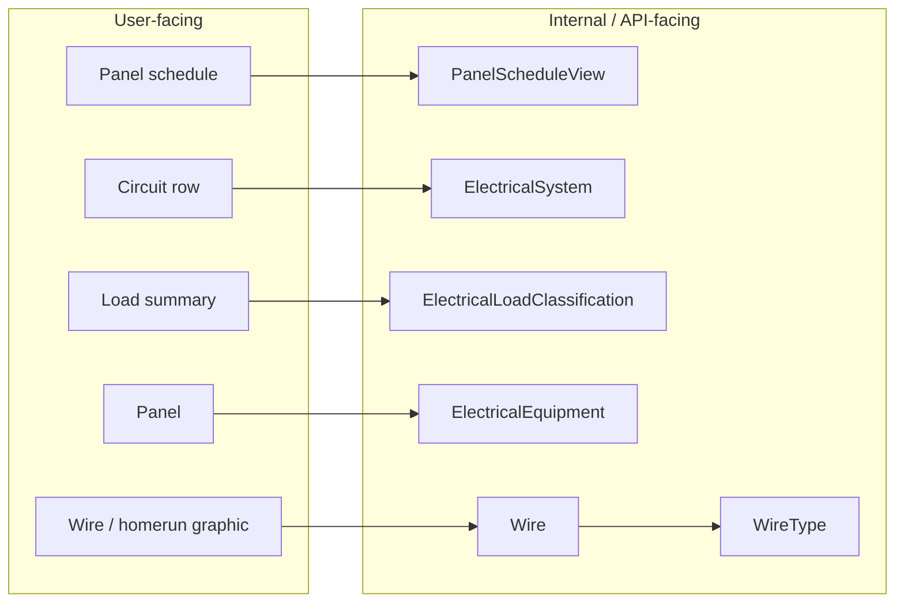

# Grounding: Revit electrical panel schedules

Scope: one subject — how Revit owns panel-schedule data, and where a value must live to appear.
Serves `source/Pe.Revit.DocumentData/Electrical/`, primarily `ElectricalPanelScheduleQueryCollector.cs`
(the collector that walks `PanelScheduleView` -> panel -> template -> `SectionType` cells).

Facts below are labelled as the sources labelled them: unlabelled = verified against Autodesk docs or
local `RevitAPI.dll` reflection; `Inference:` = a conclusion not stated verbatim by Autodesk;
`Live:` = observed in a real document through the scripting probe lane.

## User-facing vs internal vocabulary

Explain behavior to users in user-facing terms; debug ownership and data flow in the internal terms.

| User-facing term | Internal / API term | Note |
| --- | --- | --- |
| panel schedule | `PanelScheduleView` | the schedule instance |
| panel schedule template | `PanelScheduleTemplate` | definition / layout source |
| schedule cells & sections | `PanelScheduleData` | table structure + cell access |
| panel | `FamilyInstance` + `ElectricalEquipment` | usually an Electrical Equipment family instance |
| circuit row | `ElectricalSystem` | the panel body is circuit-owned |
| load summary bucket | `ElectricalLoadClassification` | demand math also needs `ElectricalDemandFactorDefinition` |
| wire graphic / homerun | `Wire` | attached to a circuit; not the owner of panel-row identity |
| wire type | `WireType` via `Wire.GetTypeId()` | conductor / material defaults |
| proxy device | model convention, not an API class | old projects use receptacles/disconnects as stand-ins |

Other project-level entities that matter: `ElectricalSetting` (project electrical rules, distribution
systems, circuit naming).



## Ownership stack

```text
Family params
  -> connector electrical values
  -> ElectricalSystem (circuit)
  -> Electrical Equipment (panel)
  -> PanelScheduleTemplate/Data/View
```

What each schedule section may read (Autodesk restricts template parameter sources by section):

- header / footer -> `Electrical Equipment` + `Project Information`
- circuit table body -> `Electrical Circuits` only
- load summary -> `Electrical Equipment` + `ElectricalLoadClassification` + `ElectricalDemandFactorDefinition`

Wire ownership: circuits own electrical identity; wires are attached routing/graphics elements on those
circuits; wire types own conductor/material defaults, not panel-body identity.

Panel totals are hierarchy-aware: Autodesk's load-calculation help states panel calculations include
loads on the panel, its child panels, and their grandchildren.

## Hard boundaries

- A family param does not flow directly into the panel body.
- A connector-driven electrical value can flow indirectly by changing circuit built-ins.
- A panel metadata field belongs on `Electrical Equipment`, not on downstream loads.
- **A body-row custom field MUST exist on `Electrical Circuits`** — the panel body is `ElectricalSystem`-owned.
- A combined field in the panel body can only combine circuit-owned fields.
- Revit does not natively aggregate arbitrary child metadata (`MOCP`, `MCA`, `PE_G___TagInstance`,
  `PE_M___ServesRoom`) across a circuit's children.
- There is no native project-GUI rule binding like `connected equipment.MOCP -> circuit.Rating`.
  Binding the same shared parameter to equipment and circuits yields two schedulable fields, not one
  live linked value. Autodesk support describes load-based breaker-size automation as a Revit limitation.
- `ElectricalSystem.Rating` is settable (2023-2026) but remains circuit-owned breaker/OCP intent. If
  equipment metadata should drive it, an add-in, script, Dynamo graph, or Pea operation must apply that policy.
- Templates control presentation, structure, and field selection. Inference: they are not a separate
  calculation engine — the connected-load and demand-load math is fundamentally Revit's.
- Revit 2026 adds settable `CableType` / `CableSize` and read-only conductor-size properties, and marks
  `WireType`, `WireSizeString`, `VoltageDrop` obsolete. It does not add cross-element parameter formulas.

## Where should this parameter live?

```text
Need to affect true electrical behavior?
  -> family param associated to connector param

Need to show in panel header/footer?
  -> bind to Electrical Equipment

Need to show in a panel body row?
  -> must exist on Electrical Circuits

Need to affect load summary / demand?
  -> use real ElectricalLoadClassification + ElectricalDemandFactorDefinition

Need arbitrary family metadata in the panel body?
  -> no native path

Need equipment MOCP to drive breaker / Rating?
  -> no native GUI binding; automate a write to ElectricalSystem.Rating

Need equipment MOCP visible only as panel-row metadata?
  -> bind a custom parameter to Electrical Circuits and copy the equipment value there
     (not Rating — Rating affects wire sizing and overload checks)
```

Can a given family param reach the body? Only if it is already a circuit built-in result, or it drives
connector electrical values (then indirectly, through the built-in). Family/category metadata alone: no.

- flows indirectly: `PE_E___Voltage`, `PE_E___ApparentPower`, `PE_E___NumberOfPoles`, `PE_E___LoadClassification`
- no native flow: `PE_G___TagInstance`, `PE_M___ServesRoom`, `PE_E___MCA`, `PE_E___MOCP`, `PE_E___FLA`,
  `PE_E___LRA`, `PE_E_LoadCalc_*`
- panel-owned, bind to `Electrical Equipment`: `PE_E___FedFromOverride*`, `PE_E___MainBreakerRating`,
  `PE_E___MinAICRating`, `PE_E___MinBusRating`, `PE_E___NEMAEnclosureRating`, `PE_E___SubFeedBreakerRating`,
  `PE_E___TypeOfMain`, `PE_E___NumberOfSpaces`, `PE_E___NumberOfWires`, `PE_E___VoltageLtoL`, `PE_E___VoltageLtoN`

## Demand math

Chain: connector load data -> assigned `Load Classification` -> its `DemandFactorId` ->
`ElectricalDemandFactorDefinition` (rule type: constant, quantity of connected objects, or connected
load) -> aggregation up the panel hierarchy -> load summary. So most "panel schedule is wrong" reports
are really upstream: connector authoring, primary-connector selection, missing load classification,
demand-factor setup, or missing `Space` assignment when users expect location text.

Inference: for MOCP/MCA/breaker coordination the safe automation shape is read equipment parameters as
inputs, apply an explicit office/code policy, write circuit-owned outputs (`Rating`, `Frame`, `LoadName`,
custom `Electrical Circuits` fields, 2026+ `CableType`/`CableSize`), and emit provenance and conflicts —
multi-load circuits need an explicit max / first / error-on-conflict policy. Design Master ElectroBIM's
"parameter linking" is this same shape as a third-party rule engine, not a hidden Revit-native feature.

## Live observations

- `Live:` template `No Feed-Through Lugs_Total Load Sum_Wire Sizes_MCB` uses built-in circuit `Load Name`
  (`BuiltInParameter.RBS_ELEC_CIRCUIT_NAME`) in both body halves.
- `Live:` in that template model, `Electrical Circuits` had only 5 project params and no `PE_E*` bindings.
- `Live:` working circuit `Load Name` values were stored on the circuit and the prefix matched the
  connected element `Mark` for sampled single-load circuits: `HOOD-1 - Kitchen 100`, `EVSE-1 - Carport`,
  `GD-1 - Kitchen 100`, `Panel 'L'`.
- `Live:` wire `6714280` had `MEPSystem -> ElectricalSystem 6714279` (circuit `L-1`), wire type
  `THWN (Copper w/ Neutral)`; the connected endpoint owner was a `DH-1` receptacle proxy, because the
  selected mechanical equipment was not circuited. The panel schedule reads the circuit, not the wire.

## Repo anchors

- Panel-schedule read lane: `source/Pe.Revit.DocumentData/Electrical/ElectricalPanelScheduleQueryCollector.cs`
- Connector authoring (native-friendly upstream lane): `source/Pe.Revit.FamilyFoundry/Operations/MakeElecConnector.cs`
- Live probe lane: `source/Pe.Revit.Scripting/Execution/RevitScriptExecutionService.cs`,
  `source/Pe.App/Commands/Scripting/CmdScriptingWorkspace.cs`

## Sources

Autodesk Help (panel schedules, panel schedule templates, add/combine panel schedule parameters, panel
properties, circuit properties, load classifications, demand factors, load calculations, connector
properties, `PanelScheduleView` developer guide); Autodesk support article on automating breaker sizes
from load; Autodesk AEC blog, New Conductor Capabilities in Revit 2026; Autodesk/AUGI/Reddit forum
threads on breaker rating and panel-schedule shared parameters; Design Master ElectroBIM docs and wish
list; local reflection against installed `RevitAPI.dll` 2023/2024/2025/2026 and
`nice3point.revit.api.revitapi/2026.4.0` `RevitAPI.xml`. Full URL list: `git log --follow` this file to
the pre-merge `docs/context/rvt-api/REVIT_PANEL_SCHEDULES.md`.
