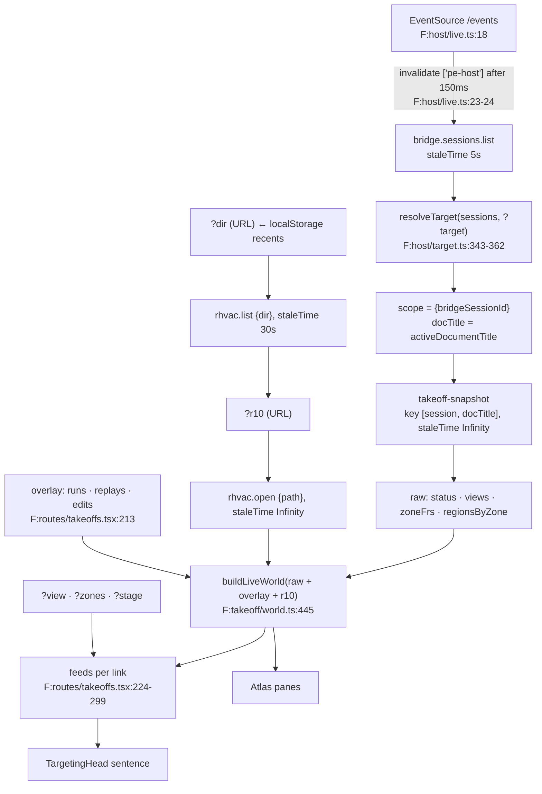
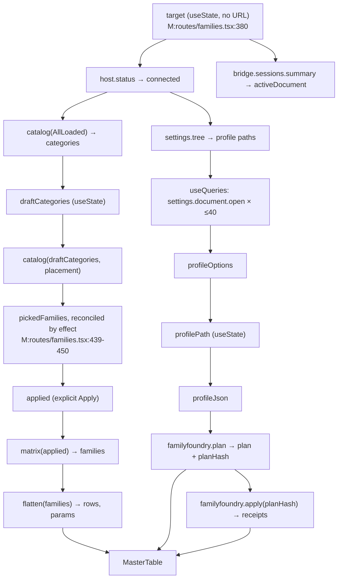
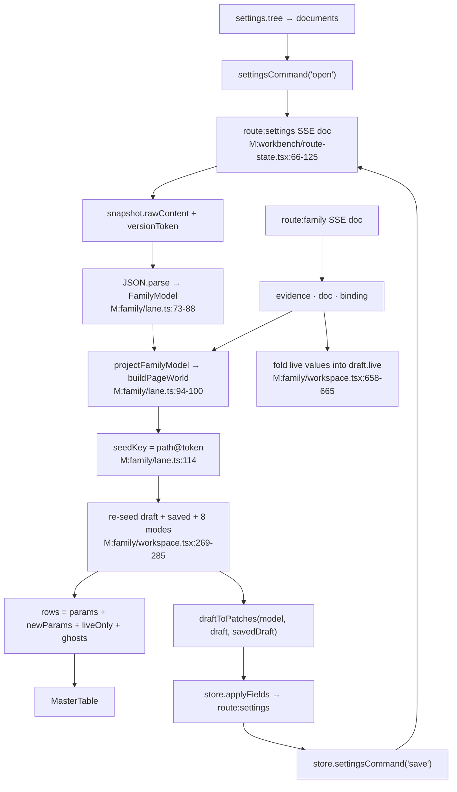

# State architecture — baseline census

Deliverable #1 of the state-architecture research. It is a census only. It proposes no design.

Date: 2026-08-24. Read-only. No source file was changed.

## Scope and path prefixes

Two checkouts hold the two clusters. Both use the same app root: `ts/apps/web/src`.

| Prefix | Checkout | Cluster |
|---|---|---|
| `F:` | `C:\Users\kaitp\source\repos\Pe.Tools-takeoff-frontier` | takeoffs · targeting canon · runs · host client |
| `M:` | `C:\Users\kaitp\source\repos\Pe.Tools` (branch `main`) | targeting-proto · family · family-review |

All `file:line` citations below use these prefixes. Both checkouts share `components/`, `host/`,
`lib/` and `workbench/` at the same paths. Where a shared file is cited, the prefix names the
checkout that was read.

## 1. Axis A — kind of state

Five kinds are present. A sixth kind exists in the family cluster only: a **host-persisted route
document** streamed over SSE. It is not react-query and it is not local. It is listed as its own
kind, `host doc`.

### 1.1 URL search

| Route | Keys | Validator | Notes |
|---|---|---|---|
| `/takeoffs` | `target`, `source`, `view`, `zones[]`, `dir`, `r10`, `stage` | `F:routes/takeoffs.tsx:142-150` | The only route where bindings live in the URL. `zones` round-trips as JSON or CSV (`F:routes/takeoffs.tsx:133-138`). |
| `/targeting-proto` | `view` | `M:routes/targeting-proto.tsx:40-45` | Picks a rendering, not a binding. |
| `/family` | `family`, `thread` | `M:routes/family.tsx:31-36` | `thread` is read by the router only, through `resolveRouteWorkspaceScope` (`M:workbench/route-state.tsx:20-24`). Nothing on the page reads it. |
| `/family-editor-proto` | `paradigm` | `M:routes/family-editor-proto.tsx:49-52` | Variant switch. |
| `/families` | none | `M:routes/families.tsx:82` | Route has no search at all. Target, scope, plan and receipts are all page memory. |
| `/runs` | none | `F:routes/runs.tsx:9` | Dev-only. |
| `/family-review-proto` | none | `M:routes/family-review-proto.tsx:32-34` | — |

### 1.2 Persisted (localStorage / disk / host)

| State | Home | Owner | Notes |
|---|---|---|---|
| `.r10` folder recents | `localStorage["pe.takeoffs.r10-dirs"]` | `F:routes/takeoffs.tsx:158-166` | Read once into `useState(readDirs)` at `F:routes/takeoffs.tsx:199`. It is a per-browser legal-options source, not a cache. A `ponytail:` comment names a disk-browse op as the replacement. |
| Plan pane height | `localStorage["pe.takeoffs.plan-height"]` | `F:components/ui/pane.tsx:165-176`, used at `F:takeoff/atlas.tsx:722` | Written on drag commit (`F:components/ui/pane.tsx:206-212`). |
| Room panel width | `localStorage["pe.takeoffs.room-panel-width"]` | same primitive, used at `F:takeoff/atlas.tsx:981` | — |
| Theme | `localStorage["theme"]` | `F:routes/__root.tsx:16` | Inline script, before hydration. |
| Family document + field trichotomy | Host `route:settings` document | `M:family/host.ts:119-166` | The document, its `versionToken`, and per-pointer `proposal`/`staged`/`review` all live host-side. |
| Family evidence + spec doc + binding | Host `route:family` document | `M:family/host.ts:120,157-159` | Written with `familyCommand`/`familyApply`. |

### 1.3 Page / session memory

| Route or module | Count | Citation |
|---|---|---|
| `F:routes/takeoffs.tsx` | 4 `useState` | `dirs:199`, `overlay:213`, `panel:215`, plus `useVerb`'s four inside `F:lib/use-verb.ts:24-28` |
| `F:takeoff/atlas.tsx` | 9 `useState` | `stageFilter:368`, `level:369`, `zoneKey:370`, `cursor:371`, `decided:372`, `fieldsMode:375`, `visibleKeys:378`, `planOpen:386`, `statsOpen:387` |
| `F:targeting/kit.tsx` | 5 `useState` | `open:74`, `busyKey:158`, `active:159`, `Picker.level:302`, `Picker.q:303` |
| `F:targeting/head.tsx` | 1 `useState` | `expanded:100` |
| `M:routes/families.tsx` | 12 `useState` | `target:380`, `placement:383`, `draftCategories:386`, `pickedFamilies:387`, `applied:388`, `profilePath:390`, `plan:391`, `excludedIds:392`, `pickedIds:393`, `applyData:394`, `projection:395`, `showUncommon:396` |
| `M:family/workspace.tsx` | 23 `useState` | `draft:207`, `overlay:211`, `saved:213`, `tableState:216`, `drillState:221`, `docMode:226`, `docZoom:227`, `drillType:228`, `stageType:229`, `focus:232`, `focusedProposal:233`, `pinnedParam:237`, `anatomyCollapsed:238`, `firstGhostKey:240`, `receipt:241`, `target:242`, `inspect:249`, `binding:253`, `saving:526`, `capturing:623`, `armedBuild:625`, `building:628`, `buildSaid:630` |
| `M:targeting-proto/kit.tsx` | 9 `useState` | `bound:62`, `multi:65`, `open:68`, `stageKey:69`, runner `busy:192`, `active:193`, `last:194`, `PathInput.seg:387`, `PathInput.q:388` |
| `M:family-review/proto-editor/shell.tsx` | 7 `useState` | `baseline:57`, `model:58`, `typeName:59`, `touched:60`, `focus:61`, plus two local |
| `F:components/master-table/master-table.tsx` | 2 `useState` | `internalState:160` (filters/sorts/query), `rowTops:262` |
| `F:host/use-target.ts` | 1 `useState` | `useWorldLog.log:49`, a capped 100-entry ring |

### 1.4 Server / host cache (react-query)

| Query | Key | Enabled | Stale time | Citation |
|---|---|---|---|---|
| `bridge.sessions.list` | `["pe-host","",key,args]` | always | 5 000 ms | `F:host/queries.ts:104-106` |
| takeoff snapshot | `["takeoff-snapshot", bridgeSessionId, docTitle]` | `live && scope!==null` | `Infinity` | `F:routes/takeoffs.tsx:189-196` |
| `rhvac.list` | host key + `{dir}` | `dir!==""` | 30 000 ms | `F:routes/takeoffs.tsx:206` |
| `rhvac.open` | host key + `{path}` | `r10!==""` | `Infinity` | `F:routes/takeoffs.tsx:207-211` |
| adopt candidates | `["takeoff-candidates", bridgeSessionId, view]` | mount of `AdoptPanel` | 0 | `F:routes/takeoffs.tsx:791-795` |
| `host.status` | host key | always | 15 000 ms | `M:host/queries.ts:96-98` |
| `bridge.sessions.summary` | host key | always | 15 000 ms | `M:host/queries.ts:100-102` |
| loaded-families catalog ×2 | host key + filter | `connected` / `connected && draftCategories.length>0` | 5 min | `M:routes/families.tsx:405-425` |
| loaded-families matrix | host key + `applied` filter | `connected && applied!==null` | 10 s | `M:routes/families.tsx:468-471` |
| `settings.tree` (profiles) | host key | `connected` | 60 s | `M:routes/families.tsx:481-490` |
| `settings.document.open` × N | `["pe-host",target,"settings.document.open",path]` | one per profile path, capped 40 | 60 s | `M:routes/families.tsx:503-515` |
| `settings.tree` (family models) | host key | always | 60 s | `M:family/host.ts:131-142` |

The query key prefix is `["pe-host"]` (`F:host/queries.ts:28`). `useHostOp` builds the key as
`[...HOST_QUERY_KEY, bridgeSessionId, opKey, stableKey(request)]` (`F:host/queries.ts:62-70`).
`stableKey` sorts object keys so equal requests share one entry (`F:host/queries.ts:43-53`).

The takeoff snapshot query does **not** use `useHostOp`. It has its own key shape
(`F:routes/takeoffs.tsx:189`), so SSE invalidation on `["pe-host"]` cannot reach it.

### 1.5 Host doc (SSE-streamed, host-persisted)

| Item | Citation |
|---|---|
| Wire: `fetch /info` → Mastra session subscribe → `fetch /route-state/<route>` → `EventSource /route-state/<route>/events` | `M:workbench/route-state.tsx:66-125` |
| Store: one Effect `Atom.family` keyed by `JSON.stringify({route,stateKey,scope})` | `M:workbench/route-state.tsx:128-133` |
| Read: `useAtomValue` → `{doc, hydrated, peaActive}` | `M:workbench/route-state.tsx:139-152` |
| Write: `POST /route-state/<route>/apply` or `/command` | `M:workbench/route-state.tsx:175-199` |
| Scope: `thread` (from `?thread=`) or `workspace` | `M:workbench/route-state.tsx:20-24` |

The doc arrives as a whole snapshot on every event. There is no patch merge on the client. This is
the one place where a write returns no data and the surface waits for the stream to re-push
(`M:family/workspace.tsx:563-567`).

### 1.6 Derived

| Derivation | Inputs | Citation |
|---|---|---|
| `World` (takeoffs) | snapshot + overlay + `r10Query.data` | `F:takeoff/world.ts:445-541`, called at `F:routes/takeoffs.tsx:217-221` |
| `Feeds` | 3 queries + `sessions` + `dirs` + fixture | `F:routes/takeoffs.tsx:224-299` |
| `BindingState` | URL search + resolved session | `F:routes/takeoffs.tsx:302-315` |
| `Row[]` (atlas) | scope zones × rooms × `decided` | `F:takeoff/atlas.tsx:414-424` |
| `visibleRows` | `rows` × `visibleKeys` reported back by the table | `F:takeoff/atlas.tsx:427-430` |
| `Stage` per zone | drift, room flags, `r10`, `data` | `F:takeoff/world.ts:432-439` |
| `PageWorld` | parsed family doc + evidence | `M:family/lane.ts:94-100` |
| `rows` (family) | `world.paramRows` + `draft.newParams` + live-only rows + ghosts | `M:family/workspace.tsx:340-359` |
| `unsavedCount` | `world` × `draft` × `saved` × `rows` | `M:family/workspace.tsx:377-385` |
| `familyState` verdict | receipts → plan → scope | `M:routes/families.tsx:588-644` |

## 2. Axis B — owner and passing

| State | Owner | Passed how | Depth to deepest reader |
|---|---|---|---|
| takeoff bindings | URL, projected by `TakeoffsRoute` | `state`/`setState` closure into `useBindings` (`F:routes/takeoffs.tsx:451`) | 2 (route → `TargetingHead` → `Picker`) |
| `Bindings` object | `useBindings` (`F:targeting/kit.tsx:68-121`) | prop `b` | 3 (`TargetingHead` → `Picker`/`StageStrip`/`PaneStrip`) |
| `Runner` | `useRunner` (`F:targeting/kit.tsx:152-188`) | prop `runner` | 3 |
| `SessionOverlay` | `TakeoffsRoute` `useState` (`F:routes/takeoffs.tsx:213`) | closed over in `actions` (`F:routes/takeoffs.tsx:454-531`) | not passed; only its effect on `world` is |
| `AtlasActions` | route object literal, rebuilt every render | prop `actions` | 3 (route → `Atlas` → `ZoneCard`/`RoomPanel`) |
| atlas selection (`zoneKey`, `cursor`, `level`) | `Atlas` (`F:takeoff/atlas.tsx:369-371`) | 8 props into `LevelPlan`, 9 into `ZoneCard`, 7 into `RoomPanel` (`F:takeoff/atlas.tsx:1092-1109`, `1458-1478`, `1578-1595`) | 3 (`Atlas` → `ZoneCard` → `ZonePeek`) |
| `stateOf` closure | `Atlas` (`F:takeoff/atlas.tsx:393`) | prop, drilled to `ZonePeek` (`F:takeoff/atlas.tsx:1783-1789`) | 3 |
| table filter/sort/query | `MasterTable` internal (`F:components/master-table/master-table.tsx:160`) | uncontrolled by default; `tableState`/`onTableStateChange` optional | — |
| family `draft` | `FamilyWorkspace` (`M:family/workspace.tsx:207`) | prop into `AnatomyDrawing` (`M:family/workspace.tsx:1575-1585`), read by ~15 local closures | 2 |
| family `focus`/`pinnedParam` | `FamilyWorkspace` (`M:family/workspace.tsx:232,237`) | `focusedParts`/`focusedParams` sets (`M:family/workspace.tsx:838-842`) | 2 |
| families scope/plan | `FamiliesRoute` (`M:routes/families.tsx:386-395`) | closures only; the route is one component | 1 |
| proto `Editor` | `useEditor` (`M:family-review/proto-editor/shell.tsx:56-84`) | one `editor` prop per paradigm | 2 |
| `FamilyStore` | `useLiveFamilyStore` (`M:family/host.ts:119`) | returned inside `FamilyLane`, then `lane.store` | 1 |

**No React context is used anywhere in scope.** Every module cited above passes state by props or
by closure. The only cross-component store is the Effect `Atom.family` in
`M:workbench/route-state.tsx:128-133`, and it is keyed rather than provided.

## 3. Axis C — async waterfall

### 3.1 `/takeoffs` (frontier)



Depth of the deepest chain: SSE → sessions → snapshot → world → feeds → sentence = **5 hops**.
The `.r10` chain is a second, independent root: `localStorage` → `?dir` → `rhvac.list` → `?r10` →
`rhvac.open` → world = **5 hops**.

Downstream triggers:

| Trigger | Effect | Citation |
|---|---|---|
| Any bridge SSE event | invalidates every `["pe-host"]` query, 150 ms debounce | `F:host/live.ts:18-27` |
| A document change | changes `docTitle`, so the snapshot key changes and a re-read starts | `F:routes/takeoffs.tsx:189` |
| `adopt` done | `invalidateSnapshot()` | `F:routes/takeoffs.tsx:646-649` |
| `sync` done | `invalidateSnapshot()` **and** a predicate invalidate of every `rhvac.open` entry | `F:routes/takeoffs.tsx:661-668` |
| `partition` | `patchSnapshot` writes `regionsByZone` in place, plus `setOverlay(runs)` | `F:routes/takeoffs.tsx:401-408` |
| `decide` | `patchSnapshot` replaces one region blob | `F:routes/takeoffs.tsx:486-493`, `682-692` |
| `capture` | `setOverlay(replays)` only; no query touched | `F:routes/takeoffs.tsx:496-505` |
| picking a trunk | `pickInto` nulls every descendant binding | `F:targeting/model.ts:145-164` |

### 3.2 `/families` (main)



Deepest chain: `target` → `status` → `catalog` → `catalog(draft)` → `applied` → `matrix` →
`rows` → table = **7 hops**, of which two are gated on an explicit human click (Apply scope,
plan).

### 3.3 `/family` (main)



The save loop is closed through the wire: nothing is folded in optimistically
(`M:family/workspace.tsx:563-567`).

## 4. Axis D — cross-pane selection and hover

### 4.1 `/takeoffs`

| State | Panes that read it | Propagation |
|---|---|---|
| `zoneKey` | nav rail list (`F:takeoff/atlas.tsx:824`), plan (`F:takeoff/atlas.tsx:930`), `ZoneCard` (`F:takeoff/atlas.tsx:953`), scope label (`F:takeoff/atlas.tsx:921`), route chips (`F:takeoff/atlas.tsx:679-681`) | `selectZone` sets `zoneKey`, clears `cursor`, and forces `level` (`F:takeoff/atlas.tsx:475-479`) |
| `cursor` (room guid) | plan (`F:takeoff/atlas.tsx:931`), table `activeKey` (`F:takeoff/atlas.tsx:1055`), `RoomPanel` mount/collapse (`F:takeoff/atlas.tsx:982,1070`), `ZoneCard.cursorRoom` (`F:takeoff/atlas.tsx:956`) | set by plan `onCursor` (`F:takeoff/atlas.tsx:934-938`), by row click (`F:takeoff/atlas.tsx:1056-1059`), by `j`/`k` (`F:takeoff/atlas.tsx:450-457`) |
| `level` | visual toolbar tabs (`F:takeoff/atlas.tsx:884`), `levelZones` (`F:takeoff/atlas.tsx:406`), `LevelStats` (`F:takeoff/atlas.tsx:946`) | three writers: first-lane effect (`381-383`), zone select (`478`), row click (`1058`) |
| `visibleKeys` | `j`/`k` walk order only | table → route, through `onVisibleChange` with an identity guard (`F:takeoff/atlas.tsx:1060-1066`) |
| `decided` | `openFlags` → row state → plan fill, rail bars, table gutter, `RoomPanel` | optimistic, set before the write (`F:takeoff/atlas.tsx:470-473`) |

**There is no hover state in `/takeoffs`.** `MasterTable` exposes `onRowHover`
(`F:components/master-table/master-table.tsx:152`) and the atlas does not use it. Every hover
affordance is a native `title` attribute or a CSS `hover:` class. Grep evidence: 29 `title=` or
`hover:` hits in `F:takeoff/atlas.tsx`, zero `onMouseEnter`/`onMouseLeave`.

### 4.2 `/family`

| State | Panes that read it | Propagation |
|---|---|---|
| `focus` (`{kind:"part"|"param", id}`) | anatomy drawing, table row tint, doc pane lit blocks | set by `hoverRow` on the table (`M:family/workspace.tsx:1619-1628`, wired at `1647`/`1702`) and by `onFocus` from the drawing (`M:family/workspace.tsx:1581`) |
| `pinnedParam` | table row tint (`M:family/workspace.tsx:1600-1616`), proposal cards | sticky. Set by `locate` (`M:family/workspace.tsx:329-332`). It exists because hover is transient and the pointer must be able to leave the row. |
| `focusedProposal` | proposal card scroll target | effect scrolls `cardRefs.current[id]` into view (`M:family/workspace.tsx:304-307`) |
| `heldFocus` / `liveFocus` | `focusedParams`, `focusedParts`, `litBlocks` | `M:family/workspace.tsx:828-846` |
| `inspect` | doc pane lower half, one slot for two subjects | `M:family/workspace.tsx:249-251` |

This cluster **does** model hover, as `focus`, and it needed a second sticky field (`pinnedParam`)
to survive the pointer leaving. The rationale is written at `M:family/workspace.tsx:234-237`.

### 4.3 `/family-editor-proto`

`focus` is one JSON Pointer shared by all panes, computed both ways rather than mirrored
(`M:family-review/proto-editor/shell.tsx:49-53`). This is the cleanest cross-pane model in the
census: one string, no derived copies.

## 5. Axis E — staging, dirtiness, sync

| Cluster | What counts as dirty | Staged representation | Sync to host | Invalidation after write |
|---|---|---|---|---|
| `/takeoffs` — room edits | any key present in `overlay.edits[guid]` | `Record<roomGuid, RoomEdit>` in page memory (`F:takeoff/world.ts:188-195`) | none for Manual J; `type` writes through immediately (`F:routes/takeoffs.tsx:461-471`) | none. The edit is re-applied on every world build (`F:takeoff/world.ts:258-288`). |
| `/takeoffs` — decisions | a flag with no matching `Resolution` on the blob (`F:takeoff/world.ts:334-340`) | none — the verdict is written through at once | `writeDecisions` → `WriteTransaction` script (`F:takeoff/host.ts:172-182`) | `patchSnapshot` splices the returned blob into the cache (`F:routes/takeoffs.tsx:682-692`). No refetch. |
| `/takeoffs` — partition | — | `overlay.runs[zoneGuid]` | `partitionZone` write script | `patchSnapshot` writes `regionsByZone`; the overlay run supplies flags and fresh geometry (`F:takeoff/world.ts:302-358`) |
| `/takeoffs` — `.r10` sync | `room.elementId!==null && room.r10===null && room.data!==null` (`F:routes/takeoffs.tsx:969`) | `inserts` derived on every render, never stored (`F:routes/takeoffs.tsx:965-971`) | `rhvac.sync` then `linkRhvacBatch` (`F:routes/takeoffs.tsx:1001-1034`) | `invalidateSnapshot()` + predicate invalidate of `rhvac.open` (`F:routes/takeoffs.tsx:661-668`) |
| `/takeoffs` — drift | `abs(room.sqft - r10.lastSyncedSqft) > 0`, summed per zone (`F:takeoff/world.ts:497-500`) | derived only | — | drift blocks a zone from sync (`F:routes/takeoffs.tsx:958-963`) |
| `/families` — scope | `applied` differs from the draft triple (`scopeDrifted`, `M:routes/families.tsx:474-478`) | `applied: AppliedScope|null` | explicit Apply → matrix query | matrix key changes |
| `/families` — plan | `plan.planHash` | `plan: FfPlanData|null` + `excludedIds: Set<number>` | `familyfoundry.plan` | re-binding a profile clears plan, applyData and exclusions (`M:routes/families.tsx:567-571`) |
| `/families` — apply | — | `applyData: FfApplyData|null` | `familyfoundry.apply({familyIds, expectedPlanHash})` | `matrix.refetch()` on success (`M:routes/families.tsx:891`). Host refuses on hash drift; the route echoes it (`M:routes/families.tsx:880-887`). |
| `/family` — profile | `isUnsavedAt(world, draft, saved, row, type)` per cell; `unsavedCount` is the total (`M:family/workspace.tsx:377-385`) | `Draft` in page memory + `SavedProfile` snapshot taken at save (`M:family/model.ts:226-266`, `297-312`) | `draftToPatches` → `store.applyFields` → `settingsCommand("save")` (`M:family/workspace.tsx:576-600`) | none client-side. The wire re-pushes the snapshot with a new token; `seedKey` changes; the re-seed effect rebuilds the draft (`M:family/workspace.tsx:269-285`). |
| `/family` — staged by another route | `field.staged != null` on `store.fields` | host-side trichotomy | — | `stagedCount` feeds the build ceremony (`M:family/workspace.tsx:633-636`) |
| `/family` — build arming | `armedBuild` carries the token the plan was armed against (`M:family/workspace.tsx:624-627`) | page memory | `familyCommand("build_evidence")` | `buildSaid` latches the host's last word and outranks the predicates (`M:family/workspace.tsx:629-630`) |
| `/family-editor-proto` | `changes(baseline, model)` — a JSON-pointer diff (`M:family-review/proto-editor/shell.tsx:105-113`) | `model` vs `baseline`, both `useState` | mock: `write()` moves `baseline` to `model` | none |
| `/family-review-proto` | `Object.keys(edits.book).length` | `EditBook` in `useEdits` (`M:family-review/proto/review-board.tsx:102-113`) | none — the route writes nowhere, and says so | none |

Three different dirtiness models are in use:

1. **Overlay** — `/takeoffs`. A side record merged into the derived world on each build. There is
   no baseline and no per-cell "what would save write". The overlay dies with the tab; a
   `ponytail:` comment at `F:takeoff/world.ts:170-175` names this as an open design question.
2. **Draft + saved snapshot** — `/family`. A per-cell answer to "what would save write" survives
   repeated saves because `saved` is re-snapshotted, not diffed against a fixture
   (`M:family/model.ts:291-296`).
3. **Baseline diff** — `/family-editor-proto`. `flatten` both documents to JSON pointers and
   compare (`M:family-review/proto-editor/shell.tsx:90-113`).

Optimistic writes appear once: `decide` in `F:takeoff/atlas.tsx:470-473` marks `decided` locally
before the host call. The comment names the risk. `/family` deliberately refuses optimism
(`M:family/workspace.tsx:564-567`).

## 6. Axis F — freshness (the `Feed` model)

`Feed` is declared at `F:targeting/model.ts:63-70`:

```
Feed = { options: Option[] | null, state: FeedState, at?: number, note?: string }
FeedState = "live" | "fresh" | "stale" | "loading" | "error" | "fixture"   (F:targeting/model.ts:61)
```

| Value | Meaning (docblock, `F:targeting/model.ts:53-60`) | Who produces it today |
|---|---|---|
| `live` | pushed by SSE; always current | `world`, `rvt` — hand-set (`F:routes/takeoffs.tsx:257,262`) |
| `fresh` | read on demand; matches its basis | `folder` — hand-set (`F:routes/takeoffs.tsx:273`); `view`/`zones`/`r10` via `q()` |
| `stale` | the basis moved and no re-read happened | **nothing produces it.** No code path sets `"stale"` in the frontier checkout. |
| `loading` | first read in flight | `q()` when `isFetching` (`F:routes/takeoffs.tsx:234`) |
| `error` | the read failed | `q()` when `isError` (`F:routes/takeoffs.tsx:232`) |
| `fixture` | seeded by a declared mock lane | `?source=fixture` (`F:routes/takeoffs.tsx:229,236-248`) |

Computation, verbatim shape (`F:routes/takeoffs.tsx:225-235`):

```
q(s, options) = !live            ? {options, state:"fixture"}
              : s.isError        ? {options, state:"error", note}
              : s.isFetching     ? {options, state:"loading"}
              :                    {options, state:"fresh", at: s.dataUpdatedAt}
```

Consequences the census records as facts, not opinions:

| Fact | Evidence |
|---|---|
| `stale` is declared, consumed, and never produced. `refusal` refuses a verb whose demand is stale (`F:targeting/model.ts:220-221`), and the test asserts that branch with a hand-written feed (`F:targeting/model.test.ts:314,357`). No route sets it. | `grep 'state: "stale"'` finds only the test and the type. |
| Any fetch, including a background refetch, reports `loading` and not `fresh`, because `isFetching` is checked before staleness. | `F:routes/takeoffs.tsx:233` |
| `at` is `dataUpdatedAt`, rendered as relative text through `ago()`, which calls `Date.now()` during render. | `F:targeting/kit.tsx:236-260` |
| `ago()` never re-renders on its own, so a "read 5s ago" caption is only as fresh as the next unrelated render. | `F:targeting/kit.tsx:255-260` |
| The `world` and `rvt` feeds are hard-coded `"live"`; they do not consult the sessions query's own state. A failed `bridge.sessions.list` reads as `live` with zero options. | `F:routes/takeoffs.tsx:251-263` |
| The `folder` feed is hard-coded `"fresh"` although it is `localStorage`, which has no basis to be fresh against. | `F:routes/takeoffs.tsx:273` |
| Feed freshness is per link. The snapshot query backs three links (`view`, `zones`, and indirectly the atlas). One read serves them and one `isFetching` flips all three. | `F:routes/takeoffs.tsx:264-272` |
| No other route in the census has a freshness model. `/families`, `/family` and the protos report `isPending`/`isFetching` ad hoc in JSX. | `M:routes/families.tsx:532`, `M:routes/families.tsx:1018` |

The `M:targeting-proto/model.ts` predecessor had **no** freshness axis at all. It had `source:
"host"|"disk"|"fixture"` instead (`M:targeting-proto/model.ts:19,37`). Freshness is new in the
canon version.

## 7. Axis G — mocking and fixtures

### 7.1 What the tests exercise today

| Test | Subject | How the world is supplied | Route touched? |
|---|---|---|---|
| `F:takeoff/takeoff.test.ts` | `buildZones`, `shoelace`, `containsEvenOdd`, `zoneStage`, `readResolutions`, `upsertResolution`, `decisionRows`, `regionForRoom`, `buildLiveWorld`, generated C# | hand-built `LiveRegion[]`, `PartitionRun`, `SessionOverlay` literals passed straight to `buildLiveWorld` (`F:takeoff/takeoff.test.ts:17,209-236`) | no |
| `F:targeting/model.test.ts` | `terminals`, `pathOf`, `pickInto`, `progress`, `seams`, `refusal` | a literal `Product` (`F:targeting/model.test.ts:14-58`) and a literal `Feeds` (`F:targeting/model.test.ts:60-67`) | no |
| `F:components/master-table/master-table.test.tsx` | the table primitive | React Testing Library + jsdom | no |
| `M:family/project.test.ts`, `M:family/build.test.ts`, `M:family/formula.test.ts` | reverse projection, build predicates, formula parse | pure inputs | no |
| `M:family-review/board.test.ts`, `M:family-review/proto-editor/composed.test.ts`, `graph.test.ts` | board staging, pointer diff, graph | fixtures in `M:family-review/proto/fixtures.ts` | no |

**Zero route-level tests exist.** No test imports `routes/takeoffs.tsx`, `routes/families.tsx`, or
`family/workspace.tsx`. The test corpus is 28 files (`find src -name '*.test.ts*'`); none render a
route component.

### 7.2 What the route can mount without a host

| Lane | Trigger | Provider | Limit |
|---|---|---|---|
| project-a fixture | `?source=fixture` | `useFixtureWorld` (`F:takeoff/proto/fixture-world.ts:71-94`) → `useMockWorldGeo` (`F:takeoff/proto/mock-geo.ts:161-186`) | Every `elementId` is `null`, so every write path is inert by construction (`F:takeoff/proto/fixture-world.ts:6-9`). |
| Family fixture | no family document open | `FIXTURE_WORLD` (`M:family/lane.ts:94-100`) | Declared, never a fallback. A document that will not parse is an error, not the fixture (`M:family/lane.ts:13-15`). |
| Proto fixtures | always | `M:targeting-proto/model.ts` `PRODUCTS`, `M:family-review/proto/fixtures.ts` | No host at all. |

`useMockWorldGeo` fetches real project-a geometry over HTTP at runtime
(`F:rhvac/fixture.ts:17-22,30-40`), so the fixture lane still needs a dev server serving
`/rhvac-fixture`.

### 7.3 What cannot be mocked today

| Item | Why |
|---|---|
| The whole `/takeoffs` route component | Four queries, `useTarget`, `useVerb`, `useFixtureWorld` and `localStorage` are all called inside the component body (`F:routes/takeoffs.tsx:181-215`). There is no injection point. |
| `Feeds` computation | Built inline in the route's `useMemo` (`F:routes/takeoffs.tsx:224-299`), not a pure exported function. The tests can build a `Feeds` literal, but not assert what the route would build from a given query state. |
| `stale` freshness | No producer exists, so no test can reach the `stale` branch of `refusal` through a route. |
| The `.r10` sync payload | `buildRhvacInsert` and the whole `sync` closure live inside `SyncPanel` (`F:routes/takeoffs.tsx:701-748,975-1045`). `buildRhvacInsert` is module-scope but not exported. |
| `AtlasActions` behaviour | The object is a literal in the route body (`F:routes/takeoffs.tsx:454-531`). Its optimistic/write-through branching is untestable without a host. |
| No HTTP mocking layer | `package.json` carries `jsdom` and `@testing-library/react` only. There is no `msw`, no fetch stub, no `QueryClient` test harness. `getContext()` returns a bare `new QueryClient()` (`F:integrations/tanstack-query/root-provider.tsx:3-9`). |
| SSE / route-state wire | `M:workbench/route-state.tsx:66-125` opens `fetch`, a Mastra session and an `EventSource` inside an Effect stream. No seam accepts a fake. |
| `Date.now()` in freshness | `ago()` reads the wall clock during render (`F:targeting/kit.tsx:256`). |

## 8. Axis H — Suspense, Activity, transitions

| Feature | Uses in scope |
|---|---|
| `Suspense` | one, and it is out of scope: `F:lib/schema-to-field-render/field-renderer.tsx:21-33` wraps three `lazy()` field kinds. |
| `React.lazy` | same file, plus `F:lib/schema-to-field-render/custom-renderer-registry.tsx:8`. |
| `<Activity>` | **none.** |
| `startTransition` / `useTransition` | **none.** |
| `useDeferredValue` | **none.** |
| `useOptimistic` | **none.** Optimism is hand-rolled at `F:takeoff/atlas.tsx:470-473`. |
| `useSyncExternalStore` | one, out of scope: `F:runs/feedback/staging.ts:14,89`. |
| Router-level pending / defer | none in the scoped routes. |

No route in scope suspends. Every loading state is a rendered branch on `isPending`, `isFetching`,
or a boolean like `geoReady` (`F:takeoff/atlas.tsx:704-712`).

## 9. Pain census

### 9.1 Hook counts per file

| File | LOC | `useState` | `useMemo` | `useEffect` | queries | `useRef` | `useCallback` |
|---|---:|---:|---:|---:|---:|---:|---:|
| `F:routes/takeoffs.tsx` | 1152 | 4 | 2 | 0 | 4 | 0 | 2 |
| `F:takeoff/atlas.tsx` | 1932 | 9 | 10 | 2 | 0 | 0 | 0 |
| `F:targeting/kit.tsx` | 630 | 5 | 1 | 3 | 0 | 1 | 8 |
| `F:targeting/head.tsx` | 250 | 1 | 0 | 0 | 0 | 0 | 0 |
| `F:targeting/model.ts` | 223 | 0 | 0 | 0 | 0 | 0 | 0 |
| `F:takeoff/world.ts` | 542 | 0 | 0 | 0 | 0 | 0 | 0 |
| `F:takeoff/host.ts` | 202 | 0 | 0 | 0 | 0 | 0 | 0 |
| `F:takeoff/model.ts` | 379 | 0 | 0 | 0 | 0 | 0 | 0 |
| `F:takeoff/proto/mock-geo.ts` | 188 | 1 | 2 | 1 | 0 | 0 | 0 |
| `F:host/queries.ts` | 187 | 0 | 0 | 0 | 24 | 0 | 0 |
| `F:host/use-target.ts` | 91 | 1 | 0 | 1 | 1 | 1 | 0 |
| `F:host/live.ts` | 32 | 0 | 0 | 1 | 0 | 0 | 0 |
| `F:lib/use-verb.ts` | 71 | 4 | 0 | 1 | 0 | 1 | 3 |
| `F:components/master-table/master-table.tsx` | 807 | 2 | 8 | 3 | 0 | 4 | 0 |
| `F:components/ui/pane.tsx` | 573 | 2 | 0 | 2 | 0 | 5 | 4 |
| `F:routes/runs.tsx` | 26 | 0 | 0 | 1 | 0 | 0 | 0 |
| `F:runs/browser.tsx` (context only) | 3309 | 33 | 10 | 21 | 0 | 15 | 8 |
| `M:routes/families.tsx` | 1478 | 12 | 18 | 3 | 6 | 1 | 0 |
| `M:family/workspace.tsx` | 2447 | 23 | 13 | 4 | 0 | 3 | 0 |
| `M:family/anatomy.tsx` | 1018 | 0 | 3 | 0 | 0 | 0 | 0 |
| `M:family/lane.ts` | 116 | 0 | 2 | 0 | 0 | 0 | 0 |
| `M:family/host.ts` | 214 | 0 | 1 | 0 | 1 | 0 | 0 |
| `M:family/model.ts` | 537 | 0 | 0 | 0 | 0 | 0 | 0 |
| `M:family/project.ts` | 523 | 0 | 0 | 0 | 0 | 0 | 0 |
| `M:family/world.ts` | 625 | 0 | 0 | 0 | 0 | 0 | 0 |
| `M:targeting-proto/kit.tsx` | 713 | 9 | 2 | 2 | 0 | 1 | 9 |
| `M:targeting-proto/model.ts` | 645 | 0 | 0 | 0 | 0 | 0 | 0 |
| `M:family-review/proto-editor/shell.tsx` | 383 | 7 | 1 | 0 | 0 | 0 | 0 |
| `M:family-review/proto-editor/composed.tsx` | 230 | 5 | 2 | 1 | 0 | 2 | 0 |
| `M:family-review/proto-editor/composed-params.tsx` | 368 | 3 | 1 | 1 | 0 | 1 | 0 |
| `M:family-review/proto/review-board.tsx` | 481 | 4 | 0 | 0 | 0 | 0 | 0 |
| `M:family-review/model.ts` | 750 | 0 | 0 | 0 | 0 | 0 | 0 |

Totals in scope: **114 `useState`**, **64 `useMemo`**, **26 `useEffect`**, **12 route-level
queries** (`F:runs/browser.tsx` excluded from the totals; it is context, not scope).

The model files are clean. `F:targeting/model.ts`, `F:takeoff/world.ts`, `F:takeoff/model.ts`,
`M:family/model.ts`, `M:family/project.ts`, `M:family/world.ts`, `M:family-review/model.ts` and
`M:targeting-proto/model.ts` hold **zero** hooks between them, across 3 824 lines. The split
between pure model and stateful shell is already real. The pain is concentrated in the shells.

### 9.2 State logic entangled with JSX

| Site | LOC of the block | What is entangled | Evidence |
|---|---|---|---|
| `F:routes/takeoffs.tsx:339-449` | 111 | The whole `Product` manifest is a literal in the render body. Every `run` closure captures `scope`, `view`, `overlay`, `boundZones`, `snapshot`, `r10Query`. `partition` runs a `for` loop of host calls and two `set*` calls inside a JSX-adjacent object. | The manifest is described as "STATIC data" at `F:targeting/model.ts:14`, yet it is rebuilt every render. |
| `F:routes/takeoffs.tsx:454-531` | 78 | `AtlasActions` mixes optimism, error setting, host writes and cache patching in four closures. | `patch` branches on `live && scope && patch.type` and falls through to a local persist. |
| `F:routes/takeoffs.tsx:224-299` | 76 | `Feeds` is built inline, with a hand-maintained 14-entry dependency array and an eslint suppression. | `F:routes/takeoffs.tsx:283-299` |
| `F:takeoff/atlas.tsx:482-674` | 193 | The column descriptor array carries cell renderers, sort keys, facets, filter predicates, and the Manual J column set switched by `fieldsMode`. | Deps are `[actions, flagVocabulary, fieldsMode]`; `actions` is a fresh object each render, so the memo never hits. |
| `F:takeoff/atlas.tsx:441-466` | 26 | The keyboard handler is an effect **with no dependency array**, so it re-subscribes on every render. It closes over `visibleRows`, `cursor`, `cursorRow` and calls `decide`, which is declared after it. | `F:takeoff/atlas.tsx:466` ends `});` with no deps. |
| `F:takeoff/atlas.tsx:1005-1033` | 29 | The table `summary` prop contains the `fieldsMode` toggle button and its two-branch title text. | — |
| `M:routes/families.tsx:645-789` | 145 | `columns` builds cell renderers plus the plan/receipt verdict lookup. | — |
| `M:routes/families.tsx:858-892` | 35 | `applyBlockedReason` is an IIFE in the render body; `runApply` sets four states and calls `matrix.refetch()`. | — |
| `M:family/workspace.tsx:1470-1520` | 51 | Two column memos, each closing over `draft`, `saved`, `world`, `overlay`, `focusedParams`. | — |
| `M:family/workspace.tsx` (whole) | 2447 | One component holds 23 `useState`, 13 `useMemo`, 4 `useEffect`, 3 `useRef`, and returns a three-pane workspace. | — |

### 9.3 Prop-drilling depth

Depth is counted in component hops from the state owner to the deepest reader.

| Chain | Depth | Widest signature |
|---|---:|---|
| `TakeoffsRoute` → `TargetingHead` → `Picker` | 2 | `Picker` takes 5 props, one of which (`b: Bindings`) is a 13-field object (`F:targeting/kit.tsx:42-56`) |
| `TakeoffsRoute` → `Atlas` → `ZoneCard` → `ZonePeek` | 3 | `ZoneCard` takes **9** props (`F:takeoff/atlas.tsx:1458-1477`); `ZonePeek` re-takes 4 of them (`F:takeoff/atlas.tsx:1780-1789`) |
| `TakeoffsRoute` → `Atlas` → `LevelPlan` | 2 | `LevelPlan` takes **8** props (`F:takeoff/atlas.tsx:1092-1109`) |
| `TakeoffsRoute` → `Atlas` → `MasterTable` → `RoomPanel` | 3 | `RoomPanel` takes 7 props (`F:takeoff/atlas.tsx:1578-1595`) |
| `FamilyWorkspace` → `AnatomyDrawing` | 1 | **9** props (`M:family/workspace.tsx:1575-1584`) |
| `FamilyWorkspace` → `PaneWorkspace` → `MasterTable` | 2 | `MasterTable` accepts 15 props (`F:components/master-table/master-table.tsx:141-157`) |
| `FamiliesRoute` → everything | 1 | The route is one 1 100-line component. Nothing is drilled because nothing is split. |

The `stateOf` closure is drilled two levels (`Atlas` → `ZoneCard` → `ZonePeek`, and `Atlas` →
`LevelPlan`) purely so three panes derive room colour the same way
(`F:takeoff/atlas.tsx:393,932,961,1789`).

### 9.4 Smells, with evidence

| # | Smell | Evidence | Consequence |
|---|---|---|---|
| S1 | Effect with no dependency array | `F:takeoff/atlas.tsx:441-466` | The `keydown` listener is removed and re-added on every render of a 1 932-line component. |
| S2 | Memo that can never hit | `F:takeoff/atlas.tsx:482,673` — deps include `actions`, a fresh literal each render (`F:routes/takeoffs.tsx:454`) | A 193-line column array is rebuilt every render. |
| S3 | Hand-maintained dependency array with a lint suppression | `F:routes/takeoffs.tsx:283-299` (14 entries), `F:routes/takeoffs.tsx:423-424`, `F:routes/takeoffs.tsx:684-685`, `F:targeting/kit.tsx:308-310`, `F:host/use-target.ts:87-88` | Five suppressions in the frontier scope alone. Each one is a place where the derivation and its inputs are stated twice. |
| S4 | Derived state stored, then reported back up | `F:takeoff/atlas.tsx:378` `visibleKeys` ← `F:components/master-table/master-table.tsx:243-248` ← `F:takeoff/atlas.tsx:1060-1066` | The table computes the visible order, pushes it up through an effect, the route stores it, and the route re-derives `visibleRows` from it (`F:takeoff/atlas.tsx:427-430`). One render cycle of lag; an identity guard exists to stop the loop. |
| S5 | The same fact in two places | `decided` (page memory, `F:takeoff/atlas.tsx:372`) and `room.decisions` (blob, `F:takeoff/world.ts:390`) both mean "this flag has a verdict". `openFlags` (`F:takeoff/atlas.tsx:391`) subtracts one; `roomsOf` (`F:takeoff/world.ts:335-340`) subtracts the other. | Two subtraction sites for one rule. |
| S6 | `level` has three writers | `F:takeoff/atlas.tsx:381-383` (effect), `478` (zone select), `1058` (row click), `880` (toolbar) — four in total | No single owner of "which level am I on". |
| S7 | Freshness word reads the wall clock during render | `F:targeting/kit.tsx:255-260` | The caption is stale until an unrelated render occurs. |
| S8 | A declared state value that nothing produces | `FeedState = "stale"` (`F:targeting/model.ts:61`), consumed at `F:targeting/model.ts:220` | A refusal branch that no route can reach. |
| S9 | Feed state hard-coded, not derived | `world`/`rvt` are `"live"` regardless of the query (`F:routes/takeoffs.tsx:257,262`); `folder` is `"fresh"` although it is `localStorage` (`F:routes/takeoffs.tsx:273`) | The seam derivation at `F:targeting/model.ts:189-201` cannot see a failed session read. |
| S10 | Cache-key fragmentation | `takeoff-snapshot` and `takeoff-candidates` do not use the `["pe-host"]` prefix (`F:routes/takeoffs.tsx:189,792`) | The root SSE invalidation (`F:host/live.ts:24`) cannot reach either. Both need hand-written invalidation. |
| S11 | Hand-written cache surgery | `patchSnapshot` (`F:routes/takeoffs.tsx:335-336`), `replaceRegionBlob` (`F:routes/takeoffs.tsx:682-692`), `regionsByZone` splice (`F:routes/takeoffs.tsx:401-404`) | Three places rewrite the query cache by hand. Each must keep `LiveSnapshot`'s shape correct. |
| S12 | Invalidate-by-predicate | `F:routes/takeoffs.tsx:664-667` matches on `queryKey[2] === "rhvac.open"` | Positional key knowledge leaks into a route. |
| S13 | Two `useVerb`-shaped busy models | `F:lib/use-verb.ts` serializes to ONE in-flight verb; `M:targeting-proto/kit.tsx:191-215` allows a `Set` of concurrent verbs | The proto and the canon disagree on whether verbs are serial. |
| S14 | A second busy state mirrors the first | `F:targeting/kit.tsx:158-165` keeps `busyKey`/`active` and clears them from an effect on `busyLabel === null` | Two sources for "is something running". |
| S15 | Reconciliation loop between an effect and a query | `M:routes/families.tsx:439-450` — a `useRef` of previously-seen names, an effect that calls `setPickedFamilies` with an identity guard | A user's deselection is inferred from set arithmetic, not stored. |
| S16 | An effect that nulls four commitments | `M:routes/families.tsx:567-571` clears `plan`, `applyData`, `excludedIds` on `profilePath` change | Correct, but the rule lives in an effect rather than in the state shape. |
| S17 | Re-seed guarded by a ref because effects may run twice | `M:family/workspace.tsx:269-285` clears 8 pieces of state | The comment at `M:family/workspace.tsx:266-268` states the reason. This is the largest single "reset on identity change" in the census. |
| S18 | A second fold effect beside the re-seed | `M:family/workspace.tsx:658-665` folds evidence into `draft.live` with its own ref guard | Two identity-change protocols in one component. |
| S19 | Escape-key unwinding is per-route and hand-ordered | `F:takeoff/atlas.tsx:445-449` (2 things), `M:family/workspace.tsx:290-300` (3 things, innermost first), `M:routes/families.tsx:554-564` (1 thing) | Three routes, three different `Escape` protocols. |
| S20 | Route state that should be addressable is not | `/families` holds `target`, scope, profile and plan in `useState` with no URL (`M:routes/families.tsx:380-395`) | A reload loses the whole session. `/takeoffs` solved this; `/families` did not. |
| S21 | `useMemo` used as a cheap-value cache | `M:routes/families.tsx:381` memoizes `{bridgeSessionId: target}` | 18 `useMemo` calls in that file; several guard object identity only. |
| S22 | Table state owned outside the table for one reason | `M:family/workspace.tsx:214-225` — the sort direction feeds the ghost-pinning workaround | The comment names it a workaround. |
| S23 | Panel data fetched at panel mount, then shadowed by local edits | `F:routes/takeoffs.tsx:790-803` — `rows ?? candidates.data?.map(toRow) ?? null`, and `patchRow` seeds `rows` from `listed` on first edit | A refetch after the first edit is silently discarded. |
| S24 | Derived-on-every-render heavy work in a panel | `F:routes/takeoffs.tsx:955-973` — `inScope`, `blockedZones`, `inserts`, `untagged`, `tags` recomputed with no memo | Runs on every keystroke elsewhere in the dialog. |

## 10. Requirements a state layer must satisfy for these routes

Each row is derived from the evidence above. No row is a preference.

| # | Requirement | Derived from | Must-have because |
|---|---|---|---|
| R1 | Bindings must be addressable, and the addressing must be one mechanism for every route. | `/takeoffs` uses URL search (`F:routes/takeoffs.tsx:142-150`); `/families` uses `useState` (`M:routes/families.tsx:380-395`); `/family` uses a host doc (`M:family/host.ts:119-166`) | S20. Three routes, three answers to "where does a selection live". |
| R2 | A binding change must clear its dependents by declaration, not by effect. | `pickInto` does it for links (`F:targeting/model.ts:145-164`); `M:routes/families.tsx:567-571` and `M:family/workspace.tsx:269-285` do it with effects | S16, S17. The declarative form already exists for one axis and not the others. |
| R3 | Every read must carry a machine-readable basis, and freshness must be computed from that basis, not asserted. | `F:routes/takeoffs.tsx:251-273` hard-codes three feed states; `stale` has no producer (S8, S9) | The `Feed` contract already demands it (`F:targeting/model.ts:53-60`) and the route cannot honour it. |
| R4 | A write must be able to declare which reads it invalidates, at the read's own identity. | `F:routes/takeoffs.tsx:334`, `646-668`, and the predicate match on `queryKey[2]` (S10, S12) | Positional key knowledge in a route is the current cost. |
| R5 | Optimistic and write-through updates must be one mechanism, not three. | `decide` is optimistic (`F:takeoff/atlas.tsx:470-473`); `patch` writes through then persists (`F:routes/takeoffs.tsx:454-472`); `/family` refuses optimism (`M:family/workspace.tsx:563-567`) | S5, S11. Each choice is defensible; three spellings are not. |
| R6 | Staged edits need a declared home with a stated lifetime, and a per-cell "what would a write send". | `SessionOverlay` dies with the tab and says so (`F:takeoff/world.ts:170-175`); `/family` answers per cell with `Draft` + `SavedProfile` (`M:family/model.ts:291-312`); `/families` answers per family with `planHash` | The three dirtiness models in §5 are the evidence. |
| R7 | A write must be able to return its own result into the read model without hand-written cache surgery. | `patchSnapshot`, `replaceRegionBlob`, `regionsByZone` splice (S11) | Three hand-rolled splices in one route. |
| R8 | Selection and hover must be first-class, shared, and separable from the panes that render them. | `zoneKey`/`cursor`/`level` read by 5 panes each (§4.1); `focus` + `pinnedParam` in `/family` (§4.2); one JSON Pointer in the proto (§4.3) | S6 (four writers for `level`), and the 8- and 9-prop signatures in §9.3. |
| R9 | Derived view order must not require a round trip through parent state. | `visibleKeys` (S4) | One render of lag and an identity guard exist only to make the round trip safe. |
| R10 | Verb execution must be one bracket: in-flight identity, elapsed time, receipt, typed failure kind, and the links it touches. | `F:lib/use-verb.ts` gives four of five; `F:targeting/kit.tsx:158-165` mirrors the fifth (S14); the proto disagrees on serialization (S13) | Two busy states already exist for one verb. |
| R11 | Refusal must be computable from state alone, before the verb runs. | `refusal` (`F:targeting/model.ts:205-223`), `applyBlockedReason` (`M:routes/families.tsx:858-868`), `BuildFacts` predicates (`M:family/workspace.tsx:639-650`) | Three routes independently invented the same shape. |
| R12 | The route's manifest must be data, evaluated once, not a literal rebuilt each render. | `F:routes/takeoffs.tsx:339-449` rebuilds 111 lines of manifest per render; the docblock calls it static (`F:targeting/model.ts:14`) | S2 — the downstream `columns` memo cannot hit because of it. |
| R13 | Every derivation must be a pure exported function, testable without React. | The model files hold zero hooks across 3 824 lines; the shells hold all 114 `useState` | §7.1 proves the split pays; §7.3 lists what stayed trapped in the shell. |
| R14 | A route must be mountable with a declared, injected data source. | No route-level test exists; no `msw`; `getContext()` returns a bare `QueryClient` (§7.3) | Today the only way to exercise `/takeoffs` is a live host or `?source=fixture` in a browser. |
| R15 | Loading, empty, error and fixture must be four distinct states that a surface can render without inventing a fifth. | `q()` collapses background refetch into `loading` (§6); `EmptyState` needs `story="scope"` vs `"filter"` chosen by hand (`F:takeoff/atlas.tsx:1034-1053`) | The route already distinguishes them in prose; the state layer does not carry the distinction. |
| R16 | Identity change (document, session, profile, revision) must have one reset protocol. | `seedKey` (`M:family/lane.ts:114`) + 8 setters; `docTitle` in the snapshot key (`F:routes/takeoffs.tsx:189`); `profilePath` effect (`M:routes/families.tsx:567`) | S17, S18. Two protocols in one component. |
| R17 | Panel-scoped server data must not be shadowed by local edits without a merge rule. | `F:routes/takeoffs.tsx:796-803` (S23) | A refetch after the first edit is discarded silently. |
| R18 | Cross-tab / cross-surface writes must be visible. | `stagedCount` reads fields staged by another route (`M:family/workspace.tsx:632-636`) | Only `/family` does this today, and only because the host owns the document. |
| R19 | The layer must not require a hand-maintained dependency list per derivation. | 5 eslint suppressions in the frontier scope (S3) | Each suppression is a restatement of the inputs. |
| R20 | Freshness captions must update on their own or state that they do not. | `ago()` at `F:targeting/kit.tsx:255-260` (S7) | A caption that lies quietly is worse than none, per the route's own posture. |

## 11. Open questions

| # | Question | Why it is open |
|---|---|---|
| Q1 | Where does a pre-sync Manual J edit belong? | `F:takeoff/world.ts:173-175` names it a deliberate seam: a blob extension or a `.r10` working copy. The overlay dies with the tab today. |
| Q2 | Should `FeedState` keep `stale`? | Nothing produces it (S8). Either a producer is owed, or the value is dead vocabulary. |
| Q3 | Is a background refetch `loading` or `fresh`? | `q()` says `loading` (`F:routes/takeoffs.tsx:233`). The docblock says `loading` means "first read in flight" (`F:targeting/model.ts:57`). These disagree. |
| Q4 | Should a feed's freshness be per link, or per read? | One snapshot read backs three links (`F:routes/takeoffs.tsx:264-272`). Per-link freshness is currently a projection of one query's state, repeated. |
| Q5 | Is `/families` supposed to be addressable? | It has no URL state at all. Nothing in the file says whether that is a decision or a gap. |
| Q6 | Do verbs serialize? | `F:lib/use-verb.ts:47` drops a second verb; `M:targeting-proto/kit.tsx:192` allows a set. The stated reason for serializing is that the host runs one transaction at a time (`F:lib/use-verb.ts:1-3`). Does that hold for reads and for disk verbs like `rhvac.list`? |
| Q7 | Should the takeoff snapshot join `["pe-host"]`? | Joining would make SSE invalidation reach it, and would make every bridge event refetch a `staleTime: Infinity` whole-model read. |
| Q8 | Who owns `level` in the atlas? | Four writers (S6). Is it a pane mode, a derived value of `zoneKey`, or a binding? |
| Q9 | Is `decided` redundant with `room.decisions`? | Both encode "this flag has a verdict" (S5). The local one exists for optimism and for the fixture lane, where `elementId` is null. |
| Q10 | Should `MasterTable` own filter/sort/query, or should the route? | The table owns it by default (`F:components/master-table/master-table.tsx:160-170`); `/family` takes it over for a ghost-pinning workaround (`M:family/workspace.tsx:214-225`). |
| Q11 | Does `visibleKeys` need to reach the route at all? | It exists only so `j`/`k` walks the filtered order (`F:takeoff/atlas.tsx:376-378`). A cursor owned beside the row model would not need the round trip. |
| Q12 | What replaces the `.r10` folder recents? | A `ponytail:` comment names a disk-browse op (`F:routes/takeoffs.tsx:156-157`). Until then, `localStorage` is a legal-options source with a hard-coded `fresh` feed state. |
| Q13 | Is the route-state wire (`M:workbench/route-state.tsx`) the intended home for all persisted route state, or only for family? | It is generic — keyed by route and state key — and only two routes use it. |
| Q14 | Can the fixture lane run without a network? | `useMockWorldGeo` fetches `/rhvac-fixture` over HTTP (`F:rhvac/fixture.ts:30-40`). |
| Q15 | Is the manifest static or dynamic? | `F:targeting/model.ts:14` says static. `F:routes/takeoffs.tsx:339-449` builds it per render because the `run` closures need live scope. What separates the static half from the closures? |
| Q16 | Does the targeting `Product` shape survive contact with a second route? | Only `/takeoffs` mounts it in the canon checkout. `M:targeting-proto/model.ts` carries six fixture products, none live. |

## 12. Coverage note

Read in full: `F:routes/takeoffs.tsx`, `F:routes/runs.tsx`, `F:targeting/model.ts`,
`F:targeting/kit.tsx`, `F:targeting/head.tsx`, `F:targeting/model.test.ts`, `F:takeoff/world.ts`,
`F:takeoff/host.ts`, `F:takeoff/proto/fixture-world.ts`, `F:host/use-target.ts`,
`F:host/live.ts`, `F:host/client.ts`, `F:host/queries.ts`, `F:host/target.ts`,
`F:lib/use-verb.ts`, `M:routes/family.tsx`, `M:routes/targeting-proto.tsx`, `M:family/lane.ts`,
`M:family/host.ts`, `M:workbench/route-state.tsx`, `M:family-review/proto/board.ts`.

Read in part (state-bearing regions plus greps for hooks, hover, storage and Suspense):
`F:takeoff/atlas.tsx`, `F:components/master-table/master-table.tsx`, `F:components/ui/pane.tsx`,
`F:takeoff/takeoff.test.ts`, `F:takeoff/proto/mock-geo.ts`, `M:routes/families.tsx`,
`M:family/workspace.tsx`, `M:family/model.ts`, `M:targeting-proto/kit.tsx`,
`M:targeting-proto/model.ts`, `M:family-review/proto-editor/shell.tsx`,
`M:family-review/proto/review-board.tsx`.

Not read, and not required by the axes: `F:takeoff/zones-projectA.ts` (1 444 lines of fixture
geometry), `F:takeoff/scripts.ts` (C# emission), `M:family/anatomy.tsx` rendering body,
`M:family-review/proto-editor/{a,b,c,composed*}.tsx` beyond their hook lists,
`M:family/{project,world,family-model,formula}.ts` beyond their zero-hook confirmation.
`F:runs/browser.tsx` (3 309 lines) was counted but not censused: `/runs` is a 26-line dev-only
shell (`F:routes/runs.tsx:1-3`) and the browser is out of the stated scope.
