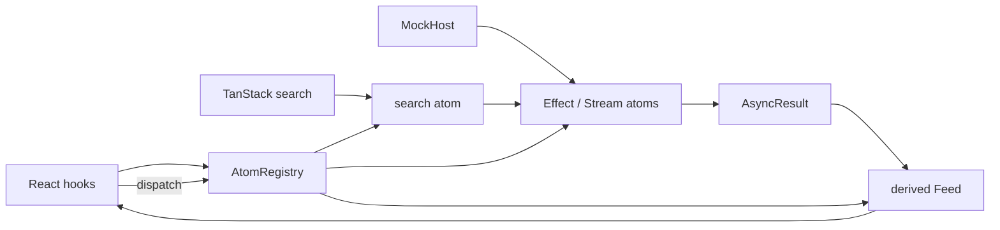

# Effect Atom state architecture prototype

## 1. Library facts

**Verdict on the two repositories:** build with Effect v4's first-party `@effect/atom-react@4.0.0-beta.92`; reject the named `@effect-atom/atom-react@0.7.0` for this app. The latter peers `effect ^3.22.1`, while React itself is not the blocker (`>=18 <20`) ([package source](https://github.com/tim-smart/effect-atom/blob/60bcae0d6824af59b5887fd09466c5dca6a07855/packages/atom-react/package.json#L25-L46)). Effect v4 already ships, rather than merely plans, `effect/unstable/reactivity` with Atom, AtomRegistry, AsyncResult and Reactivity ([v4 barrel](https://github.com/Effect-TS/effect-smol/blob/a445fe52682f023e7e74d2702e98ff3c112d1b94/packages/effect/src/unstable/reactivity/index.ts#L7-L45)). This prototype compiles directly against the app's existing Effect `4.0.0-beta.92`; there is no isolated v3 island.

| Fact | `@effect-atom/atom-react` | First-party `@effect/atom-react` used here |
| --- | --- | --- |
| Maintainer | Tim Smart / Effect ecosystem predecessor | Effect organization |
| Version researched | 0.7.0 | 4.0.0-beta.92 exact tag `a445fe5`; registry latest was beta.107 |
| Last publish / weekly downloads | 2026-08-14 / 63,678 | beta.92: 2026-06-29; latest: 2026-08-10 / 111,733 |
| Unpacked size | 96,490 B plus 713,793 B for `@effect-atom/atom` | beta.92: 89,337 B; latest: 251,120 B |
| React 19 | Supported | Exact peer `^19.2.4` ([package source](https://github.com/Effect-TS/effect-smol/blob/a445fe52682f023e7e74d2702e98ff3c112d1b94/packages/atom/react/package.json#L59-L76)) |
| Suspense / Activity / transitions | Suspense hooks; React features compose externally | `useAtomSuspense`; Activity and transitions compose externally; prototype proves both |
| Devtools | No atom inspector found | No atom inspector found; `effect/unstable/devtools` is runtime telemetry, not atom state ([source](https://github.com/Effect-TS/effect-smol/blob/a445fe52682f023e7e74d2702e98ff3c112d1b94/packages/effect/src/unstable/devtools/DevTools.ts#L1-L8)) |
| SSR / TanStack Start | Registry can be scoped, but manual | **Unsafe on beta.92 with multiple registries:** Suspense promise maps are module-global and keyed only by atom ([Hooks source](https://github.com/Effect-TS/effect-smol/blob/a445fe52682f023e7e74d2702e98ff3c112d1b94/packages/atom/react/src/Hooks.ts#L295-L321)) |

Registry metadata: [npm package](https://registry.npmjs.org/%40effect%2Fatom-react), [weekly downloads](https://api.npmjs.org/downloads/point/last-week/%40effect%2Fatom-react), [v3 package](https://registry.npmjs.org/%40effect-atom%2Fatom-react), [v3 weekly downloads](https://api.npmjs.org/downloads/point/last-week/%40effect-atom%2Fatom-react). Release cadence is active but beta-heavy: beta.92 to beta.107 in six weeks. V4 renamed v3 `Result` to `AsyncResult` and stopped re-exporting atom primitives from the React package ([React exports](https://github.com/Effect-TS/effect-smol/blob/a445fe52682f023e7e74d2702e98ff3c112d1b94/packages/atom/react/src/index.ts#L8-L23)).

The API coverage is real: `Atom.make` accepts values, derived readers, Effects and Streams; Effect/Stream values surface as AsyncResult ([Atom source](https://github.com/Effect-TS/effect-smol/blob/a445fe52682f023e7e74d2702e98ff3c112d1b94/packages/effect/src/unstable/reactivity/Atom.ts#L408-L439)). `Atom.fn`, `Atom.family`, and `Atom.keepAlive` are first-party ([fn](https://github.com/Effect-TS/effect-smol/blob/a445fe52682f023e7e74d2702e98ff3c112d1b94/packages/effect/src/unstable/reactivity/Atom.ts#L1121-L1158), [family](https://github.com/Effect-TS/effect-smol/blob/a445fe52682f023e7e74d2702e98ff3c112d1b94/packages/effect/src/unstable/reactivity/Atom.ts#L1337-L1365), [keepAlive](https://github.com/Effect-TS/effect-smol/blob/a445fe52682f023e7e74d2702e98ff3c112d1b94/packages/effect/src/unstable/reactivity/Atom.ts#L1460-L1485)). React provides `useAtomValue`, non-subscribing `useAtomSet`, `useAtomRefresh`, and `useAtomSuspense` ([Hooks source](https://github.com/Effect-TS/effect-smol/blob/a445fe52682f023e7e74d2702e98ff3c112d1b94/packages/atom/react/src/Hooks.ts#L190-L256)).

## 2. Mental model in one diagram



Smallest complete shape:

```tsx
const registry = AtomRegistry.make()
const count = Atom.make(0)
const doubled = Atom.make((get) => get(count) * 2)

function Counter() {
  const value = useAtomValue(doubled)
  const setCount = useAtomSet(count)
  return <button onClick={() => setCount((n) => n + 1)}>{value}</button>
}

root.render(
  <RegistryContext.Provider value={registry}>
    <Counter />
  </RegistryContext.Provider>,
)
```

The mental model is one explicit registry containing a dependency graph. Writable and derived atoms are nodes; Effect/Stream nodes add AsyncResult lifecycle. React is a thin `useSyncExternalStore` binding, not the owner of state.

## 3. How the scenario mapped

**Round 3.** The store was rebuilt on beta.92's native state-kind surface. The four useful grafts remain: host-atom fixture swap, per-entity view nodes, a domain Feed projector, and the `inspect()` taxonomy.

| State kind | Primitive used | Where it fought |
| --- | --- | --- |
| URL bindings, stage, selected zone ids | `Atom.searchParam` plus a Schema for all seven bindings, mirrored from TanStack `validateSearch` | Native writes wait 500 ms and call global `history.pushState`; they bypass TanStack navigation and drop the hash. TanStack must remain authoritative (`model.ts:201-218`; upstream `.explore/effect-smol/packages/effect/src/unstable/reactivity/Atom.ts:2162-2244`). |
| Persisted recent folders / pane widths | `Atom.kvs` with Schema and localStorage/memory runtime | Sync mode masks storage/schema failures by ignoring non-Success (`model.ts:221-233`; upstream `Atom.ts:2095-2155`, especially `2139-2141`). Acceptable only for noncritical preferences. |
| Page hover, plan-open state, staging, busy, receipt | `Atom.make`, `Atom.family`, `Atom.batch` | Family gives entity granularity; the application owns lifecycle and staged-edit semantics (`model.ts:235-275,426-446,531-581`; upstream `Atom.ts:2014-2025`). |
| Host cache | Effect atoms with `get.result`, `Atom.swr`, `Atom.withReactivity` | AsyncResult and dependency tracking are native; domain Feed/stale vocabulary is not (`model.ts:284-377`). |
| Derived feeds, dirty ids/count, refusal | derived `Atom.make((get) => ...)` | Strong inference; dirty count is O(dirty), not O(500) (`model.ts:379-424,448-458`). |
| Writes | `Atom.fn` plus `Atom.optimisticFn` around Adopt | `optimisticFn` executes immediately, so it cannot mean “stage now, commit later”; staging remains a plain family (`model.ts:462-501`; upstream `Atom.ts:1842-2012`). |
| Push | `Reactivity.invalidate` drives `Atom.withReactivity` nodes | Callback host events need a bridge and every node must share one runtime-factory Reactivity service (`model.ts:503-529`). |

Components import one centralized `effectAtomBench` object and only read its atoms or call its dispatchers. The store is usable without React. `Atom.withLabel` and Registry graph methods enabled the inspector; `keepAlive` is restricted to state that must survive zero subscribers.

`Atom.debounce` was deliberately not used: it delays published values, not hover dispatch or URL navigation (`.explore/effect-smol/packages/effect/src/unstable/reactivity/Atom.ts:1681-1718`). Batching the synchronous hover writes is the native operation that matches the need.

## 4. Async waterfalls

**Round 3.** This is now a real dependent async graph, not URL-gated fan-out. Each Effect generator awaits its predecessor with `get.result(..., { suspendOnWaiting: true })`; Effect tracks that dependency across the generator and cancels/rebuilds downstream when a parent changes (`model.ts:284-347`; upstream `.explore/effect-smol/packages/effect/src/unstable/reactivity/Atom.ts:153-178`).

```ts
const views = runtime.atom((get) => Effect.gen(function* () {
  const link = yield* get.result(doc, { suspendOnWaiting: true })
  return link.value ? timed(() => get(host).listViews(link.value.session.id, link.value.doc.id)) : unbound
}))

const zones = runtime.atom((get) => Effect.gen(function* () {
  const link = yield* get.result(views, { suspendOnWaiting: true })
  return link.value ? timed(() => get(host).listZones(link.value.session.id, link.value.doc.id, get(search).view)) : unbound
}))
```

- **Dedup:** one mounted atom node shares one in-flight result per Registry.
- **Cancellation:** Effect/Stream atom finalizers are supported, but `Effect.tryPromise` cannot cancel this MockHost Promise. A promoted host needs AbortSignal-aware effects.
- **Stale while revalidate:** `Atom.swr` retains prior Success while waiting (`model.ts:342-347`; upstream `Atom.ts:1746-1839`). It does not expose the scenario's `FeedState = "stale"`; the Feed projector maps waiting Success to that required domain state. Adopt invalidates and the automatic re-read clears it.
- **Retries:** none automatic. The explicit refresh verb retries; this is intentionally honest.
- **Refresh / invalidation:** manual refresh uses Registry refresh; mutation/push use `Reactivity.invalidate`, consumed through `Atom.withReactivity` (`model.ts:293,312,344,462-505`; upstream `Atom.ts:765-809`; `Reactivity.ts:218-309`).
- **Push:** `docChanged` invalidates only the doc root; tracked `doc -> views -> zones` dependencies cascade. `sessionGone` invalidates sessions (`model.ts:511-529`). Native Stream atoms remain the push-native alternative for a stream-shaped production host ([source](https://github.com/Effect-TS/effect-smol/blob/a445fe52682f023e7e74d2702e98ff3c112d1b94/packages/effect/src/unstable/reactivity/Atom.ts#L815-L890)).

Each pane uses `useAtomSuspense`, its own fallback, and its own error boundary (`bench.tsx:338-363,537-567`). The boundary is application code: `@effect/atom-react` exports none, while `useAtomSuspense` throws failures (upstream `packages/atom/react/src/index.ts:1-23`; `Hooks.ts:324-372`). Binding picks run in `startTransition` and show a pending affordance (`route:15-19`).

## 5. Fixture / mocking

**Round 3.** The fixture now returns an observably distinct canned dataset (`Fixture Zone ...` plus adjusted loads), rather than the live generator with zero latency. The centralized state object is injected into the route/view, eliminating the prior singleton-bound UI defect.

The required composition-root swap is literally one line:

```ts
registry.set(hostAtom, enabled ? fixture.host : live.host)
```

It is `model.ts:686-694`. The fixture implements the identical MockHost interface, has zero latency and projects `FeedState = "fixture"`. The first no-React test proves the entire session -> doc -> view -> zones chain used the fixture and the live host received no zones call (`mock-host.ts:93-128`; `bench.test.ts:18-33`).

```ts
const state = createEffectAtomBench(live, fixture)
state.connect(boundSearch, () => undefined)
state.dispatch.setFixture(true)
await state.testing.readResult(state.atoms.zonesResult)
expect(fixture.calls).toMatchObject({ sessions: 1, doc: 1, views: 1, zones: 1 })
```

All five required no-React cases pass: fixture swap; waterfall clearing; adopt → stale → automatic refresh; fourth listZones failure → error Feed; pushed docChanged → doc/views/zones refresh.

## 6. Perf

Browser proof used the zero-latency fixture with 500 list rows, 500 SVG rect components and 500 staging rows mounted. A pointer entry into Zone 001 measured **0.300 ms synchronous dispatch and 6 component executions** before the next animation frame. React development Strict Mode executes render bodies twice, so this corresponds to the three logical per-zone consumers—one in each pane—and not the other 499 zones. The browser showed 501 SVG `rect` elements total (500 zones plus unrelated chrome) and exactly 500 staging rows; console errors were zero.

The measurement is `performance.now()` around registry writes plus a `requestAnimationFrame` render census (`model.ts:410-430`; render markers at `bench.tsx:361,393,434`). It measures update fan-out, not paint or low-end-device GPU cost. One sample is sufficient to reject catastrophic 1,500-row rerenders, not to claim a production percentile.

The React `<Activity>` plan pane preserves React state and DOM, but hidden passive effects are cleaned up. Because `useAtomValue` is built on `useSyncExternalStore`, React-side atom subscriptions sleep while hidden. The earlier equal visible/hidden registry count was a whole-registry census, not proof that the plan subtree remained subscribed. KeepAlive host-cache atoms can still run outside that subtree; Activity does not pause the centralized graph.

## 7. URL / persisted / page separation

| Boundary | Library gives | Prototype builds |
| --- | --- | --- |
| URL | nothing router-specific | typed TanStack `validateSearch`; search atom mirror; parent-pick descendant clearing; zones array serialization (`route:7-18`, `model.ts:74-105`) |
| Persisted | `Atom.kvs` | schema-backed localStorage/memory runtime; recent-folder de-dup and max 8; pane-width split (`model.ts:221-233,654-667`) |
| Page | writable/family/derived atoms | hover, plan visibility, staged names, busy seconds, receipt/toast and derived refusal |
| Host cache | Effect/Stream atoms, AsyncResult, Registry refresh | Promise adapter, Timed values, Feed projection, explicit stale-after-write lifecycle |

This separation is visible in the inspector. Selection is URL state and reloadable; hover and staged renames never enter the URL; preferences survive reload; derived refusal is never stored. The library makes these categories composable but does not define or enforce them.

## 8. DX

**Round 3.** Native primitives improved semantic proof but increased source-reading and compatibility code. Fixed judge defects include real dependent async, injected state, distinct fixtures, per-pane failure boundaries, retained staged names, conflict display, non-wall-clock feed derivation, O(dirty) counting, a subscribed inspector, and one cleaned-up host listener.

Prototype LOC, counted as physical lines after formatting: **934 store/host**, **588 view/route**, **113 no-React tests**. This is not compact. The library removes subscription plumbing, not the scenario's domain orchestration.

Inference is strong for derived atoms and Atom.family: `get` carries concrete types without annotations. It degrades at generic AsyncResult projection and writable `Atom.fn` boundaries, where error types and nested result shapes require source-reading. V4's name is `AsyncResult`, not the requested v3 `Result`.

There is no library atom devtools. The prototype uses the cheapest public-API inspector: Registry node/subscription/edge counts plus a subscribed `<pre>` of URL, persisted, page, feeds, and the last 20 actions (`model.ts:715-751`, `bench.tsx:501-523`). Screenshot from round 2: `.artifacts/runs/state-bench/effect-atom-inspector.png`. Browser render proof was HTTP 200 at port 3003 plus a visible heading, 500-zone fact, 500 staging rows, and zero console errors.

Three worst papercuts:

1. **Native does not mean scenario-compatible:** `searchParam` bypasses TanStack Router, `optimisticFn` mutates immediately instead of staging, and SWR has no domain `stale` state. The prototype must bridge or project all three. `Atom.kvs` sync mode also hides persistence failures. Exact upstream locations: `.explore/effect-smol/packages/effect/src/unstable/reactivity/Atom.ts:2162-2244,1746-1839,1842-2012,2095-2155`.
2. **Real Suspense correctness risk:** beta.92 caches promises globally by Atom, not Registry. Nested RegistryProviders or SSR requests can suspend on another registry's promise. V3 already fixed this class of bug; v4 had not through the inspected beta.98 source.
3. **No atom devtools:** labels and Registry nodes make observability possible, but we own the inspector. The browser's TanStack devtools cannot see this graph.

Lane friction: `pnpm install` in the fresh worktree reused 1,322 packages but took 6m53s; the corrected package-local command is `vp test src/state-bench/effect-atom/bench.test.ts`. Round 3 deterministic result was 5/5 passing in 1.12 s, without the former 75 ms sleep. The scoped check ended with all five files formatted and zero warnings/type errors. Round 3 `vp run @pe/web#dev` served on 3002; an HTTP request to the bound route returned 200 with no server-console error. The round 2 browser proof used 3003.

## 9. Verdict

**Round 3.** Native v4 primitives raise the waterfall evidence but do not change the adoption verdict: scenario boundaries still require handwritten bridges, and the beta Suspense defect remains a correctness risk.

| Kaitpw want | Score | Evidence |
| --- | ---: | --- |
| Centralized importable object | **5/5** | One injected object owns Registry, atoms, dispatch, inspection and no-React test seams (`model.ts:585-751`) |
| State handles its own waterfalls | **4/5** | `get.result` proves a tracked session -> doc -> view -> zones chain; descendant clearing, Feed projection, stale vocabulary and Promise cancellation remain application code |
| Mockable | **5/5** | One-line whole-host swap works identically in UI and no-React Vitest |

**Recommendation: conditional reject for the long-lived architecture; keep as a hybrid option.** It is technically viable against Effect v4 and excellent when Effect/Stream integration is decisive. Reject it as the default until `effect/unstable/reactivity` stabilizes, the Suspense cache is registry-scoped, and atom observability exists. The cross-registry defect is a correctness blocker for TanStack Start SSR, not a documentation nit. For a one-registry client-only Pe.Tools route, it is viable today.

## 10. What I would steal

- A single explicit Registry as the no-React importable state boundary.
- AsyncResult's Initial/Success/Failure plus `waiting` representation for honest stale-while-refresh UI.
- Atom.family for fine-grained 500-entity synchronization without selector factories in components.
- Effect and Stream as first-class async/push atom inputs, including finalization.
- Labels plus public graph nodes as a minimum observability contract.
- The one-line host atom swap: fixtures replace capability roots, not individual query results.
