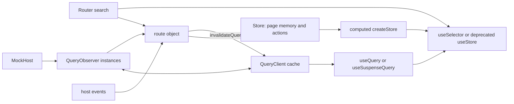

# TanStack state architecture

Research and prototype snapshot: 2026-08-24.

## 1. Library facts

This candidate is a stack, not one state system. TanStack Store owns synchronous page memory and computed values. TanStack Query owns remote cache state. TanStack Router owns URL state. The application must define their composition and lifecycle.

| Package | Current version | Last publish | Weekly downloads, 2026-08-17 through 2026-08-23 | npm unpacked size |
|---|---:|---:|---:|---:|
| `@tanstack/store` | 0.11.1 | 2026-08-05 | 30,467,049 | 123,093 B |
| `@tanstack/react-store` | 0.11.1 | 2026-08-05 | 29,174,866 | 63,848 B |
| `@tanstack/react-query` | 5.102.3 | 2026-08-24 | 66,137,030 | 745,228 B |
| `@tanstack/react-router` | 1.170.32 | 2026-08-22 | 23,683,234 | 1,071,393 B |
| `@tanstack/react-query-devtools` | 5.102.3 | 2026-08-24 | 10,799,149 | 95,040 B |
| `@tanstack/react-devtools` | 0.10.12 | 2026-08-20 | 1,539,313 | 29,137 B |

Sources: npm registry metadata and npm downloads API for [`@tanstack/store`](https://registry.npmjs.org/@tanstack%2Fstore/latest), [`@tanstack/react-store`](https://registry.npmjs.org/@tanstack%2Freact-store/latest), [`@tanstack/react-query`](https://registry.npmjs.org/@tanstack%2Freact-query/latest), [`@tanstack/react-router`](https://registry.npmjs.org/@tanstack%2Freact-router/latest), [`@tanstack/react-query-devtools`](https://registry.npmjs.org/@tanstack%2Freact-query-devtools/latest), and [`@tanstack/react-devtools`](https://registry.npmjs.org/@tanstack%2Freact-devtools/latest). Unpacked size is not shipped JavaScript size. Tree shaking and transitive core packages prevent a useful sum of this column.

- **Maintainer and license:** TanStack, with Tanner Linsley as the package author. The packages use MIT licenses. The manifests identify the repository and author. Sources: [Store manifest](https://github.com/TanStack/store/blob/8699e10440b8f0bb8fc655b60abd546fab7697a7/packages/store/package.json#L2-L15), [Query manifest](https://github.com/TanStack/query/blob/730b3aa06c49337068e1b84a5025bca75887348b/packages/react-query/package.json#L2-L15), [Router manifest](https://github.com/TanStack/router/blob/9f8990b5150338695c8870cbe443edadf2b7b825/packages/react-router/package.json#L2-L15), [Devtools manifest](https://github.com/TanStack/devtools/blob/566d39b7fcdaf377871abedf38cb0eae1227e903/packages/react-devtools/package.json#L2-L18).
- **Release cadence:** Query and Router publish several times per week. Devtools published three releases in nine days. Store 0.11.1 followed 0.11.0 by about four months. The npm table above is the current receipt. Store's slower cadence matters because 0.9 and 0.11 each changed the requested API vocabulary.
- **React 19:** React Query declares React 18 or 19 and develops against React 19.2.1. React Store accepts React 16.8 through 19 and develops against React 19.2.5. Router accepts React 18 or 19. Sources: [Query peer dependencies](https://github.com/TanStack/query/blob/730b3aa06c49337068e1b84a5025bca75887348b/packages/react-query/package.json#L67-L83), [React Store peer dependencies](https://github.com/TanStack/store/blob/8699e10440b8f0bb8fc655b60abd546fab7697a7/packages/react-store/package.json#L51-L67), [Router peer dependencies](https://github.com/TanStack/router/blob/9f8990b5150338695c8870cbe443edadf2b7b825/packages/react-router/package.json#L122-L125).
- **Suspense and transitions:** `useSuspenseQuery` forces `enabled: true`, `suspense: true`, and removes `placeholderData`. The official guide says dependent suspense queries in one component run serially and recommends `startTransition` when a query key changes. Sources: [hook source](https://github.com/TanStack/query/blob/730b3aa06c49337068e1b84a5025bca75887348b/packages/react-query/src/useSuspenseQuery.ts#L17-L33), [Suspense guide](https://github.com/TanStack/query/blob/730b3aa06c49337068e1b84a5025bca75887348b/docs/framework/react/guides/suspense.md#L6-L28). React Store's binding uses `useSyncExternalStoreWithSelector`; it does not implement a separate suspense protocol. Its React 19 test verifies that a committed selector keeps receiving updates while a transition to another selector suspends. Sources: [React selector binding](https://github.com/TanStack/store/blob/8699e10440b8f0bb8fc655b60abd546fab7697a7/packages/react-store/src/useSelector.ts#L43-L66), [Suspense transition test](https://github.com/TanStack/store/blob/8699e10440b8f0bb8fc655b60abd546fab7697a7/packages/react-store/tests/index.test.tsx#L151-L204).
- **Activity:** no Store, Query, Router, or Devtools source reviewed here contains an Activity-specific integration. In the browser proof, a 500-zone hover rendered two Plan-zone components while visible and zero while hidden: the hidden Plan's Store subscriptions stopped firing. This is React's behavior, not a TanStack integration (`view.tsx:45-49`; measurement in section 6).
- **Devtools:** Query has a maintained panel. The general `TanStackDevtools` shell accepts Query and Router panels as plugins. Its own README warns that the shell remains under active development and may break. TanStack Store has no first-party Store panel in these sources, so a whole-route Store inspector is application code. Source: [React Devtools usage and warning](https://github.com/TanStack/devtools/blob/566d39b7fcdaf377871abedf38cb0eae1227e903/packages/react-devtools/README.md#L18-L49).
- **SSR and TanStack Start:** Query supports prefetch, dehydrate, and `HydrationBoundary`; pending queries can also stream to the client. Router has a first-party `react-router-ssr-query` package and TanStack Start query integration tests. Sources: [Query SSR flow](https://github.com/TanStack/query/blob/730b3aa06c49337068e1b84a5025bca75887348b/docs/framework/react/guides/ssr.md#L37-L37), [pending-query streaming](https://github.com/TanStack/query/blob/730b3aa06c49337068e1b84a5025bca75887348b/docs/framework/react/guides/advanced-ssr.md#L378-L380), `tanstack-router/packages/react-router-ssr-query/src/index.tsx` and `tanstack-router/e2e/react-start/query-integration/` in the synced upstream clone.
- **Effect v4:** interop is functional but shallow. A Query `queryFn` needs a Promise. Effect v4 `Effect.runPromise` returns one and accepts an `AbortSignal`, so `({ signal }) => Effect.runPromise(program, { signal })` preserves Query cancellation. Typed Effect failures cross into Query's Promise error channel. They do not remain an Effect error type. Source: `C:/Users/kaitp/source/repos/Pe.Tools/.explore/effect-smol/packages/effect/src/Effect.ts:8791-8807,8984-9023`.

One major fact invalidates part of the mission wording. In Store 0.9, `new Derived()` became computed `createStore(() => ...)`, and public `new Effect()` became `store.subscribe()`. Store 0.11 deprecates `useStore` for `useSelector`. Sources: [Store changelog](https://github.com/TanStack/store/blob/8699e10440b8f0bb8fc655b60abd546fab7697a7/packages/store/CHANGELOG.md#L9-L17), [0.9 breaking changes](https://github.com/TanStack/store/blob/8699e10440b8f0bb8fc655b60abd546fab7697a7/packages/store/CHANGELOG.md#L45-L61), [deprecated alias source](https://github.com/TanStack/store/blob/8699e10440b8f0bb8fc655b60abd546fab7697a7/packages/react-store/src/useStore.ts#L3-L22). The prototype should demonstrate the current equivalents and name the mismatch.

## 2. Mental model in one diagram



Smallest complete current-API example:

```ts
import { QueryClient, QueryObserver, queryOptions } from '@tanstack/react-query'
import { batch, createStore } from '@tanstack/store'

const queryClient = new QueryClient()
const page = createStore({ sessionId: null as string | null, sessions: [] as string[] })
const progress = createStore(() => (page.state.sessionId ? 1 : 0)) // current Derived

const sessionsOptions = queryOptions({
  queryKey: ['sessions'],
  queryFn: () => host.listSessions(),
})
const sessions = new QueryObserver(queryClient, sessionsOptions)
const stopSessions = sessions.subscribe((result) => {
  if (result.data) page.setState((state) => ({ ...state, sessions: result.data }))
})
const effect = page.subscribe((state) => console.debug(state)) // current Effect

batch(() => {
  page.setState((state) => ({ ...state, sessionId: 's1' }))
  queryClient.setQueryData(['sessions'], ['s1'])
})

effect.unsubscribe()
stopSessions()
```

This is possible outside React. It is also revealing: the application owns observer construction, result projection, dependency rewiring, and cleanup. `QueryObserver` starts fetching on its first subscription and destroys itself after its last listener leaves. Source: [QueryObserver lifecycle](https://github.com/TanStack/query/blob/730b3aa06c49337068e1b84a5025bca75887348b/packages/query-core/src/queryObserver.ts#L68-L107). Store batching defers the effect flush until the outer batch exits. Source: [Store `batch`](https://github.com/TanStack/store/blob/8699e10440b8f0bb8fc655b60abd546fab7697a7/packages/store/src/atom.ts#L65-L79).

## 3. How the scenario mapped

| State kind | Primitive | Fit and friction |
|---|---|---|
| URL bindings, stage, selected zone IDs | Router `validateSearch`, `Route.useSearch`, `navigate({ search })` | Strong fit. Search is typed after a trust-boundary validator. Parent picks still need one centralized action that clears descendants. |
| Persisted recent folders and pane widths | `localStorage` plus Store hydration/write subscription | No persistence primitive in Store. This remains application code. |
| Page memory | one `createStore` route store with actions | Importable outside React and easy to test. Mutable nested state still needs immutable updates. |
| Host cache | one `QueryClient`, `queryOptions`, Query observers | Strong cache and invalidation behavior. It is a second state tree beside Store. |
| Derived feeds, progress, seams, refusals, world | computed `createStore(() => ...)` | Current replacement for `Derived`. Refusal remains computed, never flagged. |
| Side effects | `store.subscribe()` and host event subscription | Current replacement for public `Effect`. Cleanup is manual. |
| React reads | `useSelector`; `useStore` only to expose the requested deprecated API | Fine-grained selection exists. The mission's preferred hook name is already deprecated. |

Router treats search params as URL-owned application state and validates raw values through `validateSearch` (`state-bench.tanstack.tsx:17-26`). `TanstackBench` is the statically readable route object: it owns six observers (`model.ts:157-162`), descendant-clearing picks (`model.ts:231-247`), staging/adopt (`model.ts:325-385`), persistence (`model.ts:190-210`), push handling (`model.ts:636-649`), and teardown (`model.ts:448-458`). Components only select state and dispatch to it. Sources: [search-state rationale](https://github.com/TanStack/router/blob/9f8990b5150338695c8870cbe443edadf2b7b825/docs/router/guide/search-params.md#L27-L38), [validation contract](https://github.com/TanStack/router/blob/9f8990b5150338695c8870cbe443edadf2b7b825/docs/router/guide/search-params.md#L85-L118).

## 4. Async waterfalls

Hook-based dependent queries use `enabled`. A disabled child stays `status: 'pending'` and `fetchStatus: 'idle'`; it fetches when its parent value enables it. The official guide also calls out the cost: two equal serial requests take twice as long as parallel requests. Source: [dependent queries](https://github.com/TanStack/query/blob/730b3aa06c49337068e1b84a5025bca75887348b/docs/framework/react/guides/dependent-queries.md#L6-L58), [waterfall warning](https://github.com/TanStack/query/blob/730b3aa06c49337068e1b84a5025bca75887348b/docs/framework/react/guides/dependent-queries.md#L91-L95).

An object can own the same waterfall outside React:

```ts
const doc = new QueryObserver(queryClient, docOptions(null))
const views = new QueryObserver(queryClient, viewsOptions(null, null))
const zones = new QueryObserver(queryClient, zonesOptions(null, null, null))

const stopDoc = doc.subscribe((result) => {
  views.setOptions(viewsOptions(route.state.sessionId, result.data?.id ?? null))
})
const stopViews = views.subscribe((result) => {
  zones.setOptions(
    zonesOptions(route.state.sessionId, route.state.docId, result.data?.[0]?.id ?? null),
  )
})
const stopZones = zones.subscribe((result) => route.actions.acceptZones(result))
```

That proves capability, not elegance. `QueryObserver` validates and replaces options, fetches only while subscribed, and owns timers and cache attachment. The route object must call `setOptions`, keep unsubscribe functions, prevent obsolete descendants from publishing, and destroy the graph. Source: [observer options and lifecycle](https://github.com/TanStack/query/blob/730b3aa06c49337068e1b84a5025bca75887348b/packages/query-core/src/queryObserver.ts#L91-L107), [option replacement](https://github.com/TanStack/query/blob/730b3aa06c49337068e1b84a5025bca75887348b/packages/query-core/src/queryObserver.ts#L134-L180). This is hand-built orchestration around a good cache.

- **Dedup:** equal query keys share one cache query and in-flight fetch.
- **Cancellation:** every query function receives an `AbortSignal`. Cancellation only stops underlying work when the query function consumes it. Otherwise an unmounted request may finish into cache. Source: [cancellation semantics](https://github.com/TanStack/query/blob/730b3aa06c49337068e1b84a5025bca75887348b/docs/framework/react/guides/query-cancellation.md#L6-L14).
- **Stale-while-revalidate:** cached data is stale by default. Stale active queries refetch on mount, focus, and reconnect. `staleTime` controls this. Source: [important defaults](https://github.com/TanStack/query/blob/730b3aa06c49337068e1b84a5025bca75887348b/docs/framework/react/guides/important-defaults.md#L6-L29).
- **Retries:** mounted query observers retry failed queries three times with exponential backoff by default. The imperative `queryClient.query` and deprecated `fetchQuery` default to no retry. Sources: [observer defaults](https://github.com/TanStack/query/blob/730b3aa06c49337068e1b84a5025bca75887348b/docs/framework/react/guides/important-defaults.md#L33-L35), [imperative query source](https://github.com/TanStack/query/blob/730b3aa06c49337068e1b84a5025bca75887348b/packages/query-core/src/queryClient.ts#L346-L378).
- **Invalidation and push:** `invalidateQueries` marks matches stale and refetches active matches unless configured otherwise. A `docChanged` event can invalidate the doc, view, and zone key prefixes. Source: [invalidation implementation](https://github.com/TanStack/query/blob/730b3aa06c49337068e1b84a5025bca75887348b/packages/query-core/src/queryClient.ts#L298-L317).
- **Using Query as a store:** `setQueryData` synchronously creates or updates cached data. It is suitable for host push or a successful mutation receipt, but it creates a second imperative write API beside Store. Source: [setQueryData implementation](https://github.com/TanStack/query/blob/730b3aa06c49337068e1b84a5025bca75887348b/packages/query-core/src/queryClient.ts#L179-L212).
- **Streaming:** `experimental_streamedQuery` is an export alias for `streamedQuery`. It accepts an `AsyncIterable`, becomes successful after the first chunk, keeps `fetchStatus: 'fetching'` until completion, supports reset, append, and replace refetch modes, and writes chunks with `setQueryData`. Sources: [experimental export](https://github.com/TanStack/query/blob/730b3aa06c49337068e1b84a5025bca75887348b/packages/query-core/src/index.ts#L44), [stream behavior](https://github.com/TanStack/query/blob/730b3aa06c49337068e1b84a5025bca75887348b/packages/query-core/src/streamedQuery.ts#L37-L60), [stream cache writes](https://github.com/TanStack/query/blob/730b3aa06c49337068e1b84a5025bca75887348b/packages/query-core/src/streamedQuery.ts#L65-L119).
- **Suspense:** `useSuspenseQuery` gives defined data but cannot use `enabled` or `skipToken`. The Plan uses a separate suspense probe which delegates to the authoritative zones query through `ensureQueryData` (`model.ts:388-399`; `view.tsx:340-350`). The other two panes expose explicit status feeds inside Suspense boundaries. This avoids a second host request, but the mirror cache key is architecture tax caused by mixing hook suspense with a route-owned observer graph.

## 5. Fixture/mocking

The composition root swaps the host without React:

```ts
const bench = createTanstackBench(fixture ? createMockHost({ fixture: true }) : createMockHost())
```

That is the actual composition line (`model.ts:660-661`). Query options close over the injected `MockHost`; each route object owns a fresh `QueryClient`. `MockHost` exposes the required methods, pushes, latency multiplier, deterministic fixture, and one-in-four failure (`mock-host.ts:53-74`). The no-React test has exactly five named cases: one-line fixture swap, parent descendant clearing, adopt `stale` then automatic fresh reread, fourth zones call error, and `docChanged` query-basis invalidation (`bench.test.ts:6-79`). Proof: `vp test src/state-bench/tanstack/bench.test.ts` from `apps/web`, 5/5 passed in 13 ms test time.

## 6. Perf

Browser measurement used `performance.now()` from pointer entry through the next animation frame and render counters in each zone component (`model.ts:249-271`). With 500 zones in each of three panes, hovering Zone 001 with Plan visible took **11.80 ms and 6 zone renders**: two affected rows per pane under the development renderer. With Plan hidden by React Activity, moving to Zone 002 took **3.40 ms and 4 zone renders**: two each in List and Staging, zero in hidden Plan. This single development-browser sample is inside a 16.7 ms frame, not a production benchmark. It proves selector isolation and that hidden Plan subscriptions did not fire in this run. Sources: [Store selector comparison](https://github.com/TanStack/store/blob/8699e10440b8f0bb8fc655b60abd546fab7697a7/packages/react-store/src/useSelector.ts#L43-L66), [Query structural sharing default](https://github.com/TanStack/query/blob/730b3aa06c49337068e1b84a5025bca75887348b/docs/framework/react/guides/important-defaults.md#L37-L43).

## 7. URL / persisted / page separation

The separation is explicit but not unified:

- Router gives typed URL parsing, validation, navigation, and search subscriptions.
- Query gives the host cache and remote lifecycle.
- Store gives page memory, actions, computed state, batching, and subscriptions.
- The application gives `localStorage` persistence and coordinates all three systems.

This is architecturally honest. It also defeats the attractive claim that one TanStack primitive owns all state. The centralized route object can hide the split from components, but it cannot remove the split. Router preserves JSON-compatible arrays and nested values and uses structural sharing for search state. Source: [Router search representation](https://github.com/TanStack/router/blob/9f8990b5150338695c8870cbe443edadf2b7b825/docs/router/guide/search-params.md#L40-L83).

## 8. DX

- **Lines of code:** 828 state/host LOC (`model.ts` 663 + `mock-host.ts` 165), 507 view/route LOC (`view.tsx` 459 + route 48), and 80 test LOC. Total prototype: 1,415 LOC excluding generated route tree. This is too much ceremony for the scenario.
- **Type inference:** `queryOptions` preserves the association between `queryKey` and `queryFn` for `getQueryData`. It does not infer heterogeneous `getQueriesData` tuples. Source: [Query TypeScript guide](https://github.com/TanStack/query/blob/730b3aa06c49337068e1b84a5025bca75887348b/docs/framework/react/typescript.md#L202-L240). Router search inference is strong after `validateSearch`. Store state and action inference is direct, but computed stores become readonly only through `createStore` overloads. Source: [Store overloads](https://github.com/TanStack/store/blob/8699e10440b8f0bb8fc655b60abd546fab7697a7/packages/store/src/store.ts#L86-L104).
- **Devtools:** `TanStackDevtools` is wired with `ReactQueryDevtoolsPanel` and an application Store inspector (`view.tsx:71-77`). Browser proof showed the TanStack Router and Query plugins plus the route's state inspector. Screenshots were captured inline during the run; no repo image was added because the authorized file scope excluded binary artifacts. The route rendered at `http://localhost:3003/state-bench/tanstack`; browser DOM showed 500 zones and curl returned HTTP 200 with 4,460 bytes.

The three worst papercuts:

1. The bake-off brief names an API that upstream removed. `Derived` and public `Effect` disappeared in 0.9. `useStore` became deprecated in 0.11. A prototype that follows current docs cannot literally follow the requested vocabulary.
2. `QueryObserver` outside React works, but the route object must implement observer graph construction, `setOptions` rewiring, stale-result guards, result-to-Store projection, and teardown. Query owns requests; it does not own this domain waterfall.
3. Suspense fights conditional waterfalls. `useSuspenseQuery` forces enabled state and serializes queries by render order. Using it beside route-owned observers risks two authorities and makes per-pane fallbacks harder to reason about.

Research tooling papercut: a normal shallow Router clone failed on Windows because repository snapshot filenames exceeded the checkout path limit. The Git objects and required package source were readable, but the worktree stayed dirty. This is not a production Router defect. It is friction for source-based evaluation on Windows.

Implementation tooling added more signal: `pnpm install` took 6m57.6s despite no downloads; `pnpm add -F` rewrote the workspace catalog and required a scoped correction; the repository's `latest` catalog entries caused broad lockfile churn; six `QueryObserver` instances needed verbose exact generics; and `effect` exists internally but is not a package export, so the current public Effect equivalent is `Store.subscribe()`. The dev route also logged the repository's existing `react-router-ssr-query` hydration error (`undefined.mutations`), while no prototype-origin render warning remained.

## 9. Verdict

| Want | Score | Evidence |
|---|---:|---|
| Centralized importable object | 4/5 | One framework-independent `TanstackBench` owns stores, actions, QueryClient, six observers, host events, and cleanup; Router synchronization still begins in a React effect. |
| State handles its own waterfalls | 3/5 | It does so without hooks, but only through manual observer construction, rewiring, guards, projection, and teardown. Query handles cache mechanics after application code builds the dependency graph. |
| Mockable | 5/5 | Host injection and a fresh QueryClient make the fixture swap one line; all five behavior cases pass without React. |

**Recommendation: hybrid-with Router and Query; reject TanStack Store as the reason to choose the architecture.** Query and Router solve difficult, product-relevant problems. Store is small and capable, but the 1,415-LOC result adds a second client-state graph without solving persistence, URL ownership, async dependency orchestration, or Store visibility. Against the baseline rubric, it is centralized and no-React-testable but descendant clearing, invalidation, stage lifetime, observer dependencies, and disposal remain hand-coded. Against the QR rubric, it misses one primitive for sync and async state and cannot express the waterfalls as direct awaits; the route object manually maintains an observer graph.

## 10. What you would steal

- `queryOptions` as the typed key and fetch contract shared by hooks, observers, tests, and imperative cache calls.
- `QueryObserver` as an escape hatch for a non-React route controller, used only where the controller genuinely must own remote lifecycle.
- Targeted `invalidateQueries` after writes and host push events instead of copying remote records into page state.
- Router `validateSearch` as the trust boundary for bindings and selection.
- `useSelector` over the deprecated `useStore` name, with one computed `createStore` for refusal and progress.
