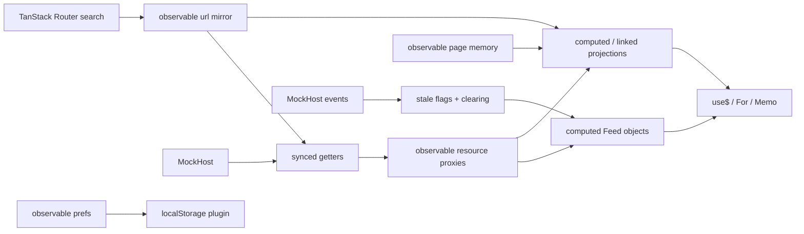

# Legend State v3 bake-off: `@legendapp/state`

## 1. Library facts

Evaluated version: **`3.0.0-beta.48`**. npm still points `latest` at `2.1.15`; the v3 beta was published 2026-07-12, while the stable tag was last published 2024-08-30. The beta tarball is 795,089 unpacked bytes across 219 files. npm reported 102,746 downloads across all versions for 2026-08-17 through 2026-08-23. These are registry facts, not a client-bundle measurement ([npm package metadata](https://registry.npmjs.org/%40legendapp%2Fstate), [npm weekly downloads](https://api.npmjs.org/downloads/point/last-week/%40legendapp%2Fstate)).

Jay Meistrich is the named maintainer ([README](https://github.com/LegendApp/legend-state/blob/23b5ddeb87598082987aa475dee1586d54328034/README.md#L134-L138)). Main was active as recently as 2026-08-11, but the six-month history was bursty: 40 commits, 28 by Meistrich, with no commits in May or June and 19 in July ([commit history](https://github.com/LegendApp/legend-state/commits/main/)). v3 has been prerelease software since alpha in May 2024 and beta since September 2024. The shipped changelog ends at early v3 alphas, so it does not explain current beta changes ([CHANGELOG](https://github.com/LegendApp/legend-state/blob/23b5ddeb87598082987aa475dee1586d54328034/CHANGELOG.md#L1-L18)). This is a long beta with active but concentrated maintenance, not a boring mature release.

The React binding uses `useSyncExternalStore`; `use$`, `useValue`, and `useSelector` share the same implementation ([source](https://github.com/LegendApp/legend-state/blob/23b5ddeb87598082987aa475dee1586d54328034/src/react/useSelector.ts#L53-L99)). Suspense is implemented by passing a promise to `React.use` when present, otherwise throwing it ([source](https://github.com/LegendApp/legend-state/blob/23b5ddeb87598082987aa475dee1586d54328034/src/react/useSelector.ts#L131-L180)). This prototype proved ordinary hooks and Suspense against this repo's React 19.2.7. That is weaker than official React 19 support: upstream still develops/tests against React 18.3.1 ([package manifest](https://github.com/LegendApp/legend-state/blob/23b5ddeb87598082987aa475dee1586d54328034/package.json#L78-L107)), and the migration guide says `use$` is incompatible with React Compiler and recommends `useValue` ([migration guide](https://legendapp.com/open-source/state/v3/other/migrating/)). React 19 `Activity` and transitions are native React features; Legend adds no special integration. The plan pane worked under `Activity`, and router picks worked under `startTransition`.

There is no state-tree devtools UI. Upstream provides trace hooks such as `useTraceUpdates`, not an inspector ([tracing docs](https://legendapp.com/open-source/state/v3/react/tracing/), [source](https://github.com/LegendApp/legend-state/blob/23b5ddeb87598082987aa475dee1586d54328034/src/trace/useTraceUpdates.ts#L4-L23)). The prototype therefore uses the required cheap `<pre>` inspector.

SSR/TanStack Start fit is mixed. Core observables are platform-neutral and localStorage can be guarded to the browser, but a module singleton is request-global during SSR. A production Start integration needs a request/client-scoped composition root, which weakens the appeal of a universally importable singleton. Worse, the published TanStack adapter imports `@tanstack/query-core` without declaring it; strict pnpm SSR failed with HTTP 500 until that dependency was attached explicitly ([adapter source](https://github.com/LegendApp/legend-state/blob/23b5ddeb87598082987aa475dee1586d54328034/src/sync-plugins/tanstack-query.ts#L22-L48)).

There is no Effect v4/effect-smol adapter. `Effect.runPromise` could be returned from a `synced.get`, but that discards typed errors, interruption, scopes, and Effect-native cancellation. Treat that as promise interop, not compatibility.

## 2. Mental model in one diagram



Smallest complete shape:

```ts
const state$ = observable({ session: "", view: "", selected: [] as string[] });
const zones$ = observable(
  synced({
    get: () =>
      state$.session.get() && state$.view.get()
        ? host.listZones(state$.session.get(), state$.view.get())
        : [],
  }),
);
const selectedCount$ = computed(() => state$.selected.get().length);

function ZoneCount() {
  return <span>{use$(selectedCount$)} selected</span>;
}
```

The attractive idea is one lazily proxied graph in which reads declare dependencies. The cost is that proxy access and subscription boundaries become architectural decisions rather than implementation details.

## 3. How the scenario mapped

| State kind / requirement | Primitive used | Result and friction |
| --- | --- | --- |
| Centralized state | `observable` singleton plus `createLegendBench` | Components only read observables and dispatch actions; the singleton is importable, but SSR wants an instance per client/request (`store.ts:92-501`). |
| URL bindings and stage | TanStack Router `validateSearch`, mirrored observable | Session→doc→view→zones and folder→r10 are validated; `pickInto` clears graph descendants (`store.ts:26-82`, `routes/state-bench.legend.tsx:16-47`). Legend does not replace the router. |
| Host cache | `observable(synced(...))` | Sessions/doc/views/zones/files derive their reads from URL state (`store.ts:123-154`). Completion/error handling still needed custom orchestration. |
| R10 query | official `syncedQuery` adapter | TanStack Query owns dedup/cache for `openR10` (`store.ts:156-170`), but the adapter's undeclared runtime dependency broke SSR. |
| Fetch coverage | official `syncedFetch` | A small exported adapter proves the primitive without distorting the method-based MockHost (`store.ts:87-90`). Fetch is too thin for the Host contract. |
| Feed objects | `computed` over resource + `syncState` | Produces `loading`, `error`, `fresh`, `stale`, or `fixture`, timestamped after reads (`store.ts:179-231`). `live` is in the contract but no snapshot is falsely labeled live. |
| Derived state | `computed`; `linked` for writable plan visibility | Progress, refusal, basis, seams, world projection, selection count, and perf stay out of components (`store.ts:233-296`). |
| Persisted prefs | `syncObservable` + `ObservablePersistLocalStorage` | Only recent folders (max 8) and pane widths persist (`store.ts:117-121`, `store.ts:361-366`). Large zone data and hover do not. |
| Page memory | nested `observable` nodes | Hover-by-id, staged renames, inspector, busy/receipt/toast, and render counters stay off the URL (`store.ts:96-114`). |
| Fine rendering | `use$`, `For`, `Memo` plus native `memo` | Per-zone leaf paths make hover narrow; native `memo` is also needed to stop router parent renders from replaying all 500 `For` children (`panes.tsx:14-82`, `panes.tsx:101-169`). |
| Suspense/concurrency | per-pane `Suspense`, React `Activity`, router `startTransition` | All three panes suspend independently; the plan is hidden with `Activity`; URL writes remain responsive (`panes.tsx:140-169`, route lines 33-47). |
| Staging/adopt | central actions + computed refusal | Dirty rename rows, refusal, seconds, receipt toast, stale-after-write, and automatic reread are centralized (`store.ts:386-414`). The MockHost contract has no rename payload, so staged names are deliberately cleared rather than sent. |

The library fought the scenario at boundaries: URL ownership, async completion, query packaging, request scoping, and devtools all remained application work.

## 4. Async waterfalls

Dependent `synced` getters read the binding nodes they depend on. Picks clear descendants first, update the URL mirror/router, and explicitly refresh the next feed so the same actions work without React subscriptions:

```ts
const zones$ = observable(
  synced({
    get: () => {
      const { session, doc, view } = state$.url.get();
      return session && doc && view ? host.listZones(session, doc, view) : [];
    },
  }),
);

const pick = (key: BindingKey, id: string) => {
  const after = pickInto(state$.url.peek(), key, id);
  writeChangedSearchFields(after);
  if (key === "view" && id) void refresh("zones");
};
```

The full implementation is at `store.ts:123-170` and `store.ts:344-359`. TanStack Query supplies cache dedup for R10 only. The plain `synced` resources have no scenario-level request cancellation or response version guard, so a late obsolete read can win. Retries are supported by the broader sync options, but this prototype intentionally does not hide the MockHost's 1-in-4 error; the QueryClient also sets `retry: false`.

Stale-while-revalidate is explicit, not automatic policy: Adopt sets `zones.stale = true`, then awaits a refresh which replaces the data and marks it fresh. A `docChanged` push invalidates doc, views, and zones; `sessionGone` invalidates sessions and clears the active session waterfall (`store.ts:416-429`). The feed retains old options during stale/error states. There is no generalized invalidation graph beyond the six lines encoded here.

Two adverse observations matter. First, `syncState.sync()` returned before the read settled, so `refresh` had to subscribe until loaded/error (`store.ts:315-342`). Second, an initial `syncedQuery` rejection did not settle the initial observable promise in the test lane; Vitest timed out. Failure-prone zones therefore use core `synced`, while `syncedQuery` is confined to R10. That is not a safe default for the main waterfall.

`syncedFetch` is a URL/global-fetch convenience. Its implementation does not provide the MockHost's structured methods, domain errors, or this scenario's dependency graph ([fetch source](https://github.com/LegendApp/legend-state/blob/23b5ddeb87598082987aa475dee1586d54328034/src/sync-plugins/fetch.ts#L22-L83)).

## 5. Fixture/mocking

The seam is the `MockHost` interface with the specified 300/200/600/800/400/500/1500 ms operations, event subscription, 500-zone fixture, and controllable latency/failure/fixture knobs (`mock-host.ts:38-54`, `mock-host.ts:99-134`). The no-React composition swap is one line:

```ts
const bench = createLegendBench({ host: createFixtureHost() });
```

The test imports no React and proves exactly five cases: fixture swap, descendant clearing, Adopt→stale→refresh, rejected zones→`error`, and push `docChanged` invalidation (`bench.test.ts:16-105`). Corrected deterministic lane:

```text
apps/web> vp test src/state-bench/legend/bench.test.ts
Test Files  1 passed (1)
Tests       5 passed (5)
```

Fixture mode is a composition-root host swap in tests and a visible runtime knob in the prototype. No observable code knows fixture data shapes beyond the shared Host return types.

## 6. Perf

Measured in Chrome against the rendered route with 500 zones, React 19.2.7, the dev server, and latency set to 0×. The hover action records `performance.now()` around the central update; render counts are incremented by each zone leaf after commit.

| Probe | Result |
| --- | --- |
| 29 hover enter/leave samples | 5.234 ms mean; 8.700 ms max |
| Components rerendered per hover event | 1 list row + 1 plan rect + 1 staging row; 3 total |
| URL-only stage change after memo boundary | 0 list, 0 plan, 0 staging rerenders |
| Two list hover moves while plan `Activity` hidden | list +3, staging +3, plan +0 |

Hidden plan subscriptions did **not** keep firing: its render count remained unchanged. When shown again React reconciles to current state. The extra enter/leave event explains the +3 in the two-move probe.

The result depends on leaf observables. A naive `use$(() => hoveredId)` in each of 500 rows would rerun 500 selectors per hover. This prototype instead subscribes each row to `hoverById[zone.id]` (`panes.tsx:14-82`). Stable IDs are also important because Legend's observable child reuse is identity-sensitive ([observable implementation](https://github.com/LegendApp/legend-state/blob/23b5ddeb87598082987aa475dee1586d54328034/src/ObservableObject.ts#L179-L223)). Large proxy iteration is another trap; upstream recommends extracting raw data for large computations ([performance guide](https://legendapp.com/open-source/state/v3/guides/performance/)).

There was a second trap: router search changes initially rerendered all 1,500 zone leaves through the parent component even though Legend's state update was fine-grained. Diff-only URL synchronization plus a native `memo(BenchPanes)` boundary reduced a stage-only navigation from 500 renders per pane to zero. Fine-grained stores do not cancel ordinary React parent rendering.

## 7. URL / persisted / page separation

| Lifetime | Contents | Owner |
| --- | --- | --- |
| URL | session, doc, view, selected zone IDs, folder, r10, stage | TanStack Router `validateSearch`; mirrored into Legend for centralized derivation |
| Persisted | recent folders (max 8), list width, plan width | Legend localStorage persistence plugin |
| Page memory | hover, staged renames, plan visibility, inspector, busy, receipt/toast, failures, perf/action log | Legend observable only |
| Host cache | sessions, doc, views, zones, folder files, opened R10 | Legend `synced`; TanStack Query adapter for R10 |
| Derived | progress, refusals, basis, seams, projected world, feed states | Legend `computed` / `linked` |

TanStack Router remains the URL authority; Legend provides no reason to replace it. The localStorage plugin synchronously parses and stringifies its table and writes the whole value ([source](https://github.com/LegendApp/legend-state/blob/23b5ddeb87598082987aa475dee1586d54328034/src/persist-plugins/local-storage.ts#L15-L73)). That is acceptable for three tiny preferences and a reason to reject it for 500 zones. The persistence guard also makes server defaults differ from hydrated client preferences; production UI must tolerate that transition.

## 8. DX

Post-format physical lines:

| Area | Lines |
| --- | ---: |
| Central store | 499 |
| View (`panes.tsx` + `page.tsx` + route) | 529 |
| MockHost | 134 |
| No-React test | 105 |

Type inference is excellent for ordinary observable leaf reads and computed values, but proxy types become noisy at library edges. `For` would not accept `Observable<Zone[] | undefined>` even immediately after a Suspense read, requiring a post-Suspense `Observable<Zone[]>` cast (`panes.tsx:9-10`). Indexed proxy writes also surface `undefined` in updater callbacks. The centralized object is easy to explore in TypeScript, but the many `.get()`/`.peek()` choices encode behavioral meaning that review must catch.

Inspector screenshot: [`ts/apps/web/src/state-bench/legend/legend-inspector.png`](../../../ts/apps/web/src/state-bench/legend/legend-inspector.png). It shows the whole state snapshot, derived basis/progress/seams, and the last 20 actions. The route rendered in Chrome and `Invoke-WebRequest http://localhost:3004/state-bench/legend` returned HTTP 200 with 4,456 bytes.

The three worst papercuts:

1. The official `syncedQuery` entry imports undeclared `@tanstack/query-core`. A normal direct app dependency was insufficient under strict pnpm because resolution starts inside Legend's virtual package; the lock snapshot had to attach it to Legend before SSR stopped returning 500.
2. Initial `syncedQuery` failure hung the observable instead of surfacing an error in the test. Core `synced` was necessary on the intentionally failure-prone zones lane.
3. `syncState.sync()` was not an awaitable completion boundary for this usage. A custom status subscription was required for deterministic refresh, stale clearing, and tests.

Other rejection evidence: no real devtools, long beta, incomplete changelog, no React 19 test posture, no cancellation/version guard in the plain synced waterfall, React Compiler guidance against `use$`, and request-scoping work for SSR.

Route/install lane notes: `pnpm install` succeeded. `pnpm add -F @pe/web` tried to promote the package to the workspace catalog and re-resolve unrelated `latest` dependencies, so those unrelated changes were removed and only candidate dependencies were retained. The original requested `vp run @pe/web#test -- state-bench` failed because `@pe/web`'s `test` script is `vp run`, making `state-bench` look like a nonexistent task. The corrected Round 2 lane passed. `vp check --fix` and the subsequent `vp check` both passed on the exact requested targets.

## 9. Verdict

| Want | Score | Evidence |
| --- | ---: | --- |
| Centralized importable object | 4/5 | The store is genuinely framework-free and importable, with narrow leaf subscriptions; SSR request scoping prevents a clean universal singleton. |
| State handles its own waterfalls | 2/5 | Reactive getters are concise, but explicit descendant clearing, status completion, stale policy, invalidation, race handling, and error recovery remain handwritten; the query adapter failed on its first error path. |
| Mockable | 5/5 | One Host parameter and a one-line fixture swap cover all five no-React cases with no provider ceremony. |

**Verdict: reject as the state architecture.** The proxy graph is pleasant for dense page memory and proved excellent hover granularity, but this application's hard part is async authority, not observable syntax. Legend adds a second cache beside TanStack Query, a fragile beta adapter, SSR scoping questions, and no useful devtools. A hybrid would keep TanStack Router + TanStack Query authoritative and use plain React/local page state; adding Legend only for the 500-zone hover map is not enough value to justify another runtime.

## 10. What you would steal

Steal three ideas even if Legend is rejected:

- Per-entity observable leaves (`hoverById[id]`) make the desired subscription boundary explicit and delivered one component per pane per hover.
- A centralized framework-free composition root with an injected Host makes fixtures and no-React tests cheap.
- Writable derived state (`linked`) is a compact vocabulary for exposing one centralized state object without pushing setters into components.

Also steal the discipline exposed by the failure: every candidate must prove package resolution under SSR, first-load rejection, hidden-Activity subscription behavior, and router-parent rerenders—not just a happy-path component demo.
