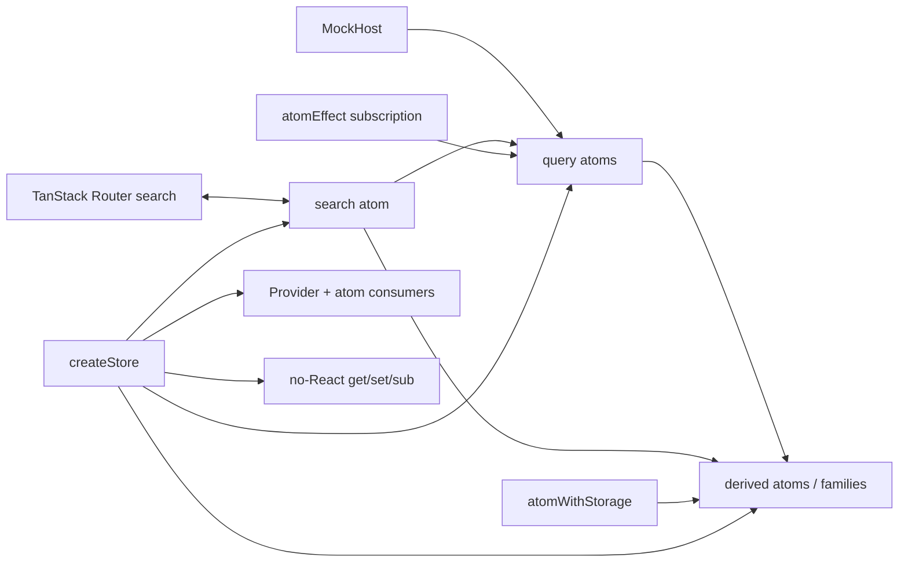

# Jotai state-architecture bake-off

## 1. Library facts

Snapshot: 2026-08-24. The prototype installs Jotai `^2.20.2`, `jotai-tanstack-query` `^0.11.0`, `jotai-effect` `^2.4.1`, and `jotai-devtools` `^0.14.0` (`source/pe-tools/apps/web/package.json:42`). The registry already lists Jotai 2.20.3 and a 3.0 alpha; the workspace's minimum-release-age policy resolved 2.20.2.

| Package | Maintainer / activity signal | Version, last publish | Weekly downloads | Unpacked |
| --- | --- | --- | ---: | ---: |
| `jotai` | pmndrs; 21.2k GitHub stars; active on snapshot day | 2.20.3, 2026-08-24 | 5,827,421 | 542,700 B |
| `jotai-tanstack-query` | Jotai community; 288 stars / 20 open issues | 0.11.0, 2025-08-01 | 266,135 | 147,146 B |
| `jotai-location` | Jotai community; 57 stars / 7 open issues | 0.6.2, 2025-08-21 | 114,881 | 44,541 B |
| `jotai-devtools` | Jotai community; 184 stars / 18 open issues | 0.14.0, 2026-05-08 | 197,141 | 2,450,429 B |
| `jotai-effect` | Jotai community; 164 stars / 2 open issues | 2.4.1, 2026-07-20 | 254,420 | 128,268 B |

Sources: [npm registry metadata](https://registry.npmjs.org/jotai), [npm weekly downloads](https://api.npmjs.org/downloads/point/last-week/jotai), and the equivalent endpoints for each package. Bundlephobia's entry-point estimates are about 9.4 kB minified / 4.0 kB gzip for [Jotai](https://bundlephobia.com/package/jotai@2.20.3), 3.0/1.2 kB for [the query adapter](https://bundlephobia.com/package/jotai-tanstack-query@0.11.0), and 6.1/2.5 kB for [devtools](https://bundlephobia.com/package/jotai-devtools@0.14.0). These are package-entry estimates, not this route's measured chunk delta; devtools also brings 11 runtime dependencies.

- React 19 and Suspense: core uses `React.use` for promise values ([source](https://github.com/pmndrs/jotai/blob/3e0b9ffad54b2fbedf2165a82d06ae6bcf1ebd67/src/react/useAtomValue.ts#L33-L53)); the query adapter documents Jotai v2 / TanStack Query v5 and suspense atoms ([README](https://github.com/jotaijs/jotai-tanstack-query/blob/06759979819e482dc2f7b26eab8e0e4243eb587e/README.md#L28-L35)). React transitions work around atom dispatches; Jotai adds no transition scheduler.
- Activity: there is no Jotai Activity contract or test. The prototype's hidden plan cleaned up its component effect, but atom-driven renders continued while hidden (section 6). That is a rejection signal, not support.
- Devtools: atom viewer and time travel exist ([README](https://github.com/jotaijs/jotai-devtools/blob/43ba45c35b5fafe8c5979ce782852a2fde77b48a/README.md#L7-L19)); production exclusion is manual ([guidance](https://github.com/jotaijs/jotai-devtools/blob/43ba45c35b5fafe8c5979ce782852a2fde77b48a/README.md#L157-L175)). The package instruments `createStore` through Jotai internals ([source](https://github.com/jotaijs/jotai-devtools/blob/43ba45c35b5fafe8c5979ce782852a2fde77b48a/src/utils/internals/compose-with-devtools.ts#L159-L221)), so importing it lazily after store creation produced an empty viewer. The working prototype imports it eagerly.
- SSR / TanStack Start: a request-scoped `Provider store={store}` is available ([source](https://github.com/pmndrs/jotai/blob/3e0b9ffad54b2fbedf2165a82d06ae6bcf1ebd67/src/react/Provider.ts#L16-L46)), but the query adapter only documents generic hydrate/dehydrate, not TanStack Start integration. Providerless SSR can leak state between requests ([guide](https://github.com/pmndrs/jotai/blob/3e0b9ffad54b2fbedf2165a82d06ae6bcf1ebd67/docs/guides/nextjs.mdx#L83-L104)).
- Effect v4 / effect-smol: no native bridge. `jotai-effect` is reactive atom lifecycle effects, not Effect TS ([README](https://github.com/jotaijs/jotai-effect/blob/d7f996a3a62820fd6e9d31d86cb2a984a45a5109/README.md#L67-L95)). An Effect program needs explicit `Effect.runPromise(program, { signal })` glue; Jotai's async atoms do expose an `AbortSignal` ([docs](https://github.com/pmndrs/jotai/blob/3e0b9ffad54b2fbedf2165a82d06ae6bcf1ebd67/docs/core/atom.mdx#L173-L200)). This would coexist with, not replace, the repo's `@effect/atom-react` graph.

## 2. Mental model in one diagram



Smallest complete centralized object:

```tsx
import { atom, createStore, Provider, useAtomValue, useSetAtom } from "jotai";

const count = atom(0);
const increment = atom(null, (get, set) => set(count, get(count) + 1));
export const state = { store: createStore(), count, increment };

export function App() {
  return <Provider store={state.store}><Counter /></Provider>;
}

function Counter() {
  const value = useAtomValue(state.count);
  const inc = useSetAtom(state.increment);
  return <button onClick={inc}>{value}</button>;
}
```

The useful mental model is a graph of tiny values plus an explicit store, not one state object. `BenchState` is the centralized importable facade that the candidate otherwise does not provide (`store.ts:230`, `store.ts:751`).

## 3. How the scenario mapped

| State kind | Primitive used | Result / fight |
| --- | --- | --- |
| URL search | writable `search` atom synchronized to TanStack Router `validateSearch` | Router remains authority; custom two-way connector and descendant clearing were required (`state-bench.jotai.tsx:8`, `store.ts:535`). |
| Host/query | `atomWithQuery`, `atomWithSuspenseQuery` | Query keys express dependencies well, but explicit feed metadata and imperative refresh glue sit beside the adapter (`store.ts:251`). |
| Render suspension | async atom + `Suspense`; `loadable()` and `unwrap()` | Concise, but both required utilities are in active API churn. |
| Per-zone derived state | `atomFamily` + `selectAtom` | Fine-grained after tuning; four families create roughly 2,000 generated atoms at 500 zones (`store.ts:437`). |
| Page memory | primitive atoms for hover, staging, busy, toast, inspector, Activity probe | Clear and testable. |
| Persistence | `atomWithStorage` | Recent folders and pane widths are concise (`store.ts:392`); SSR initially sees defaults and raw JSON validity is delegated to the caller ([docs](https://github.com/pmndrs/jotai/blob/3e0b9ffad54b2fbedf2165a82d06ae6bcf1ebd67/docs/utilities/storage.mdx#L44-L92)). |
| Push lifecycle | `atomEffect` mounted through `store.sub` | Explicit disposer works outside React, but this satellite is not Effect TS (`store.ts:448`, `store.ts:761`). |
| Fixture scope | separate host + `createStore`, passed to `Provider` | Strong: fixture swapping is construction, not branching throughout the graph. |
| Derived refusal/progress/seams | pure functions and read atoms | Inspectable and independent of components (`store.ts:197`, `store.ts:397`). |

The library fought hardest at boundaries: router synchronization, Feed freshness metadata, host-event invalidation, and store disposal are application protocols. Jotai makes those protocols representable but does not own them.

## 4. Async waterfalls

Dependent queries read upstream URL atoms and use TanStack Query's `enabled` plus complete keys. Dedup and cache sharing therefore come from one `QueryClient`. Retries are disabled. The `MockHost` contract has no signal parameter, so host requests are not cancelled; query cancellation cannot reach the mock. `unwrap()` retains the prior zones value during refresh, while explicit `FeedState = "stale"` records invalidation. Adopt marks zones stale, waits for its receipt, then re-reads; host pushes invalidate the affected query keys inside `atomEffect` (`store.ts:448`).

The core session-to-zones shape is:

```ts
const search = atom(initialSearch);

const sessionsQuery = atomWithQuery(() => ({
  queryKey: [host.key, "sessions"],
  queryFn: host.listSessions,
}));

const zonesQuery = atomWithQuery<Zone[], Error>((get) => {
  const { session, doc, view } = get(search);
  return {
    queryKey: [host.key, "zones", session, doc, view],
    queryFn: () => host.listZones(session!, doc!, view!),
    enabled: Boolean(session && doc && view),
  };
});

const zonesPromise = atom(async (get) =>
  (await get(zonesQuery).promise).data ?? [],
);
```

There are two async idioms in one store: query atoms for cache semantics and plain async atoms for Suspense. Error state is exhaustive in the `Feed` union presented by `feedFrom`, but the adapter's `QueryObserverResult` itself is a broad object rather than a small discriminated application result (`store.ts:331`). Push invalidation is explicit and test-covered, not automatic inference.

## 5. Fixture/mocking

The entire fixture swap is one line at the composition root:

```ts
const host = search.fixture ? hosts.fixture : hosts.live;
```

It appears at `state-bench.jotai.tsx:29`; the same construction is exercised without React in `bench.test.ts:27`. `MockHost` is the only data source (`store.ts:57`), has the required method latencies, a deterministic every-fourth `listZones` rejection when enabled (`store.ts:174`), and an event emitter. The store API is genuinely framework-free:

```ts
const unsubscribe = state.store.sub(state.atoms.search, onChange);
state.store.set(state.atoms.search, next);
expect(state.store.get(state.atoms.world).zones).toHaveLength(500);
unsubscribe();
state.dispose();
```

The corrected lane, `vp test src/state-bench/jotai/bench.test.ts` from `apps/web`, passes all five named cases: fixture/no-React `get/set/sub`, descendant clearing, adopt stale→refresh, 1-in-4 failure→error, and push invalidation (`bench.test.ts:23-112`).

One adapter trap matters: `QueryClientAtomProvider` creates its own inner Jotai Provider and accepts no external store ([source](https://github.com/jotaijs/jotai-tanstack-query/blob/06759979819e482dc2f7b26eab8e0e4243eb587e/src/react.ts#L15-L26)). The prototype instead owns one `QueryClient`, passes it to every query atom, and wraps the page once, preserving fixture isolation.

## 6. Perf

Method: Chrome development build, fixture route with 500 zone rows + 500 SVG rectangles + one selected staging row. The hover handler records `performance.now`; zone components increment a render counter, and React Profilers count pane commits. Dev Strict Mode render invocations are reported rather than divided away.

| Condition | Handler-to-second-frame | Zone component renders | Profiler commits |
| --- | ---: | ---: | ---: |
| Plan Activity visible, devtools minimized | 15.6 ms | 4 | 2 |
| Plan Activity hidden, devtools minimized | 12.3 ms | 4 | 2 |

An initial implementation subscribed the page root to hover telemetry and rendered all 1,001 zone consumers: 2,002 Strict Mode render calls and 3 pane commits. Moving telemetry to its own atom consumer and selecting per-zone booleans reduced the visible result to 4 / 2. This demonstrates both Jotai's fine-grained ceiling and how easily a fresh derived object or broad parent subscription destroys it.

Activity result: hiding the plan ran the plan effect cleanup and stopped the probe counter (`2` before and after a hidden hover), but the hidden plan's zone atom subscriptions still produced renders: the hidden measurement remained 4 renders / 2 commits rather than the list-only 2 / 1. Hidden subscriptions therefore **kept firing** in this build. React's Activity controls the lifecycle; Jotai offers no Activity-specific policy.

## 7. URL / persisted / page separation

| Lifetime | Authority | Library contribution | Built here |
| --- | --- | --- | --- |
| Shareable | TanStack Router search params | ordinary writable atom only | `validateSearch`, router connector, URL serialization, both waterfalls, descendant clearing (`state-bench.jotai.tsx:8`). |
| Persisted browser preference | localStorage | `atomWithStorage` | max-eight recent-folder policy and pane-width UI (`store.ts:392`). |
| Page memory | page-scoped `createStore` | atoms, families, store API | hover, dirty staging rows, busy timer/touches, receipt toast, inspector, transition dispatch, Activity probe. |
| Server/cache | page-scoped `QueryClient` | query adapter | keys, explicit freshness basis, invalidation sets, adopt reread, push mapping. |

`jotai-location` was deliberately not installed. Its location atom listens to `popstate` and calls `history.pushState` itself ([source](https://github.com/jotaijs/jotai-location/blob/08167ccdae1f9695c58b94f8550d0a094387b8b4/src/atomWithLocation.ts#L42-L52), [writes](https://github.com/jotaijs/jotai-location/blob/08167ccdae1f9695c58b94f8550d0a094387b8b4/src/atomWithLocation.ts#L86-L97)); beside TanStack Router that creates a second URL authority. The thin router connector is custom glue, but it keeps one authority.

## 8. DX

- LOC: store/model 778; React view 490; route adapter 60; no-React test 126. The required MockHost is inside the store count. This is not a small prototype: explicit feed/basis/freshness semantics and query orchestration dominate.
- Type inference: atom value and action inference is excellent locally. The centralized `BenchState` surface requires `typeof atoms`/`typeof actions` plumbing, query results expose large TanStack unions, and family values lose meaningful debug labels.
- Devtools screenshot: `source/pe-tools/apps/web/src/state-bench/jotai/devtools.png`. Browser proof showed the route, 500-zone plan, Atom Viewer, named root atoms, and thousands of unlabeled family-generated atoms. `Invoke-WebRequest` independently returned HTTP 200; the visible client route was proven in Chrome.

Worst three papercuts:

1. **Required APIs are already deprecated.** Jotai 2.20.3 deprecates built-in `atomFamily` and `loadable`; v3 removes them in favor of `jotai-family` and a userland `unwrap` composition ([migration guide](https://github.com/pmndrs/jotai/blob/v3/docs/guides/migrating-to-v3.mdx#L245-L279)). `jotai-family` itself warns that its backing Map leaks unless parameters are removed ([README](https://github.com/jotaijs/jotai-family/blob/main/README.md#L67-L79)). This scenario would need explicit cleanup for 500-zone churn.
2. **Devtools instrumentation is invasive and noisy.** A lazy import was useless because it arrived after `createStore`; eager import works but relies on internal revision APIs, adds a 2.45 MB unpacked package, and displays roughly 2,000 mostly unlabeled atoms for four per-zone families. Its transitive `react-json-tree` peer range still declares React ≤18 even though the app is on React 19.
3. **Lifecycle and cache ownership are easy to get wrong.** React's development effect probe immediately executed route cleanup; clearing the query client there cancelled the mounted Suspense query. The route now defers disposal one tick (`state-bench.jotai.tsx:32`). Separately, the local TanStack Start dev console logged an SSR-query hydration error (`undefined.mutations`) even though the client route rendered; this lane did not prove clean SSR hydration.

Time that felt wrong: hand-building Feed freshness/basis metadata, duplicating refresh behavior around query atoms, debugging import-order-dependent devtools, and tuning subscriptions. These are central architecture concerns, not incidental CSS.

## 9. Verdict

| Want | Score | Evidence |
| --- | ---: | --- |
| Centralized importable object | 5/5 | `createStore/get/set/sub`, explicit Provider store, atoms and actions exported behind one `BenchState`; the no-React suite is real. |
| State handles its own waterfalls | 3/5 | Atom dependencies and query keys are direct, but stale/basis metadata, router sync, push invalidation, adopt refresh, and cancellation are bespoke orchestration. |
| Mockable / fixture-swappable | 5/5 | One host-interface substitution creates an isolated store/query graph; all five behaviors pass without React. |

**Verdict: hybrid-with, not the repo-wide state architecture.** Keep TanStack Router as URL authority and TanStack Query as server-cache authority; Jotai is credible for dense page-local derived state where fine-grained subscriptions pay for the graph. Reject a broad migration from `@effect/atom-react`: it would introduce a second atom runtime, adapter satellites with uneven cadence, custom Effect glue, unclear Activity behavior, and an imminent v3 migration across two scenario-required APIs.

## 10. What you would steal

- The explicit vanilla `createStore/get/set/sub` contract for deterministic, no-React state tests ([store docs](https://github.com/pmndrs/jotai/blob/3e0b9ffad54b2fbedf2165a82d06ae6bcf1ebd67/docs/core/store.mdx#L8-L30)).
- Provider-scoped whole-environment fixture swaps: construct the graph once from an interface, rather than scatter fixture branches.
- Small selector atoms/families at high-cardinality render boundaries, coupled with a profiler counter that makes subscription mistakes obvious.
- `unwrap()`'s concise keep-prior-value behavior for pane-local stale-while-revalidate UX—implemented in a stable local helper if v3 removes `loadable`.
- Visible `basis` and freshness state as application data. Jotai did not supply that idea, but its inspector made the absence impossible to ignore.
