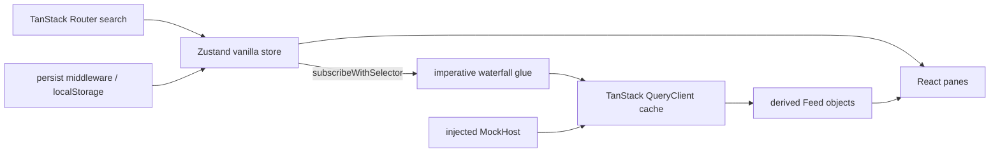

# Zustand state-architecture candidate

## 1. Library facts

The prototype uses Zustand 5.0.15 and `@tanstack/react-query` 5.102.2 from the checked-in lockfile. npm reported Zustand 5.0.15 and React Query 5.102.3 as current on 2026-08-24. The one-patch Query difference landed while this worktree stayed on its resolved lock.

| Fact | Evidence | Finding |
|---|---|---|
| Maintainers | [Zustand package](https://github.com/pmndrs/zustand/blob/f094eebe9bd3b4b0d77b997f69ab1d273f69a877/package.json#L96-L113) (`.explore/zustand/package.json:96-113`); [Query package](https://github.com/TanStack/query/blob/730b3aa06c49337068e1b84a5025bca75887348b/packages/react-query/package.json#L67-L83) (`.explore/query/packages/react-query/package.json:67-83`) | Zustand names Paul Henschel, Jeremy Holcomb, and Daishi Kato. npm names `daishi`, `jeremyrh`, and `drcmda`. npm names Tanner Linsley, Alem Tuzlak, and Kevin Vandy for React Query. |
| Release cadence | [Zustand 5.0.15](https://github.com/pmndrs/zustand/releases/tag/v5.0.15); [React Query 5.102.3](https://github.com/TanStack/query/releases/tag/%40tanstack/react-query%405.102.3) | Zustand released 5.0.10 through 5.0.15 from January to August 2026 at an irregular human cadence. Query uses a fast automated monorepo release train; 5.102.3 published on the research date. |
| npm use and size | [Zustand registry](https://registry.npmjs.org/zustand), [Zustand downloads](https://api.npmjs.org/downloads/point/last-week/zustand), [Query registry](https://registry.npmjs.org/%40tanstack%2Freact-query), [Query downloads](https://api.npmjs.org/downloads/point/last-week/%40tanstack%2Freact-query) | For 2026-08-17 through 2026-08-23, npm returned 52,541,906 Zustand downloads and 66,137,030 React Query downloads. npm unpacked sizes were 95,173 B and 745,228 B. These are package sizes, not minified application contribution. Both packages declare `sideEffects: false` ([Zustand package](https://github.com/pmndrs/zustand/blob/f094eebe9bd3b4b0d77b997f69ab1d273f69a877/package.json#L58-L61), `.explore/zustand/package.json:58-61`; Query package, `.explore/query/packages/react-query/package.json:40-65`). |
| React 19 | [Zustand v5 migration](https://github.com/pmndrs/zustand/blob/f094eebe9bd3b4b0d77b997f69ab1d273f69a877/docs/reference/migrations/migrating-to-v5.md#L10-L21) (`.explore/zustand/docs/reference/migrations/migrating-to-v5.md:10-21`); [Query package](https://github.com/TanStack/query/blob/730b3aa06c49337068e1b84a5025bca75887348b/packages/react-query/package.json#L67-L83) | Both peer ranges cover React 19 and both upstream worktrees test against React 19. Zustand's React binding is only a `useSyncExternalStore` wrapper over `StoreApi` ([source](https://github.com/pmndrs/zustand/blob/f094eebe9bd3b4b0d77b997f69ab1d273f69a877/src/react.ts#L26-L36), `.explore/zustand/src/react.ts:26-36`). No release note gives Zustand an Activity, Suspense, or transition contract. |
| Suspense and transitions | [Query Suspense guide](https://github.com/TanStack/query/blob/730b3aa06c49337068e1b84a5025bca75887348b/docs/framework/react/guides/suspense.md#L6-L28) (`.explore/query/docs/framework/react/guides/suspense.md:6-28`) | Query supplies `useSuspenseQuery`. It removes conditional `enabled`, serializes queries in one component, and recommends `startTransition` for query-key changes. Zustand supplies neither Suspense nor transition behavior. The route uses Query for Suspense and React for transitions. No upstream Activity-specific contract or test was found. |
| Devtools | [Zustand middleware](https://github.com/pmndrs/zustand/blob/f094eebe9bd3b4b0d77b997f69ab1d273f69a877/src/middleware/devtools.ts#L220-L256) (`.explore/zustand/src/middleware/devtools.ts:220-256`); [Query devtools](https://github.com/TanStack/query/blob/730b3aa06c49337068e1b84a5025bca75887348b/docs/framework/react/devtools.md#L6-L25) (`.explore/query/docs/framework/react/devtools.md:6-25`) | Zustand sends named actions and Zustand snapshots to Redux DevTools. It does not include QueryClient state. Query has separate devtools. The prototype wires Redux DevTools and renders a combined inspector (`view.tsx:548-576`). |
| SSR and TanStack Start | [Zustand Next.js guide](https://github.com/pmndrs/zustand/blob/f094eebe9bd3b4b0d77b997f69ab1d273f69a877/docs/learn/guides/nextjs.md#L9-L35) (`.explore/zustand/docs/learn/guides/nextjs.md:9-35`); [Query SSR guide](https://github.com/TanStack/query/blob/730b3aa06c49337068e1b84a5025bca75887348b/docs/framework/react/guides/ssr.md#L168-L182) (`.explore/query/docs/framework/react/guides/ssr.md:168-182`); [Router Query integration](https://tanstack.com/router/latest/docs/integrations/query) | Zustand requires one store per request and warns against global RSC reads or writes. Query documents per-request clients, dehydration, and a Start-compatible integration. This prototype still needs an isolated client because the current dev SSR query stream sends `undefined` for this route and logs `hydrate(undefined)`. |
| Effect v4 | Source searches in both pinned upstream clones | Neither repository contains a first-party Effect v4 integration. An Effect program must cross the Promise `queryFn` boundary, for example with `Effect.runPromise`; cancellation and runtime ownership would be adapter code. |

## 2. Mental model in one diagram



Smallest complete form:

```ts
const store = createStore(
  devtools(persist(subscribeWithSelector(() => ({ session: null })), { name: "route" })),
)
const queryClient = new QueryClient()

store.subscribe(
  (state) => state.session,
  (session) => {
    if (session) void queryClient.fetchQuery({
      queryKey: ["doc", session],
      queryFn: () => host.activeDoc(session),
    })
  },
)
```

This is two state systems plus a bridge. Zustand's vanilla API is deliberately small: `setState`, `getState`, `getInitialState`, and `subscribe` ([source](https://github.com/pmndrs/zustand/blob/f094eebe9bd3b4b0d77b997f69ab1d273f69a877/src/vanilla.ts#L9-L14), `.explore/zustand/src/vanilla.ts:9-14`).

## 3. How the scenario mapped

| State kind | Primitive | Prototype location |
|---|---|---|
| URL | TanStack Router `validateSearch`; Zustand mirrors the parsed bindings and every pick navigates | `routes/state-bench.zustand.tsx:17-29`; `bench.ts:456-472` |
| Persisted | Zustand `persist` with `partialize` for recent folders and pane widths only | `bench.ts:176-190`; `bench.ts:492-505`; `bench.ts:527-538` |
| Page memory | Vanilla Zustand store for hover, plan visibility, staged renames, busy seconds, receipt, and error toast | `bench.ts:87-101`; `bench.ts:194-208` |
| Host cache | An injected TanStack `QueryClient`; query keys carry the host mode and complete read basis | `bench.ts:82-94`; `bench.ts:215-247` |
| Derived | `feed()` and `refusal()` read the store and QueryClient on demand; neither value is stored | `bench.ts:380-459` |

The split is visible, which is good, but it fought the desired model. A single pane needs Zustand subscriptions for URL/page memory and Query observers for host data. Query cache events also need a filtered bridge solely to make derived `Feed` projections notify Zustand consumers (`bench.ts:315-326`).

## 4. Async waterfalls

The no-React path uses `subscribeWithSelector`. Each selector callback imperatively calls `QueryClient.fetchQuery`. The session callback awaits `activeDoc` and guards the result against the current session before it writes the document binding. The remaining callbacks spell out the other edges (`bench.ts:258-313`):

```ts
store.subscribe(s => s.bindings.session, session => {
  if (!session) return
  void loadDoc(session).then(doc => {
    const current = store.getState().bindings
    if (current.session === session)
      setBindings({ ...current, doc: doc.id }, "waterfall/doc")
  })
})

store.subscribe(
  s => [s.bindings.session, s.bindings.doc, s.bindings.view] as const,
  ([session, doc, view]) => {
    if (session && doc && view) void loadZones(session, doc, view)
  },
)
```

- **Dedup and cache:** Query keys include the full basis. `fetchQuery` shares in-flight work and returns fresh cached data. QueryClient's imperative API has no React `enabled` option ([QueryClient reference](https://github.com/TanStack/query/blob/730b3aa06c49337068e1b84a5025bca75887348b/docs/reference/QueryClient.md#L62-L98), `.explore/query/docs/reference/QueryClient.md:62-98`).
- **Cancellation and races:** a session change calls `cancelQueries` for descendant prefixes. The exact scenario `MockHost` signature has no `AbortSignal`, so its timer continues. Basis-specific keys prevent cross-basis cache overwrite, and the document continuation checks current identity. This does not satisfy the QR rubric's R12 end to end. Query only cancels the underlying promise when the query function consumes its signal ([cancellation guide](https://github.com/TanStack/query/blob/730b3aa06c49337068e1b84a5025bca75887348b/docs/framework/react/guides/query-cancellation.md#L6-L14), `.explore/query/docs/framework/react/guides/query-cancellation.md:6-14`).
- **Stale while revalidate:** invalidation retains prior data and makes the derived feed `stale`. Adopt invalidates with `refetchType: "none"`, yields one microtask so observers can see `stale`, then calls `refreshZones` (`bench.ts:565-583`).
- **Retries and failures:** prototype queries set `retry: false`, so the required fourth-call rejection remains visible as an `error` feed instead of disappearing behind retries.
- **Push events:** `docChanged` invalidates the document, views, and zones at their key prefixes without refetch. `sessionGone` also clears the active session subtree (`bench.ts:329-357`).

This is clean imperative code, but it is still glue. There is no automatic dependency graph across `await`; every edge, cancellation prefix, race guard, and invalidation is hand-maintained. That fails the QR pattern's R1, R3, and R4.

## 5. Fixture and mocking

The composition root swaps the whole source in one line (`routes/state-bench.zustand.tsx:45`):

```ts
harness: search.fixture ? createFixtureHost() : createMockHost()
```

The no-React test uses the same expression (`bench.test.ts:16-25`). It renders no component. The deterministic lane ran from `apps/web` as required:

```text
vp test src/state-bench/zustand/bench.test.ts
Test Files 1 passed (1)
Tests      5 passed (5)
```

The five named cases are fixture swap, waterfall descendant clearing, adopt stale then automatic refresh, fourth zones-call error, and pushed `docChanged` invalidation (`bench.test.ts:16-106`).

## 6. Performance

Chrome dev-mode measurements used the UI's `performance.now()` start at `actions.hover` and a microtask completion after the external-store commit. The counter records zone component render invocations. With 500 zones in each of three panes, ten moves between visible rows measured 3.8, 4.7, 5.2, 7.5, 6.1, 7.9, 6.1, 6.2, 9.4, and 8.9 ms. Median was 6.15 ms and maximum was 9.4 ms, below the 16.67 ms frame budget.

Moving from outside onto one zone caused 6 dev render invocations, which is 3 logical zone components rendered twice by React Strict Mode. Moving from one zone to another caused 12 invocations, or 6 logical components: previous and next zone in each pane. `useShallow` prevents all other zone components from rendering (`view.tsx:386-399`, `view.tsx:436-448`, `view.tsx:488-502`).

With the Plan Activity hidden, five samples were 2.7 to 4.0 ms and moves between zones fell from 12 to 8 dev render invocations. The Plan's 500 external-store subscriptions therefore stop firing while hidden; React retains its state but pauses those subscriptions. Visible mode still evaluates about 1,500 granular selectors for each hover update even though only six logical components render. That fan-out is the hidden cost behind the good commit number.

## 7. URL, persisted, and page separation

- URL search owns `session`, `doc`, `view`, multi-zone selection, `folder`, `r10`, and `stage`. The observed URL after selecting one zone encoded `zones=["zone-001"]`. Re-picking session, document, view, or folder clears only its declared descendants in the centralized `pick` action (`bench.ts:456-472`).
- Persist middleware writes only `recentFolders` and `paneWidths`. Folder recents cap at eight. No server data enters localStorage.
- Page memory owns hover, Plan visibility, staged names, the verb bracket, and toast state. Refresh replaces host data but does not silently overwrite the staged rename map.
- QueryClient owns sessions, document, views, zones, folder listing, and `.r10` data. Query keys carry each read basis.
- Feed states and refusal text are recomputed from the two authorities. There is no writable `canAdopt` flag.

Zustand gives the persisted and page-memory split. TanStack Router and Query supply the other two homes. The application builds the synchronization policy between them.

## 8. Developer experience

Physical line counts after formatting were 856 controller/model lines, 632 React view/route lines, and 107 test lines. The prototype is large because the scenario is large, but the split itself adds repeated plumbing: query option factories, cache-event notification, feed projection, lifecycle retain/release, and URL mirroring.

Type inference is strong inside a Zustand selector and a single Query option object. `useShallow` keeps tuple selectors precise ([implementation](https://github.com/pmndrs/zustand/blob/f094eebe9bd3b4b0d77b997f69ab1d273f69a877/src/react/shallow.ts#L4-L11), `.explore/zustand/src/react/shallow.ts:4-11`). Inference weakens where conditional query options meet `useQuery`; the route needed an explicit `useQuery<Zone[]>` helper (`view.tsx:351-364`). Middleware composition also makes the store's final mutator type harder to read than its state type.

Devtools evidence: [devtools.png](../../../ts/apps/web/src/state-bench/zustand/devtools.png). The screenshot shows the URL-backed selected zone, one dirty rename, 500 plan rectangles, the Zustand tree, and the separate Query cache. Redux DevTools receives named Zustand actions through `devtools`; Query state still needs Query Devtools or the inspector.

The three worst papercuts were:

1. Two authorities need a bridge. Forwarding every raw QueryCache event caused a React maximum-update-depth loop because observer events fed a Zustand rerender back into Query. Filtering to `added`, `removed`, and `updated` fixed it (`bench.ts:315-326`).
2. React dev Strict Mode runs an effect cleanup probe. Direct disposal removed the no-React subscriptions before the committed mount. The controller now defers final disposal through `retain()` (`bench.ts:645-671`). The current TanStack Start dev stream also logs `hydrate(undefined)` for this route; an isolated QueryClient keeps the route functional without changing app infrastructure.
3. Workspace tooling added noise unrelated to Zustand. `pnpm install` took 4m53s on Windows linking cached packages. `pnpm add -F @pe/web zustand` tried to edit the workspace catalog and re-resolved `latest` dependencies, producing a 312-line lock diff; the package was pinned directly to stay inside the allowed file set. The original `vp run @pe/web#test -- state-bench` command cannot work because `@pe/web#test` is itself `vp run`; Vite+ reports `Task "state-bench" not found`. The corrected lane is the command above.

The final code gate passed both required commands: `vp check --fix apps/web/src/state-bench apps/web/src/routes/state-bench.zustand.tsx`, then the same `vp check` without `--fix`. Browser proof reached HTTP 200 and rendered all three panes. The live-host UI showed `Adopting · 1s`, then `Receipt …: adopted 1 zones`; a pushed `docChanged` produced four visible stale feed badges.

## 9. Verdict

| kaitpw want | Score | Evidence |
|---|---:|---|
| Centralized importable object | 4/5 | `createBench()` is a vanilla, React-free object with store, QueryClient, actions, feeds, lifecycle, and tests. It is centralized, but it contains two state engines. |
| State handles its own waterfalls | 2/5 | Components contain no waterfall logic, but `subscribeWithSelector` plus imperative QueryClient calls manually restate every dependency, cancellation, and invalidation edge. |
| Mockable | 5/5 | One-line host replacement works in the route and the no-React test; all five cases pass without rendering React. |

**Verdict: reject Zustand as the unified route-state architecture. Keep the hybrid only if the product explicitly accepts Zustand for URL/page/persisted state and TanStack Query for host cache.** It is operationally sound and fast enough here, but it does not preserve the QR pattern's central value: sync and async derivations as peers in one statically readable graph. The required no-React test exposes the seam that React hooks normally hide.

## 10. What I would steal

- The vanilla `StoreApi` is an excellent importable test seam.
- `useShallow` makes high-fan-out hover state cheap at the component render boundary.
- Persist `partialize` states the durable subset in one place; migration and `skipHydration` are available when the route grows ([persist source](https://github.com/pmndrs/zustand/blob/f094eebe9bd3b4b0d77b997f69ab1d273f69a877/src/middleware/persist.ts#L70-L120), `.explore/zustand/src/middleware/persist.ts:70-120`).
- Named Redux DevTools actions make page-memory transitions inspectable with almost no component code.

Even if Zustand loses, those four primitives are worth copying into whichever architecture owns the full async graph.
