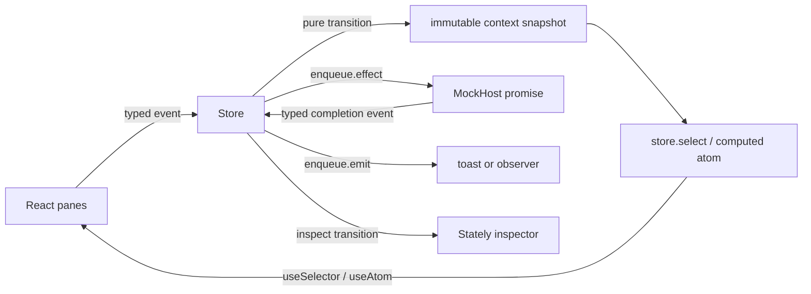

# XState Store state-architecture bake-off

Research snapshot: 2026-08-24. Upstream source pins: XState `d798af58b088489fb49a3975d63e72a8460a32b0`, Valtio `4689e794def74e02cc23373353df3a8613749aef`, Effect v4 `3a1128c7684e04d34d9f541f77adaac38a513056`.

## 1. Library facts

| Fact | `@xstate/store` | Secondary comparison: Valtio |
|---|---|---|
| Maintainer and license | StatelyAI monorepo, package author David Khourshid, MIT. The package describes itself as simple event-based state, and directs complex statecharts and actors to full XState. [README](https://github.com/statelyai/xstate/blob/d798af58b088489fb49a3975d63e72a8460a32b0/packages/xstate-store/README.md#L1-L8), `packages/xstate-store/README.md:1-8`; [package](https://github.com/statelyai/xstate/blob/d798af58b088489fb49a3975d63e72a8460a32b0/packages/xstate-store/package.json#L1-L24), `packages/xstate-store/package.json:1-24` | pmndrs repository, package author Daishi Kato, MIT. [package](https://github.com/pmndrs/valtio/blob/4689e794def74e02cc23373353df3a8613749aef/package.json#L1-L68), `valtio/package.json:1-68` |
| Current npm facts | `@xstate/store` 4.2.3, published 2026-08-10, 142,801 bytes unpacked, 154,506 downloads for 2026-08-17 through 2026-08-23. The React adapter is a separate dependency, `@xstate/store-react` 2.0.0, published 2026-05-27, 17,573 bytes unpacked, 45,405 downloads in the same week. [registry](https://registry.npmjs.org/@xstate%2fstore), [downloads](https://api.npmjs.org/downloads/point/2026-08-17:2026-08-23/%40xstate%2Fstore), [React registry](https://registry.npmjs.org/@xstate%2fstore-react) | Valtio 2.3.2, published 2026-05-01, 101,282 bytes unpacked, 1,970,304 downloads for 2026-08-17 through 2026-08-23. [registry](https://registry.npmjs.org/valtio), [downloads](https://api.npmjs.org/downloads/point/2026-08-17:2026-08-23/valtio) |
| Release cadence | Six stable Store releases from 4.0.0 on 2026-05-27 through 4.2.3 on 2026-08-10. The five gaps were 2, 16, 14, 24, and 19 days, median 16 days. This is active, but 4.0.0 was a breaking release and the React adapter moved to a new package. [npm publish history](https://registry.npmjs.org/@xstate%2fstore), [4.0 migration](https://github.com/statelyai/xstate/blob/d798af58b088489fb49a3975d63e72a8460a32b0/packages/xstate-store/MIGRATION.md#L1-L18), `packages/xstate-store/MIGRATION.md:1-18` | One current data point is not enough to infer cadence. Its much larger install base does not prove scenario fit. |
| Bundle size | Upstream claims the core is less than 1 kB minified and gzip-compressed. That excludes the separate React adapter and optional inspector. [README](https://github.com/statelyai/xstate/blob/d798af58b088489fb49a3975d63e72a8460a32b0/packages/xstate-store/README.md#L3-L8), `packages/xstate-store/README.md:3-8` | The npm package is smaller unpacked, but the proxy runtime and `proxy-compare` dependency solve a different problem. |
| React 19 | `@xstate/store-react` declares React 18 or 19 and uses `useSyncExternalStore`. [package](https://github.com/statelyai/xstate/blob/d798af58b088489fb49a3975d63e72a8460a32b0/packages/xstate-store-react/package.json#L31-L43), `packages/xstate-store-react/package.json:31-43`; [binding](https://github.com/statelyai/xstate/blob/d798af58b088489fb49a3975d63e72a8460a32b0/packages/xstate-store-react/src/index.ts#L152-L182), `packages/xstate-store-react/src/index.ts:152-182` | Valtio supports React 18 and later. Its own async guide says its promise/Suspense path has a de-optimization that prevents `useTransition` from working well. [README](https://github.com/pmndrs/valtio/blob/4689e794def74e02cc23373353df3a8613749aef/README.md#L164-L188), `valtio/README.md:164-188` |
| Suspense, Activity, transitions | Store has no Suspense resource API. `createAsyncAtom` returns `{ status: "pending" | "done" | "error" }`; `useAtom` and `useSelector` read it synchronously. No Store API names `Activity` or `startTransition`. Wrapping a send in React `startTransition` does not turn an external store into a transition-aware cache. React documents that an external-store mutation during a non-blocking transition can fall back to blocking. [atom source](https://github.com/statelyai/xstate/blob/d798af58b088489fb49a3975d63e72a8460a32b0/packages/xstate-store/src/atom.ts#L65-L131), `packages/xstate-store/src/atom.ts:65-131`; [React caveat](https://react.dev/reference/react/useSyncExternalStore#caveats) | Valtio can store promises and consume them with React 19 `use`, so it has real Suspense behavior. Upstream also warns about transition de-optimization. |
| Devtools | `store.inspect` emits an initial and then one `@xstate.transition` record per event. The upstream test wires it to `createBrowserInspector` from optional `@statelyai/inspect`. [store source](https://github.com/statelyai/xstate/blob/d798af58b088489fb49a3975d63e72a8460a32b0/packages/xstate-store/src/store.ts#L390-L409), `packages/xstate-store/src/store.ts:390-409`; [integration test](https://github.com/statelyai/xstate/blob/d798af58b088489fb49a3975d63e72a8460a32b0/packages/xstate-store/test/store.test.ts#L195-L238), `packages/xstate-store/test/store.test.ts:195-238` | `devtools(proxy)` targets the Redux DevTools extension and supports plain objects and arrays. [docs](https://github.com/pmndrs/valtio/blob/4689e794def74e02cc23373353df3a8613749aef/docs/api/utils/devtools.mdx#L9-L29), `valtio/docs/api/utils/devtools.mdx:9-29` |
| SSR and TanStack Start | There is no TanStack integration. `useSelector` supplies the same synchronous `store.get()` path for client and server snapshots. That makes the hook SSR-capable, but the application still owns per-request store construction and hydration consistency. A module singleton can leak mutable state between SSR requests. [binding](https://github.com/statelyai/xstate/blob/d798af58b088489fb49a3975d63e72a8460a32b0/packages/xstate-store-react/src/index.ts#L152-L182), `packages/xstate-store-react/src/index.ts:152-182` | Valtio also uses `useSyncExternalStore` and supplies `snapshot(proxyObject)` as its server snapshot. It likewise does not supply TanStack Start ownership rules. [source](https://github.com/pmndrs/valtio/blob/4689e794def74e02cc23373353df3a8613749aef/src/react.ts#L119-L160), `valtio/src/react.ts:119-160` |
| Effect v4 compatibility | Promise interop is possible, not native. `createAsyncAtom(({ signal }) => Effect.runPromise(program, { signal }))` preserves interruption because both APIs accept `AbortSignal`. Store still erases the typed error into `unknown`, has no `Scope`, `Layer`, or runtime ownership, and its general `enqueue.effect` callback has no cancellation token. [Store async atom](https://github.com/statelyai/xstate/blob/d798af58b088489fb49a3975d63e72a8460a32b0/packages/xstate-store/src/atom.ts#L91-L131), `packages/xstate-store/src/atom.ts:91-131`; [Store effect contract](https://github.com/statelyai/xstate/blob/d798af58b088489fb49a3975d63e72a8460a32b0/packages/xstate-store/src/types.ts#L121-L159), `packages/xstate-store/src/types.ts:121-159`; [Effect v4 run contract](https://github.com/Effect-TS/effect-smol/blob/3a1128c7684e04d34d9f541f77adaac38a513056/packages/effect/src/Effect.ts#L8803-L8808), `packages/effect/src/Effect.ts:8803-8808`; [runPromise](https://github.com/Effect-TS/effect-smol/blob/3a1128c7684e04d34d9f541f77adaac38a513056/packages/effect/src/Effect.ts#L8990-L9023), `packages/effect/src/Effect.ts:8990-9023` | Valtio accepts promises as values, but supplies no Effect runtime ownership either. |

Adversarial read: Store is small because query behavior, URL state, persistence policy, and process lifecycle stay in application code. The candidate is not "XState without diagrams." It is an event reducer with reactive atoms and effect callbacks.

## 2. Mental model in one diagram



Smallest complete example:

```tsx
import { createStore, createAsyncAtom } from "@xstate/store";
import { useAtom, useSelector } from "@xstate/store-react";

const store = createStore({
  context: { count: 0 },
  on: {
    increment: (context, event: { by: number }, enqueue) => {
      enqueue.effect(() => console.log("committed"));
      return { count: context.count + event.by };
    },
  },
});
const count = store.select((context) => context.count);
const remote = createAsyncAtom(async ({ signal }) =>
  fetch("/count", { signal }).then((response) => response.json() as Promise<number>),
);

export function Counter() {
  const value = useSelector(store, (snapshot) => snapshot.context.count);
  const load = useAtom(remote);
  return <button onClick={() => store.trigger.increment({ by: 1 })}>{value} / {load.status}</button>;
}
```

Transitions replace the complete context object. Effects run after the next snapshot is committed, and they can send typed events back through `trigger`. [implementation](https://github.com/statelyai/xstate/blob/d798af58b088489fb49a3975d63e72a8460a32b0/packages/xstate-store/src/store.ts#L275-L302), `packages/xstate-store/src/store.ts:275-302`. `store.select` produces a reactive atom with an equality function. [implementation](https://github.com/statelyai/xstate/blob/d798af58b088489fb49a3975d63e72a8460a32b0/packages/xstate-store/src/store.ts#L413-L419), `packages/xstate-store/src/store.ts:413-419`.

## 3. How the scenario mapped

| State kind | Candidate primitive | Research risk to verify in the prototype |
|---|---|---|
| URL | TanStack Router search remains authoritative; route updates dispatch a synchronization event | Store gives no URL primitive. Mirroring URL bindings can create two writable truths. |
| Persisted | Existing `localStorage` code, with store events for hydrated pane widths and recent folders | Store has a persistence extension, but using it for two fields may add more policy than native storage. Do not persist the whole context. |
| Page memory | One `createStore` context with typed transitions and derived `store.can` refusals | Every hover replaces the whole context snapshot. Selector granularity must carry the 500-zone case. |
| Host cache | `createAsyncAtom` or explicit pending/success/failure events started by `enqueue.effect` | Neither option supplies query keys, deduplication, retry, stale time, or invalidation. |
| Derived | `store.select`, `selectors` on `createStoreLogic`, and computed `createAtom` values | Derived values must stay out of context. Computed atoms track synchronous `.get()` dependencies. [atom source](https://github.com/statelyai/xstate/blob/d798af58b088489fb49a3975d63e72a8460a32b0/packages/xstate-store/src/atom.ts#L139-L213), `packages/xstate-store/src/atom.ts:139-213` |

Store offers `send`, typed `trigger`, emitted events, `can`, selectors, and pure `transition`. [public contract](https://github.com/statelyai/xstate/blob/d798af58b088489fb49a3975d63e72a8460a32b0/packages/xstate-store/src/types.ts#L220-L300), `packages/xstate-store/src/types.ts:220-300`. This is a good match for staged verbs. It does not remove the hard part of the scenario, which is coordinating five dependent host feeds without duplicating router state.

The prototype lives in `source/pe-tools/apps/web/src/state-bench/xstate/` with its composition root in `source/pe-tools/apps/web/src/routes/state-bench.xstate.tsx`. `createBenchState` closes over a `MockHost`, owns the cache, page state, transitions, emitted events, atoms, selectors, inspector subscription, push subscription, and lifetime cleanup (`store.ts:234-775`). React components only call `useSelector`/`useAtom` and typed `store.trigger.*` methods (`panes.tsx:27-443`).

The fit was worst at the host-cache boundary. Sessions use `createAsyncAtom`, while the dependent doc/views/zones and folder/r10 chains use explicit pending/success/failure events because the atom API cannot represent retained options plus `stale`, request basis, or cross-feed invalidation. Feed objects are derived from raw cache entries rather than stored (`store.ts:158-218`). That is two async idioms in one centralized object, not one coherent query model.

The three panes share selected IDs through router search and hover through one page-memory atom. Staged rename rows, dirty count, Adopt refusal, busy seconds, receipt toast, and the post-write stale refresh all stay in the centralized object (`store.ts:221-231`, `store.ts:507-580`; `panes.tsx:286-340`). Latency, deterministic failure, fixture, push-event, Activity, inspector, and pane-width controls are wired in the UI (`panes.tsx:148-217`).

## 4. Async waterfalls

`createAsyncAtom` starts one promise per recomputation. It aborts the prior signal and ignores a stale resolution. It exposes tagged status rather than suspending. [source](https://github.com/statelyai/xstate/blob/d798af58b088489fb49a3975d63e72a8460a32b0/packages/xstate-store/src/atom.ts#L65-L131), `packages/xstate-store/src/atom.ts:65-131`.

| Capability | What Store supplies | What this scenario must build |
|---|---|---|
| Dependent request | Reactive atom dependencies or completion events | The session to doc to view to zones ordering and the parent-clear rules |
| Deduplication | One atom instance shares one current run | A cache key registry if multiple atom instances or forced reads can overlap |
| Cancellation | Abort on atom recomputation and stale-result suppression | MockHost methods do not accept `AbortSignal`, so the prototype can suppress stale results but cannot stop their timers |
| Stale while revalidate | Nothing | Preserve prior options and set `FeedState = "stale"` while a refresh runs |
| Retry | Nothing | Explicit retry event or retry loop |
| Invalidation | Dependency change recomputes an observed atom | Explicit `docChanged`, write-success, and refresh events with the required feed scope |
| Push | Nothing beyond subscriptions and events | Subscribe to `MockHost.events`, dispatch invalidation events, and unsubscribe with composition-root lifetime |

The event/effect form is explicit but manual:

```ts
on: {
  pickSession: (context, { sessionId }, enqueue) => {
    enqueue.effect(({ trigger }) => {
      host.activeDoc(sessionId).then(
        (doc) => trigger.docLoaded({ sessionId, doc }),
        (error) => trigger.docFailed({ sessionId, error }),
      );
    });
    return clearBelowSession(context, sessionId);
  },
  docLoaded: (context, { sessionId, doc }, enqueue) => {
    if (context.sessionId !== sessionId) return context;
    enqueue.trigger.loadViews({ sessionId, docId: doc.id });
    return { ...context, doc };
  },
}
```

The stale-session guard and every feed transition belong to the application. Store's effect queue executes callbacks after commit, but does not await, supervise, cancel, or collect them. [source](https://github.com/statelyai/xstate/blob/d798af58b088489fb49a3975d63e72a8460a32b0/packages/xstate-store/src/store.ts#L275-L302), `packages/xstate-store/src/store.ts:275-302`. `getSnapshot()` in an effect supplies fresh context after an `await`. [contract](https://github.com/statelyai/xstate/blob/d798af58b088489fb49a3975d63e72a8460a32b0/packages/xstate-store/src/types.ts#L121-L140), `packages/xstate-store/src/types.ts:121-140`.

The actual session event clears descendants with the declarative `BINDINGS` tree, emits the new URL search, marks doc loading, then starts `activeDoc` (`store.ts:35-60`, `store.ts:301-323`). Its completion stores the doc, emits the URL update, and starts `listViews`; views completion auto-picks the first view and starts `listZones` (`store.ts:325-425`). Re-picking a view restarts only zones (`store.ts:433-460`). Folder and r10 form a separate dependent chain (`store.ts:598-657`). A complete session pick therefore makes one `activeDoc`, one `listViews`, and one `listZones` call; the fixture test observes 500 zones. The one-in-four rejection becomes an error Feed, and a `docChanged` push marks doc, views, and zones stale before rereading (`bench.test.ts:102-143`).

This implementation uses both async atoms and effects. `createAsyncAtom` demonstrates abort/stale-suppression for the root session list, but the `MockHost` contract has no signal, so no host timer is actually cancelled. General `enqueue.effect` work is also unsupervised; `dispose()` removes subscriptions and the seconds timer but cannot cancel already-started host promises (`store.ts:713-773`).

## 5. Fixture/mocking

Store construction accepts ordinary dependencies. The lowest-cost seam is a factory around store creation:

```ts
export const createBenchState = (host: MockHost) => ({
  store: createStore(makeStoreConfig(host)),
  host,
});

const bench = createBenchState(fixtureMode ? fixtureHost : mockHost); // one-line swap
```

`createStoreLogic` is another option when the dependency can safely live in its input-created context. It creates a new store per input and can attach selectors. [source](https://github.com/statelyai/xstate/blob/d798af58b088489fb49a3975d63e72a8460a32b0/packages/xstate-store/src/store.ts#L728-L750), `packages/xstate-store/src/store.ts:728-750`. Keeping a method-bearing host inside context makes inspector serialization and immutable snapshots worse, so a closure is the cleaner prototype seam.

The route's complete fixture swap is one expression: `createBenchState(initialSearch.fixture ? createFixtureHost() : createMockHost(), initialSearch)` (`state-bench.xstate.tsx:38-40`). The no-React test creates the same object with `createFixtureHost()`, waits for its derived zones Feed, and asserts `fixture` plus 500 options (`bench.test.ts:41-51`). From `source/pe-tools/apps/web`, `vp test src/state-bench/xstate/bench.test.ts` passed all five named tests: fixture swap, recursive descendant clearing, Adopt stale-to-refresh, one-in-four rejection, and push invalidation (5/5, 1.45 s on the final run).

## 6. Perf

`useSelector` subscribes through `useSyncExternalStore` and retains the prior selected value when its comparator says equal. [source](https://github.com/statelyai/xstate/blob/d798af58b088489fb49a3975d63e72a8460a32b0/packages/xstate-store-react/src/index.ts#L100-L182), `packages/xstate-store-react/src/index.ts:100-182`. This can isolate hover reads if each zone row selects a boolean or a stable ID. A pane that selects the whole snapshot, a new array, or a new object on every hover defeats that isolation.

Measured in the in-app Chromium browser against Vite dev mode at `localhost:3006`, fixture mode, with 500 zones:

- Twenty sequential list-row hovers: handler median **0.000 ms**, p95 **0.100 ms** (`performance.now()` around `hoverAtom.set`; browser timer resolution produced eighteen zeroes, one 0.1 ms, and one 0.2 ms).
- One reset-and-hover sample under React `Profiler`: exactly **1/1/1 commits** for list/plan/staging; durations **33.0/5.2/11.9 ms**. The three subscribed pane components rerendered and recreated their 500-element maps, so this is effectively 1,500 zone element calculations per hover, not row-level isolation (`panes.tsx:222-322`, `panes.tsx:404-429`).
- With Plan's `<Activity mode="hidden">`, the same hover recorded **1/0/1 commits** and **6.5/0/9.4 ms**. Hidden Plan subscriptions did not fire. Restoring Plan caused its catch-up render. This is the desired Activity behavior, but it does not cure the visible 500-zone fan-out.

## 7. URL / persisted / page separation

Store gives only an in-memory context, events, selectors, atoms, and optional persistence extensions. It has no router search ownership. The prototype should keep these authorities separate:

```text
TanStack Router search  -> bindings, stage, selected zone IDs
localStorage            -> pane widths, eight recent folders
XState Store            -> hover, panel, staged edits, verb state, receipts
async atoms/feed events -> host cache and freshness
selectors               -> progress, seams, refusals, world
```

The risk is synchronization code. Parent picks must clear descendants in the router update and then cause the host waterfall to recompute. If a transition separately mutates mirrored binding fields, reload, back navigation, or a failed transition can split the two truths.

TanStack Router search is authoritative for `fixture`, session, doc, view, selected zone IDs, folder, r10, and stage; `validateSearch` parses every field (`state-bench.xstate.tsx:13-30`). Store events emit `searchChanged`, and the composition root performs `navigate(..., replace: true)` inside `startTransition` (`state-bench.xstate.tsx:36-49`). `pickInto` recursively clears descendants for both trees (`store.ts:35-60`), with an exact no-React test (`bench.test.ts:53-77`). The browser URL was reloaded with all bindings encoded and restored the selected session/doc/view/zone and 500-zone fixture. The store mirrors the validated search only so transitions can coordinate effects; that synchronization remains a second representation and a risk.

`localStorage` alone owns the eight most-recent folders and three pane widths (`store.ts:133-155`, `store.ts:598-616`, `store.ts:703-707`). The store owns hover, inspector visibility, staged renames, busy seconds, receipt/toast, and raw host cache. Selectors alone own Feed objects, world, and Adopt refusal (`store.ts:182-231`, `store.ts:732-740`).

## 8. DX

The type surface is strong where the model fits. Transition keys infer `trigger` methods and payloads. Selectors accept equality functions. Emitted events have typed subscriptions. `createAsyncAtom` has only `unknown` error and three statuses, so application feed metadata, stale options, timestamps, and retry policy need another model. The React binding is a separate package, and the browser inspector is another optional package.

| Measure | Result |
|---|---|
| Store and host LOC | 912 raw lines: `store.ts` 775 + `host.ts` 137 (`(Get-Content $file).Count`) |
| React view LOC | 496 raw lines: `panes.tsx` 443 + route 53 |
| Test LOC | 145 raw lines: `bench.test.ts` |
| Devtools screenshot | `.artifacts/runs/state-bench-xstate-20260824/devtools.png` (165,529 bytes). It shows the whole serialized context and the last 20 inspected transition names; this cheapest inspector avoided adding `@statelyai/inspect`. |
| Type inference proof | `store.trigger.pickSession({ id })`, `enqueue.emit.searchChanged({ search })`, and every `store.select` inferred from `BenchEvent`/`BenchEmitted`/`BenchContext` without casts (`store.ts:254-740`). The only casts are input parsing and persisted JSON trust-boundary narrowing. |

Three worst prototype papercuts:

1. A clean `pnpm install` in the worktree spent **3m24s** linking 1,322 packages before candidate work could run. No code workaround; `CI=true` avoided the non-TTY cleanup prompt.
2. `pnpm add` rewrote broad unrelated lockfile ranges to current versions. About **20 minutes** went to restoring the baseline lockfile and retaining only the two direct dependencies and their four resolution/snapshot blocks.
3. `createAsyncAtom` reached `done` in React while the first store bridge remained `loading`: its subscription does not emit the initial snapshot and proved awkward as cache authority. About **25 minutes** went to reproducing it in-browser; the minimal fix shares one in-flight promise and explicitly settles the store cache (`store.ts:237-247`, `store.ts:712-716`). This duplication is a rejection signal, not an endorsement.

The route returned HTTP 200 (4,454-byte SSR shell) and rendered all three panes plus 500 zones in the browser. `vp run @pe/web#build` also passed both client and SSR production builds. The console showed an existing TanStack SSR-query hydration error, `Cannot read properties of undefined (reading 'mutations')`; it did not prevent this route from rendering, but it made the route lane noisier.

Research already identifies likely friction, but do not substitute it for observed papercuts: no query cache, tagged async does not suspend, and devtools require another package or a hand-built inspector.

## 9. Verdict

| Want | Score | Evidence |
|---|---:|---|
| Centralized importable object | `4 / 5` | `createBenchState` returns one importable store/selector/atom/lifetime object (`store.ts:234-775`), constructed once by the route (`state-bench.xstate.tsx:38-40`) and exercised without React (`bench.test.ts:41-143`). It loses one point because URL navigation remains an adapter subscription and async sessions need a second atom-to-cache bridge. |
| State handles its own waterfalls | `3 / 5` | The store owns both waterfalls, recursive invalidation, stale feeds, rejection, write refresh, and push refresh (`store.ts:301-697`; `bench.test.ts:79-143`). It loses two points because all cache keys, race guards, retained-data policy, retries, and cancellation are handwritten; general effects cannot be cancelled. |
| Mockable | `5 / 5` | The host is a closure dependency, fixture swap is one composition-root ternary (`state-bench.xstate.tsx:38-40`), and the deterministic test gets 500 zones with no React (`bench.test.ts:41-51`). |

Recommendation: **reject `@xstate/store` as the sole state architecture; consider it only as a page-memory/command layer paired with a real query/cache owner**.

Source-only prior: likely **reject as the sole state architecture** unless the prototype shows that the handwritten async coordinator stays smaller than a query cache. Store is a credible page-memory and command model. It does not make the scenario's waterfalls own their cache behavior. The candidate must earn its place against that missing center, not against reducer syntax.

Valtio is not an automatic fallback. It has more mature React render tracking, first-class promise/Suspense usage, Redux DevTools, and about 12.8 times the weekly downloads in this snapshot. It is explicitly unopinionated about action organization, and its own docs warn that promise Suspense prevents `useTransition` from working well. [actions guide](https://github.com/pmndrs/valtio/blob/4689e794def74e02cc23373353df3a8613749aef/docs/how-tos/how-to-organize-actions.mdx#L5-L16), `valtio/docs/how-tos/how-to-organize-actions.mdx:5-16`; [async guide](https://github.com/pmndrs/valtio/blob/4689e794def74e02cc23373353df3a8613749aef/docs/guides/async.mdx#L31-L55), `valtio/docs/guides/async.mdx:31-55`. It would reduce selector boilerplate, but it would leave event discipline and the host waterfall to Pe.Tools.

## 10. What you would steal

- `store.trigger.<event>(payload)`: a typed command surface without action creators. [README](https://github.com/statelyai/xstate/blob/d798af58b088489fb49a3975d63e72a8460a32b0/packages/xstate-store/README.md#L47-L61), `packages/xstate-store/README.md:47-61`
- `store.can.<event>(payload)`: derive verb refusal from the same transition that executes it. A refused transition returns `undefined`; no parallel flag is needed. [README](https://github.com/statelyai/xstate/blob/d798af58b088489fb49a3975d63e72a8460a32b0/packages/xstate-store/README.md#L64-L91), `packages/xstate-store/README.md:64-91`
- `enqueue.effect`, `enqueue.emit`, and inspection records: commit state first, then expose side effects and action history through narrow seams. [README](https://github.com/statelyai/xstate/blob/d798af58b088489fb49a3975d63e72a8460a32b0/packages/xstate-store/README.md#L380-L436), `packages/xstate-store/README.md:380-436`
- Abort-on-recompute from `createAsyncAtom`: keep the `AbortSignal` and stale-result suppression if Pe.Tools builds its own small async primitive. Do not steal the absence of cache keys, retries, or stale-while-revalidate.
