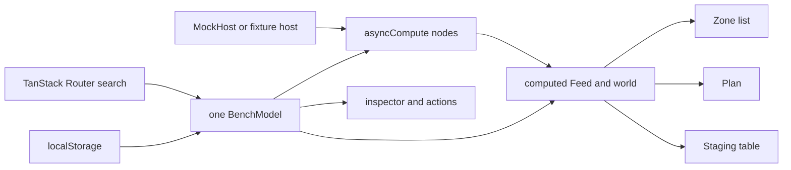

# Preact Signals state benchmark

Date: 2026-08-24. Prototype: `/state-bench/preact`. Source clone:
`C:/Users/kaitp/source/repos/Pe.Tools/.explore/preact-signals` at `1e3ab34`.

## 1. Library facts

| Fact | Finding |
|---|---|
| Packages | `@preact/signals-react` 3.12.0 and `@preact/signals-core` 1.14.4. |
| Maintainer | The Preact Authors. Both package manifests name the team and the `preactjs/signals` repository (`packages/react/package.json:2-18`, `packages/core/package.json:2-18`). |
| Release cadence | React had 12 releases from 3.6.2 on 2026-01-20 through 3.12.0 on 2026-08-04, about one every 18 days (`packages/react/CHANGELOG.md:3-166`). Core 1.14.4 last published 2026-07-07. |
| npm use | Last complete week, 2026-08-17 through 2026-08-23: 302,080 React downloads and 7,350,385 core downloads. Sources: [React npm downloads](https://api.npmjs.org/downloads/point/last-week/@preact/signals-react) and [core npm downloads](https://api.npmjs.org/downloads/point/last-week/@preact/signals-core). |
| Published size | npm reports 193,395 unpacked bytes for React and 259,629 for core. These are package sizes, not the tree-shaken application bundle. Sources: [React npm metadata](https://registry.npmjs.org/@preact/signals-react/3.12.0) and [core npm metadata](https://registry.npmjs.org/@preact/signals-core/1.14.4). |
| React 19 | Declared peer support is React 16.14 through 19 (`packages/react/package.json:70-72`). React 19 support is real, but updates route through `useSyncExternalStore` (`packages/react/runtime/src/index.ts:20,354-371`). |
| Suspense | No async primitive and no query integration. The prototype supplies `asyncCompute` and a `read()` method. Every pane has a Suspense boundary. The Plan suspends on its first read; the other panes render the explicit `Feed` state. |
| Activity | No library API. React owns it. Hidden Activity disconnected the Plan passive effect and stopped Plan renders in the prototype. [React Activity reference](https://react.dev/reference/react/Activity). |
| Transitions | The adapter uses `useSyncExternalStore`, so external-store notifications are synchronous. The prototype reproduced the transition de-opt. |
| Devtools | `@preact/signals-debug` logs signal and effect work (`packages/debug/README.md:18-60`). The visual panel needs `signals-debug`, `signals-devtools-ui`, and `signals-devtools-adapter` (`packages/devtools-ui/README.md:6-33`). The prototype uses the cheaper state-tree and last-20-actions inspector. |
| SSR and TanStack Start | Server rendering does not track signals (`packages/react/README.md:129-131`). There is no async cache hydration, prefetch, or stream contract. A client-owned route model works, but Start gains no server-data integration from Signals. |
| Effect v4 | Neutral. The model can call an Effect adapter that returns a Promise and accepts an `AbortSignal`, but Signals has no Effect service, scope, error, or layer integration. |

`createModel` is the best new fact. It groups signals, computeds, and actions. It captures effects and disposes them through `Symbol.dispose` (`packages/core/README.md:257-289`; implementation at `packages/core/src/index.ts:998-1125`). `useModel` makes one instance and installs disposal (`packages/react/README.md:106-127`; `packages/react/runtime/src/index.ts:463-472`).

## 2. Mental model in one diagram



Smallest complete shape:

```ts
const RouteModel = createModel((host: MockHost) => {
  const session = signal("")
  const doc = asyncCompute(async (get, abort) => {
    const id = get(session)
    return id ? host.activeDoc(id, abort) : null
  })
  return { session, doc, pick(id: string) { session.value = id } }
})

function Route() {
  const model = useModel(() => new RouteModel(createFixtureHost()))
  useSignals()
  return <p>{model.doc.state.value.status}</p>
}
```

## 3. How the scenario mapped

| State kind | Primitive | Notes |
|---|---|---|
| URL | TanStack Router `validateSearch`; binding signals in `BenchModel` | Model actions update the search object. `syncSearch` handles browser navigation. |
| Persisted | Signals plus `localStorage` | Recent folders cap at eight. Three pane widths are editable and saved. |
| Page memory | Signals | Hover, Activity visibility, staged renames, busy time, receipt, toast, and inspector state. |
| Host cache | Six `asyncCompute` nodes | Sessions, active document, views, zones, folder files, and open R10. |
| Derived | `computed` | Feeds, progress, refusal, world rows, and inspector JSON. |

The centralized object worked. Components read signals and call model actions. The library fought the scenario at async state, URL persistence, cache policy, mutation policy, Suspense, and devtools. All of those were built locally.

One extra failure appeared in the browser. `useModel` returns its disposer directly from a passive effect (`packages/react/runtime/src/index.ts:463-472`). React development effect replay called that disposer, then reused the same instance. The first version left every async request aborted and caused the Plan Suspense boundary to retry about 800 times per second. `armReactLifecycle` defers disposal and cancels it when the route effect reconnects (`ts/apps/web/src/state-bench/preact/model.ts:513`). This is prototype code, not a general fix for the library.

## 4. Async waterfalls

The 204-line helper is `ts/apps/web/src/state-bench/preact/async.ts`. Its explicit `get` subscribes when the read happens, including after an `await` (`async.ts:47-96`). Each run receives the active `AbortSignal` (`async.ts:110`). A dependency write aborts that signal and starts the callback again. Pending state keeps the previous `data`.

```ts
const activeDoc = asyncCompute(async (get, abort) => {
  const id = get(session)
  return id ? host.activeDoc(id, abort) : null
})

const views = asyncCompute(async (get, abort) => {
  const sessionId = get(session)
  const docId = get(doc)
  if (!sessionId || !docId) return []
  await awaitAsync(activeDoc, get, abort)
  return host.listViews(sessionId, docId, abort)
})

const zones = asyncCompute(async (get, abort) => {
  const sessionId = get(session)
  const docId = get(doc)
  const viewId = get(view)
  if (!sessionId || !docId || !viewId) return []
  await awaitAsync(views, get, abort)
  return host.listZones(sessionId, docId, viewId, abort)
})
```

This fixes W1, W2, and W3. It does not provide keyed deduplication, shared cache identity, retry or backoff, stale time, garbage collection, focus or reconnect refresh, optimistic mutations, infinite queries, SSR hydration, prefetch, or integrated devtools. Those are still TanStack Query's job.

Invalidation is local. Adopt marks zones stale and starts a re-read (`model.ts:298-329`). `docChanged` marks document, views, and zones stale and refreshes all three (`model.ts:226-250`). There is no general invalidation registry.

## 5. Fixture and mocking

The composition-root swap is one line:

```ts
new BenchModel(search.source === "fixture" ? createFixtureHost() : createMockHost(), search)
```

The same constructor works without React:

```ts
const model = new BenchModel(createFixtureHost())
await model.cache.sessions.settled()
expect(model.feeds.sessions.peek().state).toBe("fixture")
```

`bench.test.ts` renders no React. It passed all five required cases: fixture swap; waterfall descendant clearing; adopt to stale to refresh; error feed; and `docChanged` invalidation.

## 6. Performance

The browser harness bound one document and view, which loaded 500 zones into all three panes. The inspector measured one distinct hover write with `performance.now` around `flushSync`, then read exact pane render counters.

| State | Commit | Zone list renders | Plan renders | Staging renders |
|---|---:|---:|---:|---:|
| Plan visible | 167.20 ms | 2 | 2 | 2 |
| Plan Activity hidden | 98.50 ms | 2 | 0 | 2 |

This fails 60 fps by a large margin. Development Strict Mode accounts for the two render calls, but not enough to change the verdict. The prototype deliberately renders all 500 rows and rectangles so the control arm pays for coarse component tracking. Per-zone components or direct signal-to-text bindings may reduce the cost, but this prototype did not add them after the failure.

Activity did help: the Plan passive-effect probe changed from `active` to `unsubscribed`, and Plan hover renders fell from two to zero. The Signals graph outside React remained alive.

## 7. URL, persisted, and page separation

Signals provides only the in-memory primitives.

- URL search parsing and serialization come from TanStack Router. `pickBinding` clears descendants in one action (`model.ts:259-296`).
- Persistence is 32 lines of local `localStorage` read and write code.
- Page memory is plain signals.
- Host cache state is the custom async helper.
- Derived values are library `computed` signals.

The separation is visible and testable, but the library does not enforce it. A later edit can put a binding in page memory without any warning.

## 8. DX

Final line counts:

| Area | Lines |
|---|---:|
| `async.ts` | 204 |
| `host.ts` | 205 |
| `model.ts` | 576 |
| Store logic total | 985 |
| `panes.tsx` | 202 |
| Route | 227 |
| View total | 429 |
| No-React tests | 98 |

Type inference is strong for signals, computed values, and `createModel`. The recursive model validator caught non-signal data placed on the returned object. Async result typing is ours, so its quality is not library evidence.

Devtools screenshot path: none. The browser harness captured the full route and inspector, but the mission file allowlist did not permit a screenshot artifact path. The inspector is the `<pre>` state tree plus the last 20 actions in `panes.tsx`.

The three worst papercuts:

1. The library leaves almost the whole async query layer to the application. The 204-line helper is the cost of fixing only three known holes.
2. `useSyncExternalStore` defeats `startTransition` for signal-driven renders.
3. `useModel` disposal needed a development effect-replay adapter before Suspense could settle.

Runtime proof: `vp run @pe/web#dev` selected `http://localhost:3002/`. The browser harness rendered `/state-bench/preact`, drove the complete binding waterfall, selected a zone, ran both performance probes, and captured the inspector. The console also showed an existing TanStack `react-router-ssr-query` hydration error, `Cannot read properties of undefined (reading 'mutations')`. The route still rendered; this prototype did not change that unrelated stack.

## 9. Verdict

| Want | Score | Evidence |
|---|---:|---|
| Centralized importable object | 5/5 | One `BenchModel` owns inputs, async nodes, derived state, and actions. Components receive only the model. |
| State handles its own waterfalls | 3/5 | Straight-line `awaitAsync` works across `await`, but it costs a 204-line local runtime and has no general cache policy. |
| Mockable | 5/5 | The host is a constructor argument. Fixture mode is the same one-line swap in React and Vitest. |

Recommendation: reject as the production default. Keep it as the control arm. It preserves the qr-repo feel better than a hook and query-key design, but the amount of local async infrastructure, transition de-opt, poor 500-zone hover result, and `useModel` lifecycle failure outweigh the small core API.

## 10. What I would steal

Steal `createModel`: constructor arguments, action wrapping, nested model shape, effect capture, and `Symbol.dispose` are a good owner for one route-sized object. The core README explains the contract in about 30 lines (`packages/core/README.md:257-289`). It is useful even if another library owns server state.

Also steal the explicit `get(signal)` shape for async derivations. It makes a post-`await` dependency visible and testable. Do not steal this helper as a query cache.

## 11. Candidate-specific answers

### F2: transition de-opt

Verified. The view probe called `startTransition`, then read the signal before `startTransition` returned. It changed synchronously from `view-plan` to `view-upper`, while `isPending` was `false`. This matches the adapter source: `useSignals` calls `useSyncExternalStore` (`packages/react/runtime/src/index.ts:354-371`). React schedules external-store consistency work synchronously.

### F3: Activity subscription lifetime

Verified. With Plan visible, its Activity-scoped passive-effect probe reported `active` and a hover caused two Plan render calls. After `mode="hidden"`, the probe reported `unsubscribed` and a hover caused zero Plan render calls. State and DOM returned when shown again. The Signals graph and the other pane subscriptions continued outside the hidden subtree.

### Helper size and TanStack Query gap

`async.ts` is 204 lines. It fixes post-`await` tracking, keep-previous pending state, and transport cancellation. It still lacks shared keyed cache and deduplication, retries, stale and garbage-collection timers, focus and network refresh, mutation and optimistic-update machinery, paginated or infinite queries, SSR dehydration and hydration, prefetch, error-boundary policy, and integrated query devtools.
